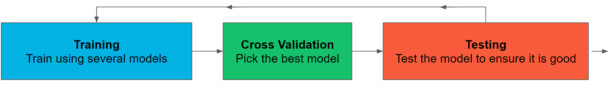
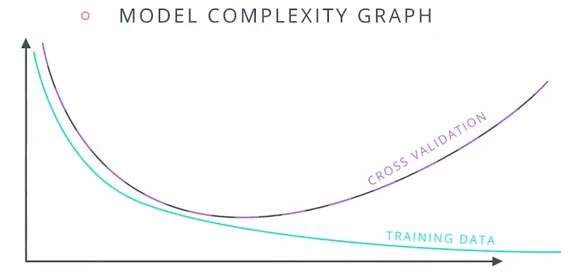

### Cross-Validation

**交叉验证与数据回收**

在机器学习中，测试通常是通过将数据分为训练集和测试集来完成的，但这样做可能会丢弃一些本可以用于训练算法的数据。为了避免这种情况，同时又不作弊，可以使用交叉验证方法。

**K折交叉验证**

- **步骤**：
  1. 将数据分成K个桶。
  2. 训练模型K次，每次使用不同的桶作为测试集，其余的作为训练集。
  3. 将结果平均以获得最终模型。

- **实现**：
  - 在`SKLearn`中，我们需要创建一个K折对象，参数是数据的大小和测试集的大小。例如：`kf = KFold(12, 3)`。
  - 随机化数据以消除任何偏差的暗示，这也可以在`SKLearn`中通过在初始化K折对象时设置`shuffle`参数为`True`来实现。例如：`kf = KFold(12, 3, shuffle=True)`。


以下是使用K折交叉验证进行高斯过程回归的代码示例：

```python
import numpy as np
import matplotlib.pyplot as plt
from sklearn.gaussian_process import GaussianProcessRegressor
from sklearn.gaussian_process.kernels import RBF, ConstantKernel as C
from sklearn.model_selection import KFold

# 示例数据（需要替换为实际实验数据）
time_points = np.array([0, 1, 2, 3, 4, 5, 6, 7])
concentration_data = np.array([1.0, 2.1, 3.5, 4.0, 4.8, 5.2, 5.7, 6.0])
volume_data = np.array([1.0, 1.1, 1.2, 1.3, 1.4, 1.5, 1.6, 1.7])
feeding_rate = 0.1  # 示例喂料速率
dV_dt = np.gradient(volume_data, time_points)  # 计算体积变化率

# 计算 R(s)
R_s = []
for i in range(len(time_points) - 1):
    delta_c = (concentration_data[i+1] - concentration_data[i]) / (time_points[i+1] - time_points[i])
    R = delta_c - (1 / volume_data[i]) * (feeding_rate - concentration_data[i] * dV_dt[i])
    R_s.append(R)
R_s = np.array(R_s)

# 准备数据
X = time_points[:-1].reshape(-1, 1)
y = R_s

# K折交叉验证
kf = KFold(n_splits=3, shuffle=True, random_state=1)

# 定义高斯过程模型
kernel = C(1.0, (1e-4, 1e1)) * RBF(1.0, (1e-4, 1e1))

gp = GaussianProcessRegressor(kernel=kernel, n_restarts_optimizer=10)

predictions = []
for train_index, test_index in kf.split(X):
    X_train, X_test = X[train_index], X[test_index]
    y_train, y_test = y[train_index], y[test_index]
    gp.fit(X_train, y_train)
    y_pred, sigma = gp.predict(X_test, return_std=True)
    predictions.extend(y_pred)

# 最终预测值
predictions = np.array(predictions)

# 绘制结果
plt.figure(figsize=(10, 6))
plt.plot(time_points[:-1], R_s, 'o-', label='R(s) (Measured)')
plt.plot(time_points[:-1], predictions, 's-', label='GP Cross-Validated Predictions')
plt.xlabel('Time')
plt.ylabel('R(s)')
plt.legend()
plt.title('Cross-Validated Predictions Using Gaussian Process')
plt.show()
```

- **数据准备**：替换示例数据为实际实验数据。
- **计算 \(R(s)\)**：根据积累速率公式计算 \(R(s)\)。
- **K折交叉验证**：
  - 使用`KFold`对象进行3折交叉验证，并设置`shuffle=True`以随机化数据。
  - 每次迭代使用不同的训练集和测试集来训练和验证模型。
- **高斯过程模型**：使用`GaussianProcessRegressor`拟合高斯过程模型，并进行预测。
- **绘制结果**：绘制测量值和交叉验证预测值，以验证模型的准确性。

通过上述代码，可以使用K折交叉验证方法进行高斯过程回归，从而有效利用所有数据进行训练，同时进行模型验证。


### Model complexity graph

以下是一个使用Python和Matplotlib绘制模型复杂性图的示例代码：

```python
import numpy as np
import matplotlib.pyplot as plt
from sklearn.model_selection import train_test_split, KFold, cross_val_score
from sklearn.gaussian_process import GaussianProcessRegressor
from sklearn.gaussian_process.kernels import RBF, ConstantKernel as C

# 示例数据生成
np.random.seed(0)
X = np.sort(np.random.rand(100, 1) * 10, axis=0)
y = np.sin(X).ravel()

# 划分训练和测试数据集
X_train, X_test, y_train, y_test = train_test_split(X, y, test_size=0.2, random_state=42)

# 不同复杂度（核函数尺度）的高斯过程回归模型
kernels = [C(1.0, (1e-3, 1e3)) * RBF(l, (1e-3, 1e3)) for l in np.logspace(-2, 2, 10)]

train_errors = []
cv_errors = []

# 进行K折交叉验证
kf = KFold(n_splits=5, shuffle=True, random_state=42)

for kernel in kernels:
    gp = GaussianProcessRegressor(kernel=kernel, n_restarts_optimizer=10)
    
    # 计算训练误差
    gp.fit(X_train, y_train)
    y_train_pred = gp.predict(X_train)
    train_error = np.mean((y_train_pred - y_train) ** 2)
    train_errors.append(train_error)
    
    # 计算交叉验证误差
    cv_error = -cross_val_score(gp, X_train, y_train, cv=kf, scoring='neg_mean_squared_error').mean()
    cv_errors.append(cv_error)

# 绘制模型复杂性图
plt.figure(figsize=(10, 6))
plt.plot(np.logspace(-2, 2, 10), train_errors, label='Training Data', color='cyan')
plt.plot(np.logspace(-2, 2, 10), cv_errors, label='Cross Validation', color='purple')
plt.xscale('log')
plt.xlabel('Model Complexity (Kernel Scale)')
plt.ylabel('Mean Squared Error')
plt.legend()
plt.title('Model Complexity Graph')
plt.show()
```

- **数据生成**：生成随机的示例数据。
- **模型复杂度**：通过调整RBF核函数的尺度参数来改变模型的复杂度。
- **交叉验证**：使用K折交叉验证计算每种复杂度下的模型的交叉验证误差。
- **绘图**：绘制训练误差和交叉验证误差随模型复杂度变化的图形。



- **训练误差（Training Data）**：通常随模型复杂度增加而减少。
- **交叉验证误差（Cross Validation）**：在模型复杂度较低时，误差较高（欠拟合）；在模型复杂度适中时，误差较低；在模型复杂度较高时，误差增加（过拟合）。

通过这种图形，可以更好地理解模型复杂度对性能的影响，找到平衡模型复杂度与泛化能力的最佳点。


### Learning Curve

学习曲线展示了模型在不同训练集规模下的训练误差和交叉验证误差。通过比较不同复杂度模型的学习曲线，可以更好地理解模型的表现。

以下是绘制三种不同复杂度模型的学习曲线的示例代码：

```python
import numpy as np
import matplotlib.pyplot as plt
from sklearn.model_selection import train_test_split, KFold, cross_val_score
from sklearn.gaussian_process import GaussianProcessRegressor
from sklearn.gaussian_process.kernels import RBF, ConstantKernel as C

# 示例数据生成
np.random.seed(0)
X = np.sort(np.random.rand(100, 1) * 10, axis=0)
y = np.sin(X).ravel() + 0.1 * np.random.randn(100)

# 不同复杂度（核函数尺度）的高斯过程回归模型
kernels = [C(1.0, (1e-4, 1e3)) * RBF(l, (1e-4, 1e3)) for l in [0.1, 1.0, 10.0]]

# 准备训练集大小
train_sizes = np.linspace(0.1, 0.9, 5)

# 存储训练误差和交叉验证误差
train_errors = np.zeros((3, len(train_sizes)))
cv_errors = np.zeros((3, len(train_sizes)))

kf = KFold(n_splits=5, shuffle=True, random_state=42)

for i, kernel in enumerate(kernels):
    for j, train_size in enumerate(train_sizes):
        X_train, _, y_train, _ = train_test_split(X, y, train_size=train_size, random_state=42)
        
        gp = GaussianProcessRegressor(kernel=kernel, n_restarts_optimizer=10)
        
        # 计算训练误差
        gp.fit(X_train, y_train)
        y_train_pred = gp.predict(X_train)
        train_error = np.mean((y_train_pred - y_train) ** 2)
        train_errors[i, j] = train_error
        
        # 计算交叉验证误差
        cv_error = -cross_val_score(gp, X_train, y_train, cv=kf, scoring='neg_mean_squared_error').mean()
        cv_errors[i, j] = cv_error

# 绘制学习曲线
fig, axes = plt.subplots(1, 3, figsize=(18, 6), sharey=True)

titles = ['Model A (Low Complexity)', 'Model B (Medium Complexity)', 'Model C (High Complexity)']
colors = ['cyan', 'red']

for i, ax in enumerate(axes):
    ax.plot(train_sizes * len(X), train_errors[i], 'o-', label='Training Error', color=colors[0])
    ax.plot(train_sizes * len(X), cv_errors[i], 'o-', label='CV Error', color=colors[1])
    ax.set_title(titles[i])
    ax.set_xlabel('Number of Training Points')
    if i == 0:
        ax.set_ylabel('Error')
    ax.legend()
    ax.grid(True)

plt.suptitle('Learning Curves for Models with Different Complexity')
plt.show()
```


- **数据生成**：生成带有噪声的示例数据。
- **模型复杂度**：定义三种不同复杂度的高斯过程回归模型，通过改变RBF核函数的尺度参数来实现。
- **训练集大小**：使用不同大小的训练集进行训练。
- **计算误差**：计算不同训练集大小下的训练误差和交叉验证误差。
- **绘制图形**：绘制每种模型的学习曲线，显示训练误差和交叉验证误差随训练集大小的变化。

通过上述代码，可以绘制三种不同复杂度模型的学习曲线，展示模型在不同训练集规模下的表现。学习曲线可以帮助理解模型的泛化能力，并识别过拟合和欠拟合的情况。