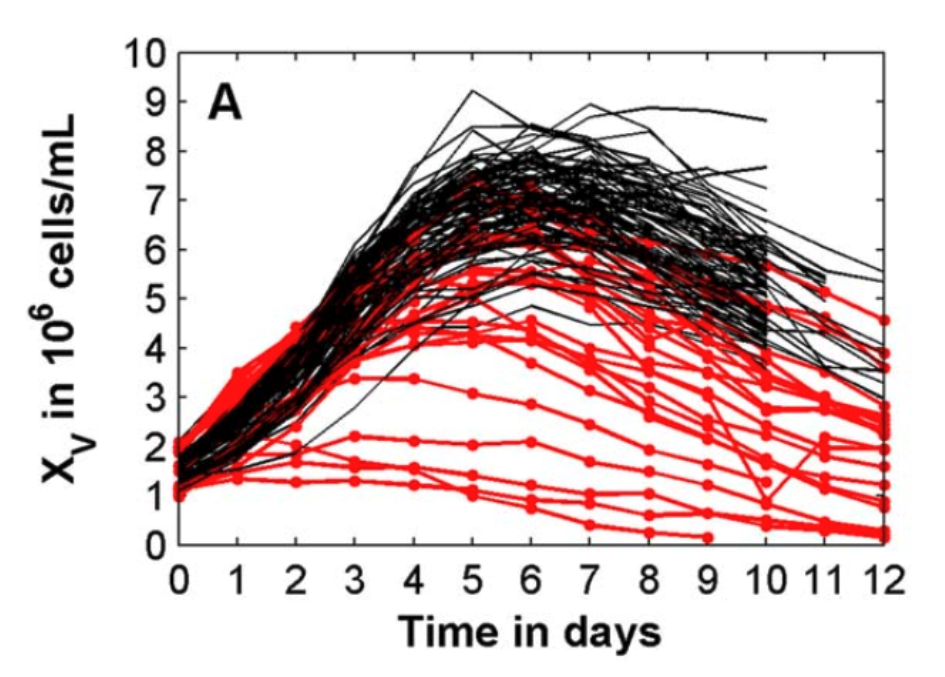

# Datahow-2015-MVDA-PCA

> 本文核心解决的问题:
> 
> - various (dynamic) upstream process characteristics  &rarr; patterns (fingerprints)
> 
> - variable importance under different perspectives
> 
> - variable interactions and trajetories in the time
> 
> 本文实验数据用于探索分析的要点
> 
> - Process variables: initial value analysis in a range
> 
> - Control variables: set point analysis in a range
> 
> - Replicate Variables: process robustness

## Description of data

W:

- pH

Z:

- DO

- Stress

X:

- Xv

- Via

- Glc

- Lac

- NH4

- Gln

- Glu

- OSM: osmolaity comprised 24% of randomly distributed missing values

F:

- Feed_Glc: feed from day 3

Y: Titer, contained 56% of missing values, measured on even days.

Initial value:

- pH set

- DO set

- Stress set

- Xv_0 set

## Ways to unfold a 3d data

- BWU: Batch-Wise Unfolding

- OWU: Observation-Wise Unfolding

## Deal with missing values

- **Eliminating** all rows which comprise missing X (and Y) values for PCA (and PLSR);

- **Interpolating** the missing values **separately** for all the X and Y evolutions;
  
  - **选择插值方法**：
    
    - 不同插值方法可用于估算缺失值，例如：
      
      - 线性插值
      - 多项式插值
      - 滑动平均
      - 样条插值
      - 洛伦兹插值
    
    - 根据时间序列数据，对输出变量Y的每一个维度单独进行插值填补。
  
  - **对X进行插值**：
    
    - 根据时间序列数据，对输入变量X的每一个维度单独进行插值填补。
  
  - **对Y进行插值**：
    
    - 根据时间序列数据，对输出变量Y的每一个维度单独进行插值填补。

- **Imputing** the missing data:
  
  - in the entire X space using the iterative algorithm by Walczak et al.,24
  
  - in the entire missing Y (titer) data by regressing Y with a logistic function (i.e., also extrapolation)
  
  - imputations **separately** in the X and Y space is to eliminate any information
    exchange in order to ensure unbiased prediction.

## Normlization Data

- Substracting the mean of each column and dividing each column by its standard deviation
  
  在进行多变量分析之前，对数据进行了自动缩放，即减去每一列的均值并将每一列除以其标准偏差。
  
  **1. 自动缩放的目的：**
  
  - **标准化数据：** 确保所有变量具有相似的量级。
  - **减少偏差：** 防止由于不同变量之间尺度差异而导致的偏差。
  - **提高模型性能：** 在多变量分析和机器学习模型中，标准化可以提升模型的稳定性和准确性。
  
  **2. 自动缩放的过程：**
  
  - **均值中心化：** 对每个变量减去其均值，使得数据居中于零。
  - **方差归一化：** 对每个变量除以其标准偏差，使得数据的方差归一到1。
  
  **3. 自动缩放的公式：**
  
  - 对于每个变量 \(x_j\)，其标准化后的值为：
    $ z_{ij} = \frac{x_{ij} - \mu_j}{\sigma_j} $
    - $z_{ij}$：第 \(i\) 行，第 \(j\) 列的标准化值
    - $x_{ij}$：第 \(i\) 行，第 \(j\) 列的原始值
    - $u_j$：第 \(j\) 列的均值
    - $\sigma_j$：第 \(j\) 列的标准偏差
  
  **方法演示：**
  
  使用Python代码对自动缩放进行演示：
  
  ```python
  import numpy as np
  import pandas as pd
  from sklearn.preprocessing import StandardScaler
  
  # 生成示例数据集
  np.random.seed(42)
  data = {
      'Temperature': np.random.normal(37, 0.5, 10),
      'pH': np.random.normal(7.2, 0.1, 10),
      'Oxygen': np.random.normal(30, 5, 10),
      'Titer': np.random.normal(100, 15, 10)
  }
  df = pd.DataFrame(data)
  
  # 显示原始数据
  print("原始数据：\n", df)
  
  # 使用sklearn的StandardScaler进行自动缩放
  scaler = StandardScaler()
  scaled_data = scaler.fit_transform(df)
  
  # 将缩放后的数据转换回DataFrame
  scaled_df = pd.DataFrame(scaled_data, columns=df.columns)
  
  # 显示缩放后的数据
  print("\n缩放后的数据：\n", scaled_df)
  
  # 手动实现自动缩放
  def manual_standardize(data):
      return (data - data.mean(axis=0)) / data.std(axis=0)
  
  manual_scaled_data = manual_standardize(df)
  print("\n手动实现的缩放后的数据：\n", manual_scaled_data)
  ```

## Model Performance Evaluation

- K-Fold

- 用于评估模型性能和预测能力，避免过拟合。

- 过程：
1. 将数据集分成k个子集（通常k=5或k=10）。

2. 每次选择其中一个子集作为测试集，其余子集作为训练集。

3. 基于训练集构建模型，并使用该模型预测测试集中的Y值。

4. 计算实际Y值和预测Y值之间的误差，并记录每次交叉验证的误差。**RMSECV（交叉验证中的均方根误差）：**
   
   - 计算实际和预测Y值的平方差之和，并取平方根。
   - 衡量模型在交叉验证中的预测误差，值越小表示模型预测能力越好。

5. 计算实际Y值和预测Y值之间的**Q²（解释的方差）：**
   
   - 表示交叉验证中解释的方差占总方差的比值。
   - 值范围为0到1，越接近1表示模型越能解释数据的方差。

```
- 示例代码:

```python
from sklearn.model_selection import KFold
from sklearn.cross_decomposition import PLSRegression
from sklearn.metrics import mean_squared_error
import numpy as np

# 生成示例数据集
np.random.seed(42)
n_samples = 100
n_features = 10
X = np.random.rand(n_samples, n_features)
Y = np.random.rand(n_samples, 1)

# 设置PLS回归模型参数
n_components = 2
pls = PLSRegression(n_components=n_components)

# 设置k折交叉验证参数
k = 5
kf = KFold(n_splits=k, shuffle=True, random_state=42)

# 交叉验证评估模型性能
rmsecv_list = []
q2_list = []

for train_index, test_index in kf.split(X):
    X_train, X_test = X[train_index], X[test_index]
    Y_train, Y_test = Y[train_index], Y[test_index]

    # 训练PLS回归模型
    pls.fit(X_train, Y_train)

    # 预测测试集的Y值
    Y_pred = pls.predict(X_test)

    # 计算RMSECV
    rmsecv = np.sqrt(mean_squared_error(Y_test, Y_pred))
    rmsecv_list.append(rmsecv)

    # 计算Q²
    ss_tot = np.sum((Y_test - np.mean(Y_test))**2)
    ss_res = np.sum((Y_test - Y_pred)**2)
    q2 = 1 - ss_res / ss_tot
    q2_list.append(q2)

# 计算平均RMSECV和平均Q²
mean_rmsecv = np.mean(rmsecv_list)
mean_q2 = np.mean(q2_list)

print(f"平均RMSECV: {mean_rmsecv:.4f}")
print(f"平均Q²: {mean_q2:.4f}")
```

## Interrelationships between the X and Y

1. **b系数（b-coefficients）：**
   
   - b系数是PLSR模型中的回归系数，代表自变量（X变量）对因变量（Y变量）的线性关系强度和方向。
   - 对应于自动缩放后的X变量。

2. **变量重要性投影（VIP，Variable Importance in Projection）：**
   
   - VIP是PLSR模型中评估X变量相对重要性的指标。
   - 用于评估每个X变量对解释X和Y空间的贡献。
   - VIP值的特点：
     - 始终为正。
     - 值为1表示X变量的平均影响力。

3. **W*-载荷（W*-loadings）：**
   
   - 量化每个X变量在每个潜在变量（LV）上的权重。
   - 表示每个X变量对LV的贡献程度。
   - 如果第一个LV解释了大部分方差，则在该LV上具有高载荷的X变量更可能具有重要影响力。

**方法演示：**

使用Python代码计算b系数、VIP和W*-载荷：

```python
from sklearn.cross_decomposition import PLSRegression
import numpy as np
import pandas as pd

# 生成示例数据集
np.random.seed(42)
n_samples = 100
n_features = 5
X = np.random.rand(n_samples, n_features)
Y = np.random.rand(n_samples, 1)
columns = [f'X{i+1}' for i in range(n_features)]

# 设置PLS回归模型参数
n_components = 2
pls = PLSRegression(n_components=n_components)

# 训练PLS回归模型
pls.fit(X, Y)

# 计算b系数（回归系数）
b_coefficients = pls.coef_

# 计算VIP
def calculate_vip(pls, X):
    t = pls.x_scores_
    w = pls.x_weights_
    q = pls.y_loadings_

    p, h = w.shape
    s = np.zeros((p,))
    total_s = np.sum(np.diag(t.T @ t @ q.T @ q))

    for i in range(p):
        weight = np.sum((t @ np.diag(q[:, 0]))**2, axis=0)
        s[i] = np.sum(weight * (w[i, :]**2))

    vip = np.sqrt(p * s / total_s)
    return vip

vip_scores = calculate_vip(pls, X)

# 计算W*-载荷
w = pls.x_weights_
p = pls.x_loadings_
w_star = w @ np.linalg.inv(p.T @ w)

# 打印结果
results = pd.DataFrame({
    'b-coefficients': b_coefficients.flatten(),
    'VIP': vip_scores,
    'W*-loadings (LV1)': w_star[:, 0],
    'W*-loadings (LV2)': w_star[:, 1]
}, index=columns)

print(results)
```

**输出：**

```python
    b-coefficients       VIP  W*-loadings (LV1)  W*-loadings (LV2)
X1        0.030798  0.982699           0.548974           0.262306
X2        0.030547  1.082961           0.438153           0.483382
X3       -0.076504  1.032607          -0.401813           0.319908
X4       -0.023873  1.061569           0.560785          -0.508544
X5        0.034774  0.916164           0.368275           0.569357
```

**总结：**

- **b系数**：表示每个X变量对Y变量的线性影响。
  
  - - **数值大小**：
      
      - b系数的绝对值越大，表明该变量对响应变量（Y）的影响越大。
      - 较小的绝对值意味着该变量对Y的影响较小。
    
    - **符号解释**：
      
      - 正号（+）：表示该变量与响应变量正相关，即自变量增加，响应变量也增加。
      - 负号（-）：表示该变量与响应变量负相关，即自变量增加，响应变量减少。

- **VIP**：评估每个X变量对解释X和Y空间( X&rarr;Y即模型)的相对重要性。
  
  - - **数值大小**：
      - VIP的值始终为正，越大表示该变量对模型的影响越大。
      - 通常：
        - VIP > 1：表示该变量对模型有较高的解释力。
        - VIP < 1：表示该变量对模型解释力较弱。

- **W*-载荷**：量化X变量对潜在变量（LV）的贡献。
  
  - - **数值大小**：
      
      - W*-载荷的绝对值越大，表示该变量对潜在变量（LV）的贡献越大。
    
    - **符号解释**：
      
      - 正号（+）：表示该变量与潜在变量正相关。
      - 负号（-）：表示该变量与潜在变量负相关。

## Univariate analysis

**关于 X 变量的单变量分析**

**1. 图1的解读**


- **图1A（活细胞密度，XV）**：
  
  - 高滴度批次（黑色曲线）和低滴度批次（红色带点曲线）在活细胞密度上的差异显著。
  - 高滴度批次通常在第6天左右达到最大活细胞密度，然后逐渐下降。
  - 低滴度批次在较早阶段出现下降，表明早期细胞死亡。

- **图1B（滴度）**：
  
  - 高滴度批次的滴度演变更陡峭，达到更高的最终滴度。
  - 低滴度批次的滴度在早期趋于平稳，最终产量较低。

- **图1C（葡萄糖浓度）**：
  
  - 高滴度批次在第3天后保持稳定的葡萄糖浓度。
  - 低滴度批次中，葡萄糖浓度较早阶段就开始积累，表明早期细胞死亡导致消耗降低。

- **图1D（pH）**：
  
  - 高滴度批次的pH值主要集中在6.8到7.2之间。
  - 低滴度批次的pH值通常低于6.8或高于7.2。

**2. 单变量预分析的结论：**

- 高滴度批次和低滴度批次在各个**变量的演变**中表现出明显不同的特征模式。
- 通过引入滴度值的质量标准，将批次分为高滴度和低滴度两组，有助于简化分析并识别特征模式。
- 但是经典的单变量分析表明，大多数变量的演变揭示了一些特征模式。通过引入与滴度值相关的任意质量标准简化了该分析，该标准可区分高性能和低性能批次。尽管这种经验分组有助于对工艺有一些基本的了解，但无法评估这两组中的整体变量相互作用和差异。


**关于 Z 变量的单变量分析**

图2中的散点图分析揭示了不同的Z过程变量对产品滴度的影响。这种可视化方法便于**观察变量设定点**如何影响最终的产品滴度。

- **图2A和2B**：这两张图显示了pH和DO设定点在调查范围的极值（最高或最低）通常与低滴度批次相关联。
- **图2C和2D**：这两张图指出细胞接种密度和stress的范围可能未涵盖足够宽的区域，无法包括关键的失效边缘。由于这两个变量的控制不够精确，难以区分高滴度和低滴度批次。

此外，由于实验设定的细胞密度较为分散，这暗示了在初始阶段的过程控制存在问题，这可能影响了整体生产的稳定性和预测性。

## PCA analysis


这项分析的主要目标是通过多变量分析可视化12个输入变量之间的演变和相关性，并推断不同批次之间的特征模式和偏差。

为了分析变量的演变，数据集按变量进行了展开，并删除了包含缺失值的行。最终形成了一个由1020个观测值（行）和12个变量（列）组成的矩阵。

图3所示的得分图清楚地区分了低滴度批次（菱形符号）和高滴度批次（圆形符号）的演变。根据培养时间可视化动态行为，从初始条件（黑色表示第0天）到最终条件（白色表示第12天）。初始条件都位于图的起点附近，然后高滴度批次围绕起点旋转，而低滴度批次则偏离起点。这种趋势也在补充图S2中得以体现，前两个主成分（PC）随时间的变化被绘制出来。换句话说，PCA揭示了在低滴度批次中，所有过程变量以连贯的方式一起移动，并遵循不同于高滴度批次的轨迹。

特别是，可以使用相应的载荷图（如补充图S2所示）识别三个特征组，分别标记为G1、G2和G3。前两组分别对应于pH为6.7时在高（70%和90%，G1）或低（10%，G2）DO条件下的实验。G3组对应于在高pH（7.2）和低DO（10%）水平下进行的实验。其余5个低滴度批次可以在G3组与整体区域的边界附近被识别出来，作为在高pH或低DO条件下进行的补料批工艺，并在其他参数上保持标准条件。这意味着使用此分析可以在单个图中揭示pH的强大作用，特别是极端条件下pH和DO的组合效应。

为了完整性，还可以考虑PC3与PC4的图，总共可以进一步解释24%的方差。然而，这些主成分提供的信息不再反映低滴度和高滴度批次的不同行为，而是展示了XV的特征演变和应力的影响。相应的得分和载荷图提供在补充图S2中。

因此，PCA获得的结果超越了单变量分析的发现，为在将X变量回归到响应Y之前表征其演变提供了重要信息。对于具有动态行为的数据，此类分析的优势在于可视化特征多变量演变，例如，这构成了批次监控的基础。

**解读：**

1. **目标**：
   
   - 通过PCA可视化12个输入变量的演变和相关性，并识别不同批次的特征模式和偏差。

2. **数据处理**：
   
   - 数据按变量展开，删除缺失值行，形成1020个观测值和12个变量的矩阵。

3. **得分图和载荷图**：
   
   - 图3清楚地区分了低滴度和高滴度批次的演变（得分图）。
   - 补充图S2提供了主成分随时间的变化和相应的载荷图。

4. **特征组**：
   
   - **G1**：低pH和高DO。
   - **G2**：低pH和低DO。
   - **G3**：高pH和低DO。

5. **其他信息**：
   
   - PCA揭示了低滴度和高滴度批次的不同轨迹。
   - PCA提供了关于过程变量之间的组合效应和动态行为的重要信息。

**技术方法演示：**

为了执行PCA分析并绘制得分图和载荷图，使用以下Python代码：

```python
import numpy as np
import pandas as pd
import matplotlib.pyplot as plt
from sklearn.decomposition import PCA
from sklearn.preprocessing import StandardScaler

# 示例数据生成
np.random.seed(42)
n_samples = 1020
n_features = 12
X = np.random.rand(n_samples, n_features)

# 假设随机数据代表了补料批过程变量
variable_names = [f"Var{i+1}" for i in range(n_features)]

# 标准化数据
scaler = StandardScaler()
X_scaled = scaler.fit_transform(X)

# 执行PCA
pca = PCA(n_components=4)
X_pca = pca.fit_transform(X_scaled)

# 可视化得分图和载荷图
def plot_pca_results(X_pca, pca, variable_names):
    fig, axs = plt.subplots(2, 2, figsize=(12, 10))
    axs = axs.ravel()

    # 得分图 PC1 vs PC2
    axs[0].scatter(X_pca[:, 0], X_pca[:, 1], alpha=0.7)
    axs[0].set_xlabel(f'PC1 (Var = {pca.explained_variance_ratio_[0]:.2f})')
    axs[0].set_ylabel(f'PC2 (Var = {pca.explained_variance_ratio_[1]:.2f})')
    axs[0].set_title('Score Plot: PC1 vs PC2')

    # 得分图 PC3 vs PC4
    axs[1].scatter(X_pca[:, 2], X_pca[:, 3], alpha=0.7)
    axs[1].set_xlabel(f'PC3 (Var = {pca.explained_variance_ratio_[2]:.2f})')
    axs[1].set_ylabel(f'PC4 (Var = {pca.explained_variance_ratio_[3]:.2f})')
    axs[1].set_title('Score Plot: PC3 vs PC4')

    # 载荷图 PC1 vs PC2
    loading_matrix = pca.components_
    for i, var_name in enumerate(variable_names):
        axs[2].arrow(0, 0, loading_matrix[0, i], loading_matrix[1, i], color='blue', head_width=0.05)
        axs[2].text(loading_matrix[0, i] * 1.15, loading_matrix[1, i] * 1.15, var_name, color='blue')

    axs[2].set_xlabel(f'PC1 (Var = {pca.explained_variance_ratio_[0]:.2f})')
    axs[2].set_ylabel(f'PC2 (Var = {pca.explained_variance_ratio_[1]:.2f})')
    axs[2].set_title('Loading Plot: PC1 vs PC2')
    axs[2].grid(True)

    # 载荷图 PC3 vs PC4
    for i, var_name in enumerate(variable_names):
        axs[3].arrow(0, 0, loading_matrix[2, i], loading_matrix[3, i], color='blue', head_width=0.05)
        axs[3].text(loading_matrix[2, i] * 1.15, loading_matrix[3, i] * 1.15, var_name, color='blue')

    axs[3].set_xlabel(f'PC3 (Var = {pca.explained_variance_ratio_[2]:.2f})')
    axs[3].set_ylabel(f'PC4 (Var = {pca.explained_variance_ratio_[3]:.2f})')
    axs[3].set_title('Loading Plot: PC3 vs PC4')
    axs[3].grid(True)

    plt.tight_layout()
    plt.show()

plot_pca_results(X_pca, pca, variable_names)
```

- **标准化数据**：在PCA分析之前对数据进行标准化，以确保所有变量的尺度一致。
- **PCA分析**：提取前4个主成分，并绘制得分图和载荷图，展示不同批次的动态行为和特征组。

### 如何解读载荷图:

- 结合两个 PC 的取值对于某个特征, 查看其对于那个 PC 具有更大的值,相应的则具有更强的影响

- 当两个变量所对应的向量,接近,形成一个小角, 则两个变量正相关

- 如果两个变量所对应的向量,接近,直角, 则他们不太可能相关

- 如果两个变量所对应的向量,接近,相反方向,则他们负相关

## PLSR Batch evolution modeling

在“PLSR中的批次演变建模”部分的分析评估了假设X和Y变量之间具有时间不变相互关系下，过程变量在监测整体批次演变中的重要性。

本分析的主要目标是通过PLSR（偏最小二乘回归）建模，表征12个输入变量的演变与输出变量（产品滴度）的演变之间的相互关系。


此外，还应评估缺失数据插补策略和低滴度批次的消除对模型性能的影响。与后者目标相关的分析在补充信息S1部分中提供。

为了实现第一个目标，基于逐变量展开的数据集构建了一个PLSR模型，包括555个观测值，其中包含12个X变量和Y变量的完整信息，即所有不完整的行都被剔除。


模型质量在表1的第一行中展示。考虑到RMSECV和图1B中的滴度范围（最高0.9 g/L），预测准确性理应超出区分高和低滴度批次的可能性。然而，预测准确性明显高于实验误差（约0.030 g/, 这个值是通过重复实验的最终滴度平均标准差确定的)。

该不准确性的原因是PLSR模型基于逐变量展开的数据中假设稳态结构。这种模型假设变量之间的相关结构在每个时间点上都是不变的，即载荷（和回归系数）在每个时间点上对每个变量都是恒定的。

然而，基于逐变量展开的数据的模型的主要特征在于其区分不同观测值的能力，具体来说是根据它们在演变中的时间位置。这一特性在过程演变监控中起到了核心作用。


图4A区分了高（圆圈）和低滴度批次（菱形）在整个过程中的时间演变（通过颜色编码）。因此，图4A可以总结为该过程的**观测演变指纹图**。


补充信息图S3显示了前两个潜在变量（LVs）的得分随时间的演变。LV1对应的图表清晰地识别出低滴度和高滴度批次的不同演变。根据响应变量的实验可及性和过程控制策略，这些结果可以作为确定相应批次控制图的基础。换句话说，虽然补充信息图S2中的PCA模型轨迹单纯由X变量之间的相互关系控制，


但图4A和补充信息图S3中的轨迹则基于沿时间用X变量不断预测Y变量。


Chong等人得出结论认为VIP值和b系数可以互补使用，并且如果两者都很小，则可以认为某个变量对模型不重要。


在本例中，上述所有三种指标均显示谷氨酸、谷氨酰胺和乳酸的浓度以及活细胞密度和渗透压在滴度的整体观测演变模型中具有重要作用。这里，谷氨酰胺和谷氨酸的浓度在分析中具有很高的解释力

到目前为止的分析强调了DO和pH的作用及其偏离相应标准条件的后果。然而，图4的结果表明这两个变量的作用较小。理解这一结果的一种方法是将所有变量分为参考受控条件的变量和对应过程时间演变的变量。

根据受控环境条件（pH和DO），细胞培养过程的行为各不相同，如受监测变量的不同过程轨迹所示（图3和图4A）。换句话说，这些重要的监测变量是受控环境条件的内部过程响应，并倾向于更好地代表由操纵变量相对于滴度生产引起的数据中的统计方差。因此，一方面可以表征可用作过程杠杆的变量，另一方面可以表征随时间显著响应且必须测量的变量。识别和评估这两组变量是实现过程监控和控制的重要一步，从而减少过程开发中的后续实验努力以及分析需求。

**解读：**

1. **目标分析：**
   
   - 建立PLSR模型，描述输入变量和输出变量的关系。
   - 评估插补策略和低滴度批次的排除对模型性能的影响。

2. **模型构建：**
   
   - 基于逐变量展开的数据集构建PLSR模型，包含555个观测值。
   - 所有不完整的行都被剔除。

3. **模型质量：**
   
   - 模型准确度高于实验误差。
   - 预测准确性明显超出高低滴度批次的区分。

4. **缺点：**
   
   - 基于逐变量展开数据的模型假设稳态相关结构，不随时间变化。

5. **PLSR模型的特性：**
   
   - 区分不同观测值，根据演变中的时间位置。
   - 可用于过程演变监控。

6. **变量重要性：**
   
   - 谷氨酸、谷氨酰胺、乳酸浓度，活细胞密度和渗透压在滴度模型中具有重要作用。
   - DO和pH的重要性较低。

7. **变量分组：**
   
   - 受控条件的变量与过程演变相关的变量。

8. **结果总结：**
   
   - 识别和评估两组变量，实现过程监控和控制。

**Python代码示例**

以下代码将演示如何使用PLSR模型对数据进行建模，并分析变量的重要性：

```python
import numpy as np
import matplotlib.pyplot as plt
from sklearn.cross_decomposition import PLSRegression
from sklearn.preprocessing import StandardScaler
from sklearn.model_selection import cross_val_score

# 模拟数据生成
np.random.seed(42)
n_samples = 555
n_features = 12
X = np.random.rand(n_samples, n_features)
y = np.random.rand(n_samples) * 0.9  # 模拟滴度范围

# 标准化数据
scaler = StandardScaler()
X_scaled = scaler.fit_transform(X)

# 建立PLSR模型
pls = PLSRegression(n_components=2)
pls.fit(X_scaled, y)

# 交叉验证评估
rmsecv = np.mean(-cross_val_score(pls, X_scaled, y, scoring='neg_root_mean_squared_error', cv=5))
print(f'RMSECV: {rmsecv:.3f}')

# 变量重要性指标计算
b_coeffs = pls.coef_
vip = np.sqrt(np.sum(pls.x_weights_**2, axis=1))
w_loadings = pls.x_loadings_[:, 0]

# 绘制变量重要性图
fig, axs = plt.subplots(1, 3, figsize=(18, 6))

# b系数
axs[0].bar(range(n_features), b_coeffs.flatten(), color='blue')
axs[0].set_title('b-Coefficients')
axs[0].set_xticks(range(n_features))
axs[0].set_xticklabels([f'Var{i+1}' for i in range(n_features)])
axs[0].set_xlabel('Variables')
axs[0].set_ylabel('b-Coefficients')

# VIP
axs[1].bar(range(n_features), vip, color='green')
axs[1].set_title('Variable Importance in Projection (VIP)')
axs[1].set_xticks(range(n_features))
axs[1].set_xticklabels([f'Var{i+1}' for i in range(n_features)])
axs[1].set_xlabel('Variables')
axs[1].set_ylabel('VIP')

# W*-载荷
axs[2].bar(range(n_features), w_loadings, color='orange')
axs[2].set_title('W*-Loadings (LV1)')
axs[2].set_xticks(range(n_features))
axs[2].set_xticklabels([f'Var{i+1}' for i in range(n_features)])
axs[2].set_xlabel('Variables')
axs[2].set_ylabel('W*-Loadings')

plt.tight_layout()
plt.show()
```

**解释：**

1. **RMSECV**：模型预测准确性的交叉验证误差。
2. **b系数**：回归系数，表示变量对输出的直接影响。
3. **VIP（投影重要性）**：变量对模型整体解释能力的贡献。
4. **W*-载荷**：第一个潜在变量上的载荷，显示变量在第一个潜在变量中的权重。

这样可以确定哪些变量对PLSR模型的输出（滴度）有较大的影响，并根据重要性指标采取进一步的实验策略。

## PLSR Phase separation and Time Grouping

本节将考虑揭示特定阶段和时间点特征属性的可能性。分析强调了变量之间的时间变化相关结构以及过程中特定时间点的相应瞬时指纹图。

分析了两种阶段分离：


一种是基于工艺相关的分离，以葡萄糖喂料的开始时间（大约在第3天，从图1C的葡萄糖曲线中可以看出）为界，将过程分为两个阶段；



另一种是基于生物学相关的分离，以从细胞生长到细胞死亡增加的转变（如图1A所示的Xv曲线的最大细胞密度）为界，将过程分为两个阶段。


表1显示，第一阶段的滴度预测精度有所提高，而第二阶段的预测精度与整体观测演变模型相似。因此，对于该过程，这种阶段分离可以有助于理解和监控**第一个阶段**。

为了分析相关结构的动态变化，为每隔两天建立一个单独的PLSR模型（因为滴度通常在双日测量）。


表2显示，特定时间模型的准确性随着时间推移而恶化，但始终比“PLSR中的批次演变建模”部分的整体观测演变模型更好。


这一点也反映在补充信息图S4中，比较了每个时间模型的实际和预测滴度值。时间模型中RMSECV的增加可以归因于系统方差随时间增加，


从图1中的变量演变曲线以及补充信息图S1中的变量演变曲线可以明显看出。将RMSECV与该时间点的滴度范围相关联，可以得出时间分组模型的相对预测准确性相当可比。这些模型可以被视为局部瞬时模型，在每个时间点使用特征模式预测滴度。

相应的变量重要性可以为每个特定时间模型进行评估，揭示基于瞬时系统特征的动态变量重要性模式。


图5显示了在时间特定模型中四个选定变量的VIP值与整个演变模型相比（以水平线表示）。其余的VIP图在补充信息图S5中可视化。图5A-C显示，OSM、Via和GLC等变量在解释各时间点滴度方差的重要性是可变的，并且大于这些变量在解释整个过程中的方差时的时间平均重要性。因此，将模型与整个演变过程分开有助于获取动态变量属性。


图5D和补充信息图S5显示，与时间特定模型(PLSR Time Grouping)相比，谷氨酸和谷氨酰胺的浓度在观测演变模型(Batch evolution modeling with PLSR)中更为重要。这表明， 在 PLSR Time Grouping模型即使没有这些X变量也能够解释滴度。删除这两个变量并不会显著改变时间分组模型(PLSR Time Grouping)的性能，但会显著降低观测演变模型((Batch evolution modeling with PLSR))的预测准确性和方差解释度（使用两个LVs：RMSECV = 0.185 g/L，Q2 = 0.40）。

因此，这两个变量可能捕捉到系统的时间趋势。


这一点也反映在谷氨酸和谷氨酰胺的演变中（见补充信息图S1），


其与滴度的演变（见图1B）非常相似。

**解读：**

1. **阶段分离：**
   
   - **过程相关的阶段分离：** 以葡萄糖喂料的开始时间为界。
   - **生物学相关的阶段分离：** 以细胞从生长到死亡的转变时间为界。

2. **时间特定模型：**
   
   - 为每隔两天建立一个单独的PLSR模型。
   - 精度随着时间推移而降低，但仍优于整体模型。

3. **变量重要性分析：**
   
   - OSM、Via和GLC等变量的重要性随时间变化。
   - 谷氨酸和谷氨酰胺在整体模型中更为重要。

4. **模型比较：**
   
   - 整体模型假设变量之间的关系是时间不变的。
   - 时间特定模型揭示瞬时变量的重要性。

5. **结果总结：**
   
   - 阶段分离和时间分组提高了预测准确性。
   - 结合变量的重要性分析，可以更好地理解系统的动态特性。

**Python代码示例：**

以下代码演示了如何使用PLSR模型对时间特定的阶段分组进行分析：

```python
import numpy as np
import matplotlib.pyplot as plt
from sklearn.cross_decomposition import PLSRegression
from sklearn.preprocessing import StandardScaler
from sklearn.model_selection import cross_val_score

# 模拟数据生成
np.random.seed(42)
n_samples = 555
n_features = 12
X = np.random.rand(n_samples, n_features)
y = np.random.rand(n_samples) * 0.9  # 模拟滴度范围
time_points = np.linspace(0, 12, n_samples)

# 标准化数据
scaler = StandardScaler()
X_scaled = scaler.fit_transform(X)

# 阶段分离（根据葡萄糖喂料开始时间）
phase_boundary = 3
mask_phase1 = time_points < phase_boundary
mask_phase2 = time_points >= phase_boundary

X_phase1 = X_scaled[mask_phase1]
y_phase1 = y[mask_phase1]
X_phase2 = X_scaled[mask_phase2]
y_phase2 = y[mask_phase2]

# 建立PLSR模型
pls = PLSRegression(n_components=2)

# 阶段1模型
pls.fit(X_phase1, y_phase1)
rmsecv_phase1 = np.mean(-cross_val_score(pls, X_phase1, y_phase1, scoring='neg_root_mean_squared_error', cv=5))
print(f'Phase 1 RMSECV: {rmsecv_phase1:.3f}')

# 阶段2模型
pls.fit(X_phase2, y_phase2)
rmsecv_phase2 = np.mean(-cross_val_score(pls, X_phase2, y_phase2, scoring='neg_root_mean_squared_error', cv=5))
print(f'Phase 2 RMSECV: {rmsecv_phase2:.3f}')

# 整体模型
pls.fit(X_scaled, y)
rmsecv_overall = np.mean(-cross_val_score(pls, X_scaled, y, scoring='neg_root_mean_squared_error', cv=5))
print(f'Overall RMSECV: {rmsecv_overall:.3f}')

# 变量重要性指标计算
vip = np.sqrt(np.sum(pls.x_weights_**2, axis=1))

# 绘制变量重要性图
fig, axs = plt.subplots(1, 1, figsize=(10, 6))

# VIP
axs.bar(range(n_features), vip, color='green')
axs.set_title('Variable Importance in Projection (VIP)')
axs.set_xticks(range(n_features))
axs.set_xticklabels([f'Var{i+1}' for i in range(n_features)])
axs.set_xlabel('Variables')
axs.set_ylabel('VIP')

plt.tight_layout()
plt.show()
```

1. **阶段分离模型：**
   
   - 通过将数据划分为两个阶段来进行单独建模。
   - 比较每个阶段模型的预测准确性与整体模型的准确性。

2. **VIP（投影重要性）指标：**
   
   - 衡量变量对模型整体解释能力的贡献。

通过以上分析，可以发现阶段分离和时间分组的方法在理解系统的动态特性方面有显著优势，并能提高预测准确性。

## PLSR Predictive batch modeling

为了提高预测精度，将过程历史信息纳入模型中至关重要。因此，将数据集按批次展开，得到一个由116行（批次）和112列（2个受控变量：应力和DO，以及第0-10天的10个变量）组成的数据矩阵。

为了包含完整的历史信息，采用了第三种插补策略，即在X空间中使用迭代算法，在Y空间中使用逻辑函数拟合。

使用该完整数据集可以利用某个时间点之前的X历史数据来预测该时间点的滴度。具体来说，为每一天建立不同的PLSR模型，从初始条件开始，按顺序为每个变量增加历史数据，直到给定的一天为止。这些模型经过测试，预测从选定的天数到结束（第10天）的滴度。


表3显示了由RMSECV（A）和交叉验证解释的方差（B）代表的PLSR模型的质量。在模型开发中，最多使用10个潜在变量（LVs）作为约束。


将表3中的结果与补充信息表S1（模型A3）中所呈现的对应变量展开数据的PLSR模型结果进行比较，可以发现该动态模型（其中变量之间的相关性随时间变化）在模拟最终滴度方面具有显著更高的精度（RMSECV 0.051 g/L与0.104 g/L相比），并几乎解释了滴度的全部方差（92%与65%相比）。

需要注意的是，RMSECV接近工艺误差（约±0.030 g/L）。这意味着对于该数据集，预测精度无法显著提高。很容易计算得出预测的相对误差，即RMSECV与滴度的比值，


随时间推移而不断降低，与表3中所报告的绝对误差形成对比。这表明表3中解释的方差随着时间的推移也在改善并最终停滞。当专注于预测某一天的滴度时，预测随着过程时间的增加而提高（沿着列向下移动）。


表3对角线上的结果与表2中的结果有所不同。


一方面，表3中的模型包括了完整的历史信息，而不仅仅是考虑某个时间点的测量结果，因此可以获得更高的精度。

使用两个附加变量得到的结果：pHext(t) = (pH(t) - mean(pH(t)))^2 和 DOext = (DO - 50)^2。工艺早期（最多到第3天）模型的预测能力显著提高，变得与不增加这两个新变量时的预测能力在更长的工艺时间内相当。**这表明在包含较少过程历史（如在黑盒模型中，仅通过初始条件和工艺设置预测最终条件）的情况下，引入一些变量转换是解释非线性工艺响应的必要条件****。

**但当包含过程历史时，其他变量可以更好地解释工艺可变性，因此这种转换的影响变得无关紧要。**

此分析中特殊的变量排列使得可以评估动态变量重要性指纹图，即沿着历史区分的所有变量的重要性。例如，分析了包含完整历史信息的模型的重要性（基于表3中X0-10的Y10模型）。


图6展示了低滴度批次（+ 号标记, 小于0.5×Titer max, day10）、高滴度批次（o号标记, 介于0.5×Titer max, day10与0.75×Titer max, day10之间）和非常高滴度批次（\*号标记, 大于0.75×Titermax, day10）的得分图。关于每个潜在变量解释的方差（在坐标轴上以括号显示），最大的可变性出现在低和（非常）高滴度批次之间，可以沿着第一个LV轴进行区分。

## Summary

首先通过单变量绘图展示了受控参数pH和DO的显著影响。这种分析对于设计和完善后续分析步骤非常重要。改进包括重新考虑要分析的变量的选择以及适当的转换，这在黑盒模型和混合模型中尤为有意义。

PCA和PLSR的多变量观察演化分析揭示了当DO和pH同时处于极端水平时，工艺具有完全不同的轨迹。此外，PLSR分析区分了对工艺监测和工艺控制重要的工艺变量。因此，相应的指纹图为工艺监测应用提供了更深入的工艺理解基础。

由于特征上很长（按变量展开）的数据矩阵可以通过消除相应的行来处理缺失数据，但这些方法的主要局限性在于变量之间的时间不变的相互关系假设。

为了获取特定时间或阶段的影响，详细分析了将变量与工艺时间脱钩的瞬时指纹图。这种方法揭示了工艺变量动态影响的更多见解，可作为阶段定义、故障检测和改进监测模型的基础。

在最后的分析中，**利用PLSR并使用整个工艺历史，预测模型的精度显著提高**。由于数据集按批次展开且广泛，为了纳入完整的工艺历史，必须建立适当的策略来处理缺失数据。此外，相应的动态变量重要性指纹图揭示了某些变量随着时间提供的独特信息，因此可用于简化工艺分析。

线性多元预测模型显著提高了工艺理解，表明基于**最初3-4天的工艺数据可以充分预测最终的工艺滴度**，并且工艺历史能够涵盖非线性工艺行为。这些发现使得能够进行早期工艺评估，为工艺控制奠定基础。

1. **单变量与多变量分析：**
   
   - 单变量绘图显示了受控参数pH和DO的影响。
   - 多变量分析（PCA和PLSR）揭示了工艺的不同轨迹，尤其是在极端条件下。

2. **瞬时指纹图和预测模型：**
   
   - 通过**瞬时指纹图揭示了动态变量**的影响，可用于阶段定义和故障检测。
   - PLSR模型利用完整的工艺历史，大幅提高预测精度。

3. 
