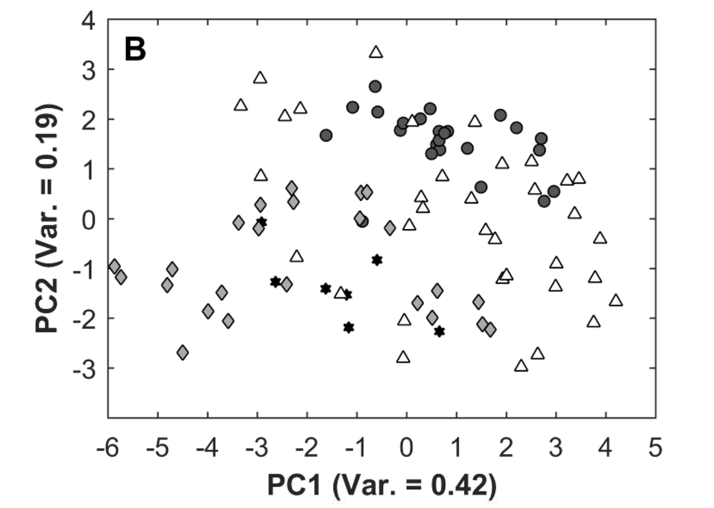
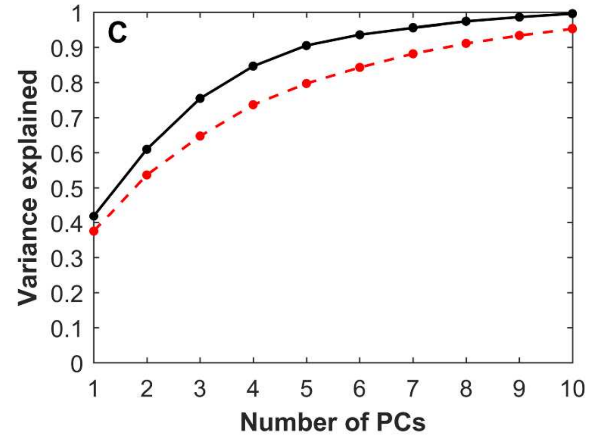

# Datahow-2017-CQAs-Historical-Model-PLS

1. **研究目标和背景**：
   过程数据 &rarr; 产品质量
   
   实验在毫升级（ambr-15®）规模上进行，并研究了
   
   - 不同的培养基补充剂，
   
   - 工艺过程中的pH
   
   - 温度变化
   
   对产品质量的影响。

2. **方法概述**：
   
   - **主成分分析 (PCA)**：首先，通过PCA展示了包括聚集体、片段、带电变体和糖类在内的产品质量属性之间的强相关性。
   - **偏最小二乘回归 (PLS1 和 PLS2)**：接着，使用PLS回归方法，根据过程信息来预测产品质量变量（可以逐一或同时进行）。
   - **建模技术比较**：对比两种建模技术，结果表明单个PLS2模型能够揭示工艺特性与大量产品质量变量之间的相互关系。

3. **动态过程的可预测性**：
   
   - **时间点建模**：为了展示工艺过程预测的动态演化，在不同时间点定义了不同的模型。结果显示，
     - 几个产品质量属性主要由培养基组成驱动，因此可以从工艺过程早期进行预测，
     - 其他质量属性则受到过程参数变化的显著影响。

4. **工具集的应用**：
   
   - **普遍适用的工具集**：案例研究中提出的通用工具集为过程开发中的决策和过程优化提供了可靠的基础。

## Introduction

- Datahow-2015-MVDA-PCA visualized the dynamic change of the interrelationship between the process variables and the produced titer and demonstrated that reliable forecast models can be generated after a few process days(3-4days or all days).

- In this work, **PLSR, SVR, Random Forest and Radial basis function neural networks** were **compared** regarding their capability to predicting various product quality attributes based on **different amounts of historic process information**
1. **预测能力**：
   
   - **一些质量变量可以被预测得相当准确**：
     - 使用PLSR模型，可以比较准确地预测一些质量变量。

2. **解释能力的限制**：
   
   - **变量数量多**：
     
     - 由于考虑了大量的变量，整体关系的解释变得困难。
   
   - **细胞培养运行样本量少且差异大**：
     
     - 培养运行的数量相对较少，而且不同培养运行之间存在很大差异性。
     - 这导致模型在解释培养过程与质量变量之间的关系时受到限制。
- **总体解释**：虽然PLSR模型能够相当准确地预测某些质量变量，但由于变量数量众多和培养运行样本量较少且差异显著，对整体关系的解释能力有限。

 **研究创新点**

- **单一可靠的细胞培养模型**：
  - 该模型能够**在特定时间点，基于整体过程信息**（过程属性，PA）准确**预测一大组**最终产品的质量属性（CQAs）。
  - 这种预测是通过大量设计的毫升级细胞培养实验实现的。

## Experimental procedure

### 实验概述

这项实验通过使用 ambr® 15 系统（最大工作容量 15 mL）对91次实验进行研究，以探索各种补充培养基因素和工艺执行策略对单克隆抗体（mAb）产品质量属性的影响。

### 实验计划与程序

**实验数据集**：

- **总计**：91次实验
- **实验设计**：四个实验块（DoE1 到 DoE4），包括分数阶析因设计和单因素分析（OPAT）

**实验目标**：

- 测试**9种补充培养基**因素在不同浓度下，以及**三种不同的工艺**执行策略。

**研究因素**：

- **培养基因素**：
  - 糖类：半乳糖 (Gal)、蔗糖
  - 氨基酸：天冬酰胺 (Asp)
  - 金属与金属组合：锰 (Mn)、铁 (Fe)、铜-锌 (CuZn)、钴 (Co)
  - 其他：精胺、没食子酸
- **工艺执行策略**：
  - 进料量（两种进料方案，DoE1）
  - 氮气流速（两种氮气流速，DoE3）
  - 温度变化（第6天由36.5°C降至更低水平，DoE1和DoE3）

**细胞培养过程**：

- **扩增**：培养前，在无动物成分的扩增培养基中用透气旋转管扩增细胞至少六次稀释，持续14天。
- **接种**：在 ambr 反应器中以0.2 x 10^6 cells/mL接种，工作体积10-15 mL。
- **培养周期**：14天
- **进料**：化学定义的主进料包含30种成分，补充因素在第3、5、7和10天加入**主进料**中，**葡萄糖从第3天起每天添加。**
- **液体处理**：由机器人系统完成
- **pH控制**：通过添加**二氧化碳和碳酸钠 (1M)** 调节
- **pH调节**：第6天进行pH调整，但由于6天前后存在微小变化**，pH被视为动态过程变量**

**四个DoE的独立执行**：

- DoE实验块逐次进行，独立于本文分析。
- **调整**：
  - 某些条件被淘汰（如DoE2到DoE4中的Gal水平）
  - 新条件被引入（如DoE3中的CuZn和氮气流速）

**离线测量**：

- **仪器**：
  - pH、pCO2、pO2：ABL5 (Radiometer, Denmark)
  - 细胞密度和活性：ViCell® (Beckman Coulter, USA)
  - 葡萄糖、氨和乳酸浓度：Bioprofile 100+ (Nova Biomedical, USA)

**产品纯化与分析**：

- 第14天剩余的培养体积通过小规模 Protein A 柱 (Phytip®, PhyNexus) 纯化
- **分析方法**：
  - **糖基化**：毛细管凝胶电泳与激光诱导荧光检测 (CGE-LIF)
  - **带电变体**：成像毛细管等电聚焦 (iCE280)
  - **聚集体**：高效液相色谱 (SE-HPLC)
  - **低分子量形式**：非还原 SDS-PAGE (Labchip GX II)

### 关键内容概括

- 本实验采用 ambr® 15 系统在毫升级别上对细胞培养过程中的各种**培养基因素**和**工艺参数**进行了研究。
- 设计了四个实验块，使用**分数阶析因设计**和**OPAT分析**方法测试了九个补充培养基因素及三种工艺执行策略。
- 实验提供了大量过程信息，包括多种工艺和产品质量属性，为进一步模型开发和优化提供了丰富的数据。


## Data set and multivariate analysis 

X:

total 7

at days 3, 5, 7, 10, 12, 14

- VCD
- Via
- NH4
- LAC
- GLU
- pCO2
- pO2


Z:

total 12


Y:

total 14 or 19

- titer
- fragments(LMW)
- aggregates(Agg)
- 5 charge variants (C1 to C5)
- 6 or 11 specific glycoforms
  - if 6
    - zero galactose molecules
    - one galactose molecules
    - two galactose molecules
    - afucosylated forms (AF)
    - sialylated forms (Sia)
    - high mannose forms(HM)


旨在利用多变量技术，特别是主成分分析 (PCA) 和偏最小二乘回归 (PLSR) 来分析过程变量与产品质量属性之间的关系。


1. **多变量分析方法**：

- **主成分分析 (PCA)**：
  - 将高维相关数据集表示为新的低维坐标系统，通过潜在变量（主成分）方向上的分数 T 和载荷 P 将数据映射到新系统中。
  - 可用于相关的过程数据（X块）和产品质量数据（Y块）。
- **偏最小二乘回归 (PLSR)**：
  - 将过程数据（Z和X）与质量数据（Y）关联。
  - 通过潜在变量（LVs）方向上的最大协方差来建立Z和X与Y的关系。
  - **PLS1模型**：对单个Y变量进行回归。
  - **PLS2模型**：对多个Y变量同时进行回归。

2. **K-fold, RMSECV, Q^2, optimal number of LVs**

背景：为了避免模型的过拟合问题，在构建偏最小二乘回归 (PLSR) 模型时，采用了 K 折交叉验证 (K = 5)。

- K折交叉验证过程：
  - 将数据集分为5组，每次留出其中1组作为测试集，其余4组作为训练集构建模型。
  - 通过对测试集数据的预测来评估模型的预测能力。
  - 这一过程对5组数据分别重复，最终使用交叉验证的均方根误差 (RMSECV) 和解释的相对方差 (Q²) 来评估模型性能。

 - **RMSECV**（交叉验证均方根误差）：
   - 预测值与观察值之间的平均绝对偏差。
 - **Q²**（交叉验证解释的相对方差）：
   - 预测数据中解释方差与总方差的比值。
   - 取值范围：1代表完美的预测模型，0代表模型只使用Y变量的平均值进行预测。

 - **RMSECV的尺度缩放**：
- 为了比较不同范围的Y变量的RMSECV，将其与各自Y变量的标准差进行缩放。
    - **解释**：
      - 0代表完美模型
      - 1代表模型始终预测平均值
- **潜在变量 (LVs) 数量的选择**：
    - PLS1模型：选择 RMSECV 最小值时对应的 LVs 数量。
    - PLS2模型：选择 Y变量平均缩放 RMSECV 最小值时对应的 LVs 数量。


3. **PLS模型中的变量关系指标**：

- **β系数**：
  - 表示自缩放 X 变量与特定 Y 变量之间的回归系数。
  - 在 PLS1 和 PLS2 模型中，每个 Y 变量都有一组 β 系数，需要分别比较。

- **W*载荷**：
  - 如果首个潜在变量 (LV) 解释了大部分方差，则**对该 LV** 具有绝对、**高 W* 载荷的 X** 变量很可能具有影响力。

- **VIP值**（Projection 中的变量重要性）：
  - 表示 X 变量在潜在变量模型中**解释整个 X 和 Y 空间的相对重要性**。
  - 可用于同时解释整个 X 和 Y 空间的信息。

- **C载荷**：
  - 表示 Y 变量在潜在变量空间的方向。
- 指标之间的比较与优缺点
  - **PLS1模型**：
    - 使用 β 系数、VIP 值和 W*载荷作为变量重要性衡量指标。
  - **PLS2模型**：
    - 当同时分析多个 Y 变量时，β 系数的解释变得复杂。
    - VIP 值可以链接整个 X 和 Y 空间的信息，更加简化解释过程。

- 如果首个 LV 解释了大部分方差，则可以在一个图中联合解释 C 和 W*载荷。
  - 这种方法在变量较多时解释起来较为困难。

- **PLS模型中的变量关系指标**：
  - **β系数**：X 变量对 Y 变量的回归系数。
  - **W*载荷**：表示 X 变量在潜在变量空间的影响力。
  - **VIP值**：衡量 X 变量对 X 和 Y 空间的相对重要性。
  - **C载荷**：表示 Y 变量在潜在变量空间的方向。

- **PLS模型中的解释优缺点**：
  - **PLS1模型**：
    - β系数和 VIP 值在解释单个 Y 变量的影响力时较有用。
  - **PLS2模型**：
    - β系数在多个 Y 变量时解释较为复杂。
    - VIP 值可更好地综合解释 X 和 Y 空间的信息。
  
- **联合解读**：
  - 联合解释 C 和 W*载荷在变量较少时有效，但在变量较多时难以操作。


4. **目标函数采用 AIC，对预测变量数量进行惩罚，以减少变量数量并简化解释。**

```python
# 定义 AIC 计算函数
def calculate_aic(model, X, Y):
    n = len(Y)
    p = model.coef_.size
    predictions = model.predict(X)
    residual_sum_of_squares = np.sum((Y - predictions) ** 2)
    aic = n * np.log(residual_sum_of_squares / n) + 2 * p
    return aic
```


5. **缺失值处理**

**背景**：数据集中的缺失值可以通过整体数据集的一般相关结构进行填补。在此研究中，使用了 **Trimmed Scores Regression (TSR)** 算法来填补展开的 X 和 Y 数据中的缺失值。

1. **Trimmed Scores Regression (TSR) 算法**：
   - **原理**：通过利用数据的整体相关结构，对随机分布的缺失值进行填补。
   - **应用方式**：将 TSR 算法分别应用于展开的 X 和 Y 数据，以避免在回归分析前发生信息交换。

2. **数据预处理**：
   - **自动缩放 (Auto-scaling)**：
     - 先将每个变量居中于其均值，再通过标准差进行缩放。
     - 有助于使不同量级的变量在分析中具有相同的重要性。


以下是 Python 代码示例，演示如何使用 Trimmed Scores Regression (TSR) 算法来填补缺失值，并进行 PLS2 模型的分析。

```python
import numpy as np
from sklearn.cross_decomposition import PLSRegression
from sklearn.preprocessing import StandardScaler
from sklearn.impute import SimpleImputer
from sklearn.decomposition import PCA
from sklearn.model_selection import KFold
from sklearn.metrics import mean_squared_error
import matplotlib.pyplot as plt

# 模拟数据（含缺失值）
np.random.seed(42)
X = np.random.randn(100, 10)
Y = np.random.randn(100, 5)

# 引入缺失值
missing_rate = 0.1
mask = np.random.rand(*X.shape) < missing_rate
X[mask] = np.nan

# 使用 SimpleImputer 和 StandardScaler 进行缺失值填补和数据缩放
imputer = SimpleImputer(strategy='mean')  # 可替换为 TSR 算法
scaler = StandardScaler()

X_imputed = imputer.fit_transform(X)
X_scaled = scaler.fit_transform(X_imputed)

# Y 数据预处理
Y_scaled = scaler.fit_transform(Y)

# PLS2 模型训练
pls2 = PLSRegression(n_components=5)
pls2.fit(X_scaled, Y_scaled)

# 交叉验证评估模型性能
def cross_val_score_pls2(X, Y, n_splits=5):
    kf = KFold(n_splits=n_splits, shuffle=True, random_state=42)
    errors = []

    for train_idx, test_idx in kf.split(X):
        X_train, X_test = X[train_idx], X[test_idx]
        Y_train, Y_test = Y[train_idx], Y[test_idx]

        model = PLSRegression(n_components=5)
        model.fit(X_train, Y_train)
        Y_pred = model.predict(X_test)
        mse = mean_squared_error(Y_test, Y_pred)
        errors.append(mse)
    
    return np.mean(errors)

mse = cross_val_score_pls2(X_scaled, Y_scaled)
print("Cross-Validation Mean Squared Error:", mse)

# PCA 示例
pca = PCA(n_components=2)
X_pca = pca.fit_transform(X_scaled)
plt.scatter(X_pca[:, 0], X_pca[:, 1], c='blue')
plt.xlabel('Principal Component 1')
plt.ylabel('Principal Component 2')
plt.title('PCA - Principal Components Scatter Plot')
plt.show()
```


## Result and Discussion

### **3.1 质量属性的 PCA 分析**：

1. **主成分分析 (PCA) 结果概述**：
   
   - 对14个产品质量属性（titer、LMW、聚集体、5种电荷异构体 C1-C5、6种糖型 HM、G0、G1、G2、AF、Sia）进行了 PCA 分析。
   
     

   - **载荷图（Figure 3A）**：
     
     - 可视化了这些质量属性的相关性结构。
     - 两个主成分 (PCs) 就可以解释总方差的61%。
   
2. **主成分的解释**：
   - **PC1**：
     - 将低加工和中等加工的糖型（HM、AF 和 G0）与高加工糖型（G1、G2、Sia）区分开来。
   - **PC2**：
     - 区分正电荷异构体 C1 和 C2 与中性和负电荷异构体 C3 到 C5。

3. **得分图（Figure 3B）**：
   
   
   
   - **实验区分**：
     - 91次实验根据颜色和形状区分了4个 DoE。
     - **DoE2（深灰色圆形）**：
       - 多数位于 PC1 和 PC2 的正值区间。
  - **DoE3（浅灰色菱形）**：
       - 多数位于 PC1 和 PC2 的负值区间。
   - 这表明这些实验中的因素可能影响了不同的 Y 变量组。
   
4. **方差解释曲线（Figure 3C）**：

   

   - 比较了两种不同的情况：
     1. **第一种情况（红色虚线）**：
        - Y 变量中的糖型由每个特定测量形式组成，共19个 Y 变量。
     2. **第二种情况（黑色实线）**：
        - Y 变量中的糖型由6个特征组组成，共14个 Y 变量。
   - **解释方差的 PC 数量**：
     - 14个 Y 变量：
       - 4个主成分解释80%的方差，6个主成分解释90%的方差。
     - 19个 Y 变量：
       - 5个主成分解释80%的方差，8个主成分解释90%的方差。

5. **结论**：
   - **将产品质量数据作为一个具有代表性且高度相关的信息块，而非单独考虑每个质量属性。**
   - 为后续 PLS2 模型的使用提供了依据。

   - **PCA 分析**：
      - 对14个**产品质量属性进行了 PCA 分析**，两个主成分解释了61%的方差。
      - 低加工与高加工糖型，以及不同电荷异构体通过 PC1 和 PC2 进行区分。

   - **实验区分**：
      - 91次**实验通过得分图**可视化，显示不同 DoE 对质量属性的不同影响。

   - **方差解释曲线**：
      - 比较两种不同的糖型分组方式，确定**主成分数量与方差解释的关系**。

   - **结论**：
      - 将**产品质量数据视为一个高度相关的信息块**，**证明了使用 PLS2 模型的合理性**。

下面是使用 Python 进行 PCA 分析的代码演示。

```python
import numpy as np
import matplotlib.pyplot as plt
from sklearn.decomposition import PCA
from sklearn.preprocessing import StandardScaler
import seaborn as sns

# 模拟数据（替换为真实数据）
np.random.seed(42)
n_samples = 91
n_features = 14
data = np.random.randn(n_samples, n_features)

# 自动缩放
scaler = StandardScaler()
data_scaled = scaler.fit_transform(data)

# 执行 PCA
pca = PCA(n_components=2)
principal_components = pca.fit_transform(data_scaled)

# 载荷图
loadings = pca.components_.T
plt.figure(figsize=(8, 6))
plt.scatter(loadings[:, 0], loadings[:, 1])
for i, feature in enumerate(range(n_features)):
    plt.text(loadings[i, 0], loadings[i, 1], f"Y{feature+1}", fontsize=12)
plt.xlabel("PC1")
plt.ylabel("PC2")
plt.title("Loadings Plot")
plt.grid(True)
plt.show()

# 得分图
plt.figure(figsize=(8, 6))
plt.scatter(principal_components[:, 0], principal_components[:, 1], c='blue', label='DoE')
plt.xlabel("PC1")
plt.ylabel("PC2")
plt.title("Score Plot")
plt.grid(True)
plt.show()

# 方差解释曲线
explained_variance = pca.explained_variance_ratio_.cumsum()
plt.figure(figsize=(8, 6))
plt.plot(range(1, len(explained_variance) + 1), explained_variance, marker='o')
plt.xlabel("Number of Principal Components")
plt.ylabel("Cumulative Explained Variance")
plt.title("Explained Variance Curve")
plt.grid(True)
plt.show()
```

1. **载荷图**：显示了不同质量属性在主成分空间中的相关结构。
2. **得分图**：显示不同 DoE 中实验的区分。
3. **方差解释曲线**：展示不同主成分数量对累计方差的解释能力。


### **3.2 使用 PLS1 单独预测质量属性**

1. **PLS1 模型建立**：
   
   - 为每个质量属性分别构建了 PLS1 回归模型，作为后续与 PLS2 模型对比的基准。
- 为研究生产的单克隆抗体 (mAb) 质量的可预测性，使用了不同的过程历史数据来建模最终产品质量。
   
2. **预测结果与解释**：
   
   - **Figure 4：Q² 值矩阵**：
     
     
     
     - 展示了使用不同时间点的过程信息预测不同质量属性的 Q² 值（方差解释率）。
     - **行**：模型中包含的时间点（如 T3 表示包括第3天的信息）。
     - **列**：各个质量属性。
     - **颜色**：接近100%（黑色）表示可预测性很高，接近0%（白色）表示不可预测。
     
   - **不同质量属性的预测结果**：
  
     - **LMW**：**基于固定过程条件 (Z) 即可预测**，方差解释率为71%，加入过程历史信息无法进一步提高预测性。
     - **大多数其他质量属性**：
       - Titer、Aggregates、C1 和 C3 到 C5、G0 到 G2、HM 和 Sia：在模型中包括第5天的过程信息后，预测性基本保持稳定。
       - Titer、C1 和 C3 到 C5：加入第7天的信息后进一步提高预测性。
     - **C2 和 AF**：需要更晚阶段的信息。
   
3. **预测准确性总结**：
   - **高准确性（>80%）**：Titer、C1、C3、C4 和 G2
   - **中等准确性（~70%）**：Aggregates、LMW、C2、G0、G1 和 HM
   - **较弱预测性**：C5、AF 和 Sia

4. **相关性结构影响**：
   
- 相互相关的变量组预测趋势相似，如 C1 和 C3、G0、G1 和 G2。
   
5. **固定过程条件的局限性**：
   - **固定 Z 条件通常不足以建模最终产品质量，过程变量信息很重要。**
   - **关键过程变量**：
     - 第6天的 pH 适应和温度变化对 Titer 和电荷异构体非常重要。
     - 从第3天开始的补充因子和进料方案，以及第6天的温度变化引起了动态响应。

6. **非线性关系**：
   
- 固定 Z 条件和质量属性之间的关系可能是非线性的，**额外的时间依赖变量（X）能更好地再现这一行为。**
   
7. **解释简化**：
   
   - **鉴于大量相关的质量属性（CQAs），有必要通过单一模型简化解释**，将过程信息与高维质量属性连接起来。
   
   - **PLS1 模型的预测性能**：
      - 构建 PLS1 模型对每个质量属性进行单独预测，确定其预测性能（Q² 值）。
   
   - **不同质量属性的预测性**：
      - 不同质量属性在不同时间点的过程信息下具有不同的预测模式。
      - LMW 在**固定过程条件**下可预测，其他**大多数属性需要包括第5天或第7天的信息**。
   
   - **解释简化目标**：
      - 鉴于质量属性之间的相关性结构，有必要通过单一模型（PLS2）简化解释，以连接过程信息与高维质量属性。

下面是使用 Python 进行 PLS1 分析的代码示例。

```python
import numpy as np
import matplotlib.pyplot as plt
from sklearn.cross_decomposition import PLSRegression
from sklearn.metrics import r2_score
from sklearn.preprocessing import StandardScaler
import seaborn as sns

# 模拟数据（替换为真实数据）
np.random.seed(42)
n_samples = 91
n_predictors = 20
n_quality_attrs = 14

X = np.random.randn(n_samples, n_predictors)  # 过程信息
Y = np.random.randn(n_samples, n_quality_attrs)  # 质量属性

# 进行 PLS1 回归并计算 Q²
def pls1_predict(X, Y, n_components=5):
    pls = PLSRegression(n_components=n_components)
    pls.fit(X, Y)
    Y_pred = pls.predict(X)
    return r2_score(Y, Y_pred, multioutput='raw_values')

# 自动缩放数据
scaler = StandardScaler()
X_scaled = scaler.fit_transform(X)

# 不同时间点的过程数据
process_blocks = {
    'Z': X_scaled[:, :5],
    'T3': X_scaled[:, :10],
    'T5': X_scaled[:, :15],
    'T7': X_scaled[:, :20]
}

# 为每个质量属性构建 PLS1 模型
q2_values = {}
for time_point, X_block in process_blocks.items():
    q2_values[time_point] = pls1_predict(X_block, Y)

# 可视化结果
plt.figure(figsize=(10, 6))
sns.heatmap(pd.DataFrame(q2_values).T, annot=True, fmt=".2f", cmap="Blues")
plt.xlabel("Quality Attributes")
plt.ylabel("Process Time Points")
plt.title("Q² Values for Different Quality Attributes Over Time")
plt.show()
```

1. **Q² 矩阵**：显示了不同时间点的过程信息对不同质量属性的预测性能。


