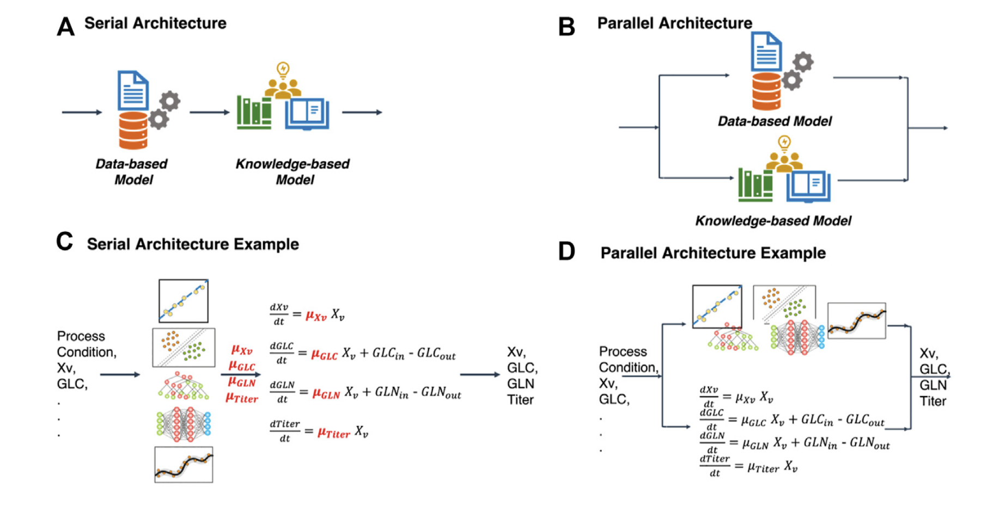
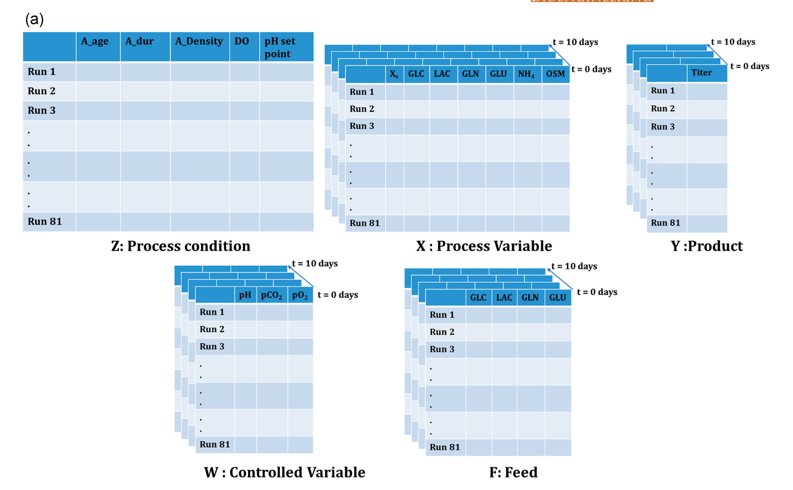
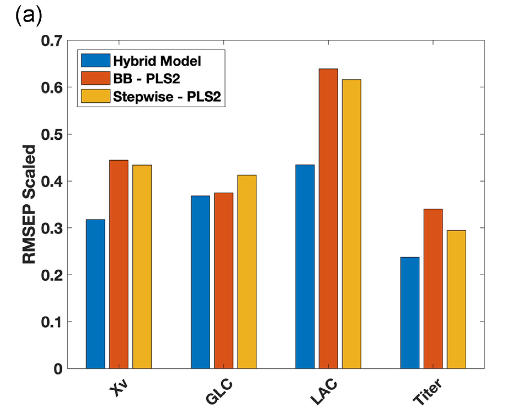
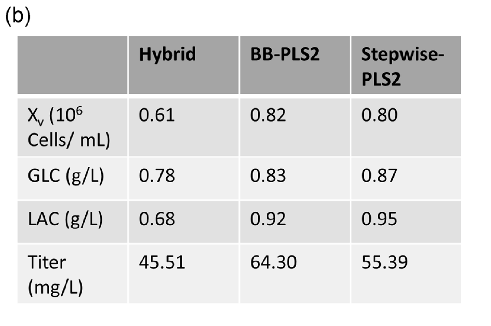
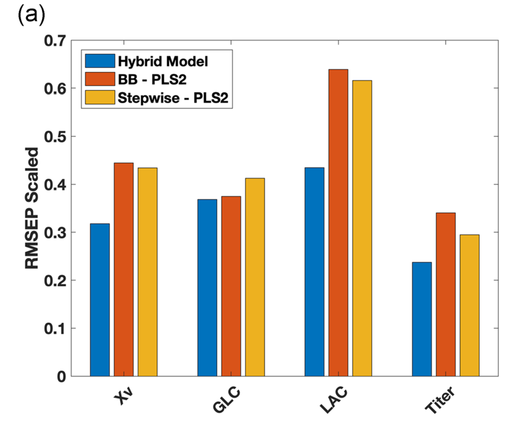
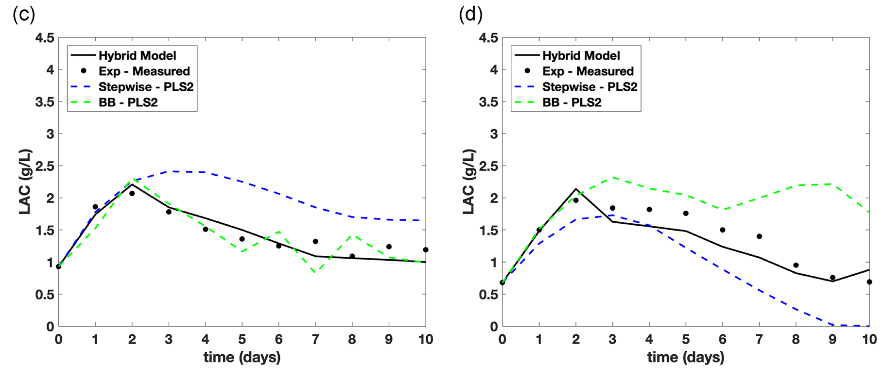
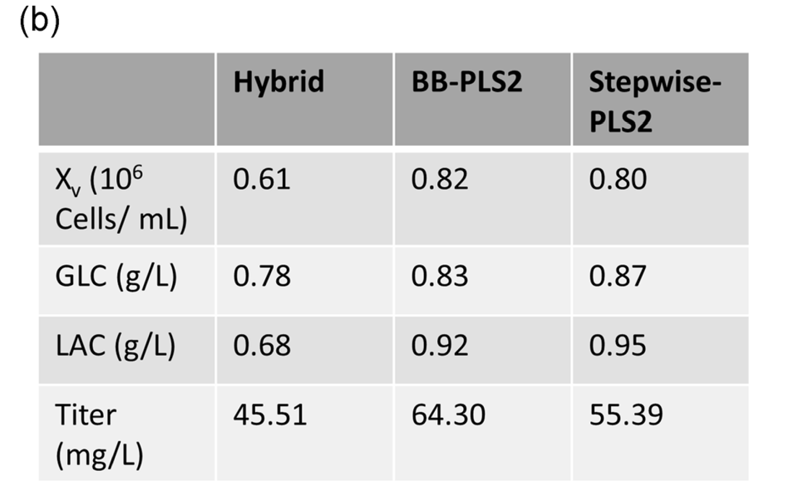

## **Abstract**

1. **挑战与解决方案：**
   
   - **挑战：** 建立适用于所有哺乳动物细胞培养过程的通用机理模型因缺乏对代谢网络和反应途径的完整理解而具有挑战性。
   - **解决方案：** 混合模型技术利用机理模型和数据驱动模型的协同作用，克服了单一方法的局限。

2. **研究发现与优势：**
   
   - 使用3.5升间歇供料实验的数据集进行分析，混合模型在预测不同过程变量的时间演变方面，相比传统统计模型展示出更高的准确性和外推能力。
   - 混合模型展现了优越的预测结果，包括更高的精度和稳健性，尤其在只利用初始和过程条件进行预测时更为明显。

3. **未来应用的重要性：**
   
   - 强调了混合模型在基于模型的过程优化和实验设计中的重要作用，尤其是在治疗蛋白生产领域。
   - 混合模型的应用不仅可以提高预测的准确性，还有助于定义更为稳健的过程设计空间，减少实验需求，加速产品开发流程。


## **Introduction**

**数据驱动模型（黑盒模型）：**

- **依赖性**：这类模型完全依赖于数据，通过输入和输出变量之间的统计相关性来捕捉相关的过程行为。
- **效率与简易性**：在算法性质简单且需求明确的情况下，这些模型可以高效且简单地生成，即使在专业知识有限的情况下也是如此。
- **数据需求**：需要大量高质量的数据来训练可靠的模型，但这些模型通常不适用于未被探索的区域。
- **功能**：可用于评估变量的重要性和相关性，识别过程噪声和异常的来源，并阐明非直观的相互关系，从而提出新的见解。
- **局限性**：这类模型不会生成新的过程知识。

**基于第一原理的模型（FPMs）：**

- **基础**：这些模型基于物理、化学和生物学原理，涵盖质量和能量平衡、热力学、传输现象和反应动力学方案。
- **表达形式**：通常以微分方程（常微分或偏微分）和代数方程的混合系统形式表达。
- **参数特性**：与数据驱动模型不同，FPMs中的参数具有明确的物理意义，因此通常可以在不依赖于具体过程的情况下预先估计。
- **可靠性与外推能力**：只要能捕捉到相关现象，这些模型就显示出高度的可靠性和良好的外推能力。
- **时间消耗与局限性**：模型的生成既耗时又复杂，当底层现象不被完全理解或缺少用于参数估计的变量测量时，创建FPMs变得不可能。

**总结**：

- **数据驱动模型**以其高效和简易的特点，在数据充足且问题定义明确时非常有效，但在未探索的区域和生成新过程知识方面存在局限。
- **基于第一原理的模型**则提供了一种基于深层物理、化学原理的可靠解决方案，适合在已知物理规律的情况下进行精确的问题处理，但其生成复杂且在某些情况下可行性受限。


**混合模型概念：**

- **定义：** 混合模型结合了机理模型框架和数据驱动方法，使用数据驱动方法来估计方程中的未知部分，并能灵活适应不同情境。
- **优势：** 机理结构的嵌入提高了模型的稳健性和外推能力，减少了过度拟合和所需数据量。
- **简化管理：** 数据驱动部分简化了系统复杂性的管理和模型参数及敏感度的估计。

**技术演进与应用历史：**



- **不同架构：** 
  - **串行方法(A, C)**：使用黑盒模型估计机理方程中的未知项。
  - **并行方法(B, D)**：使用黑盒模型减少机理模型的错误。
  - **混合方法**：使用机理模型生成数据来训练黑盒模型。

**应用范例：**

- **生物工程和化学工程的应用：**
  - 生物过程工程的例子包括普通生物反应器模型、青霉素生产过程、酵母和啤酒生产。
  - 化学工程的应用包括使用人工神经网络（ANNs）、支持向量回归、非线性偏最小二乘（PLS）等多种数据驱动模型。

**应用领域：**

- **模型预测控制(MPC)：** 混合模型已成功应用于模型预测控制，参考文献包括Sommeregger等人（2017年）和Von Stosch等人（2012年）的研究。
- **过程监测与预测(Process Monitoring)：** 在过程监测和预测方面，Von Stosch等人（2016年）和Zorzetto与Wilson（2003年）的工作体现了混合模型的有效性。
- **迭代过程优化(Iterative process optimization)：** 在迭代过程优化领域，Teixeira等人在2005年、2006年和2007年的系列研究中详细探讨了这一应用。
- **下游色谱过程：** Creasy等人（2015年）在治疗性蛋白制造的背景下，展示了混合模型在下游色谱过程中的应用。

**混合模型的构建与性能评估：**

- **模型构建：** 在本研究中，开发了一个基于人工神经网络（ANNs）和质量平衡方程的混合过程模型，用于预测单克隆抗体生产中间歇供料哺乳动物细胞培养生物反应器的关键状态变量的时间演变。
- **性能评估：** 所得混合模型的性能与最新的统计模型进行了比较，包括模型的准确性、插值和外推能力，以及在过程优化和实验设计中的潜在应用。


## **Dataset**

### **Data type**

- **数据来源**：本研究中开发的混合模型使用了最初由Rouiller等人（2012年）发布的细胞培养过程数据集进行测试。
- **实验设计**：数据集包括81个间歇供料runs，每次run的工作体积为3.5升，持续时间为10天。实验通过操纵三种种子条件（N-1扩增过程细胞密度、持续时间和细胞年龄）和两种过程条件（pH和DO设定点）进行。
- **参数变化**：
  - 接种密度: 扩增N-1过程细胞密度在5.51 × 10^6至7.17 × 10^6细胞/mL之间变化。
  - 细胞年龄: 在23至35天之间变化。
  - 扩增持续时间: 为4天或5天。
  - pH设定点: 在6.7到7.2之间变化
  - 溶解氧（DO）设定点: 在10%至70%之间变化。

- **Z矩阵**：表示所有设计条件的二维矩阵，行和列分别代表运行和操纵变量。
  - A_age
  - A_dur
  - A_Density
  - DO
  - pH
- **X矩阵**：表示动态变化的、非控制的过程变量（如可见细胞密度、葡萄糖浓度、乳酸、谷氨酰胺、谷氨酸和氨的浓度及渗透压），这是一个具有额外时间维度的三维矩阵。
  - Vcd
  - Glc
  - Lac
  - Gln
  - Glu
  - NH4
  - Osm
- **F矩阵**：组织在培养时间内添加到间歇供料中的不同代谢物的质量，这是一个与X矩阵维度相同的三维矩阵。
  - Glc
  - Gln
  - Glu
  - Lac
- **W矩阵**：建立的另一个过程信息矩阵，包括所有被控制以保持在特定设定点附近的变量，如pH、二氧化碳和氧的部分压力，这些变量每天测量。
  - pH,
  - pCO2
  - pO2
- **Y矩阵**：**产品滴度在0天至运行结束的交替日（即第2、4、6、8和10天）测量，对未量化的日子（即第1、3、5、7和9天）使用logistic interpolation进行估算**。
  - Titer
  
  - **logistic interpolation**
    
    逻辑插值（Logistic Interpolation）是一种在给定数据集上应用逻辑函数模型来估算未知数据点的方法。逻辑函数通常用于描述增长过程中的饱和现象，其形状类似于"S"形曲线。在Python中，可以使用`SciPy`库中的优化工具来实现逻辑插值。
    
    以下是使用Python进行逻辑插值的一个基本示例，我们将通过定义一个逻辑函数并使用`curve_fit`方法从`scipy.optimize`来拟合给定的数据点。
    
    ### 步骤 1: 定义逻辑函数
    
    逻辑函数通常定义为：
    
    $f(x) = \frac{L}{1 + e^{-k(x-x_0)}}$
    
    其中：
    - \( L \) 是曲线的最大值，
    - \( k \) 是曲线的陡峭程度，
    - \( x_0 \) 是曲线的中点。
    
    ### 步骤 2: 准备数据
    
    假设你有一组实验数据，你需要在这组数据上应用逻辑插值。
    
    ### 步骤 3: 使用 curve_fit 进行参数拟合
    
    利用`curve_fit`从`scipy.optimize`可以很方便地找到逻辑函数的最佳参数。
    
    ### 示例代码
    
    ```python
    import numpy as np
    from scipy.optimize import curve_fit
    import matplotlib.pyplot as plt
    
    # 定义逻辑函数
    def logistic(x, L, k, x0):
        return L / (1 + np.exp(-k * (x - x0)))
    
    # 示例数据 (x值和y值)
    xdata = np.array([0, 1, 2, 3, 4, 5, 6, 7, 8, 9])
    ydata = np.array([0.1, 0.15, 0.3, 0.6, 1.1, 2, 3.2, 4.5, 5.8, 6.0])
    
    # 使用curve_fit进行逻辑函数拟合
    params, covariance = curve_fit(logistic, xdata, ydata, p0=[max(ydata), 1, np.median(xdata)])
    
    # 打印最优参数
    print("L =", params[0])
    print("k =", params[1])
    print("x0 =", params[2])
    
    # 绘制数据点
    plt.scatter(xdata, ydata, color='red', label='Data Points')
    
    # 绘制拟合曲线
    xmodel = np.linspace(min(xdata), max(xdata), 300)
    ymodel = logistic(xmodel, *params)
    plt.plot(xmodel, ymodel, label='Fitted Curve')
    
    plt.xlabel('x')
    plt.ylabel('y')
    plt.title('Logistic Curve Fit')
    plt.legend()
    plt.show()
    ```
    
    在这个示例中：
    
    - 我们定义了一个逻辑函数`logistic`。
    - 准备了一些模拟数据`xdata`和`ydata`。
    - 使用`curve_fit`进行了参数拟合，并得到了最佳拟合参数。
    - 使用`matplotlib`展示了数据点和拟合曲线。
    
    逻辑插值非常适合于那些数据随着时间（或其他因素）逐渐接近某个极限值的情况，常见于生物学和化学过程建模等领域。


### **Data type function**

- **矩阵Z, X, W的功能**：
  
  
  
  - **Z矩阵**：在整个模型运行期间保持不变，表示固定的实验条件或参数。
  - **X矩阵**：动态信息，反映了随时间变化的过程变量，如细胞密度或化学物质浓度，这些在黑盒模型中被机理框架计算。
  - **W矩阵**：也包含动态信息，通常涉及可直接测量的实验参数，如pH和氧的部分压力等。

- **模拟和计算过程**：
  
  - 每天培养过程中相关的质量平衡是如何整合的，以及如何模拟添加饲料来为下一天的过程做准备。
    - **新起点的设置**：
      每次添加饲料后，原有的质量平衡会发生变化，需要重新计算和设定新的起点，以便于下一天的培养可以在更新后的条件下继续进行。
  - Y矩阵，尽管包含了滴度信息，但在模型计算中并未使用，因为滴度由模型直接计算，故Y矩阵扮演了数据监控而非计算的角色。
- **数据插补**：
  
- 文中提到大约4%的数据缺失，并使用了削减分数回归(Trimmed Score Regression)算法进行数据插补，这是一种用于处理缺失数据的统计技术，以确保数据完整性，使模型预测更为准确。
  
- Trimmed Score Regression: 是一种处理异常值和偏差数据的回归技术，它通过修剪（削减）部分数据点的贡献来提高统计估计的鲁棒性。此方法特别适用于数据集中存在异常值或非典型观测值时，有助于得到更为稳健的回归结果。

    实现Trimmed Score Regression通常涉及以下几个步骤：

1. **拟合初始模型**：
   首先对数据拟合一个标准的回归模型（如线性回归），以获得初步的参数估计。

2. **计算残差**：
   基于初步模型计算每个数据点的残差（实际观测值与模型预测值之间的差异）。

3. **残差排序**：
   将所有数据点的残差按绝对值大小进行排序。

4. **数据削减**：
   移除具有最大残差的一定比例的数据点，这些通常被认为是潜在的异常值或极端观测值。

5. **重新拟合模型**：
   使用剩余的数据点重新拟合回归模型。

6. **迭代优化**（可选）：
   这个过程可以迭代进行，每次迭代中进一步调整削减的数据点，直到满足停止准则（如参数估计的变化非常小）。

下面是一个使用Python进行Trimmed Score Regression的简单示例。我们将使用`statsmodels`库来拟合线性回归，并手动实现数据削减的步骤：

```python
import numpy as np
import statsmodels.api as sm

# 生成一些测试数据
np.random.seed(0)
X = np.linspace(0, 10, 100)
y = 3 * X + np.random.normal(0, 2, 100) + 20 * np.random.binomial(1, 0.05, 100)  # 添加一些异常值

# 添加常数项
X = sm.add_constant(X)

# 拟合初始线性回归模型
model = sm.OLS(y, X).fit()

# 计算残差
residuals = np.abs(model.resid)

# 排序残差并找到削减点（例如削减最大的5%的数据点）
cutoff = np.percentile(residuals, 95)

# 保留残差小于削减点的数据
X_trimmed = X[residuals < cutoff]
y_trimmed = y[residuals < cutoff]

# 使用削减后的数据重新拟合模型
trimmed_model = sm.OLS(y_trimmed, X_trimmed).fit()

# 打印两个模型的参数进行比较
print("Original model params:", model.params)
print("Trimmed model params:", trimmed_model.params)
```

- 这种削减方法会改变数据的分布，因此在进行削减之前应当仔细考虑削减比例。
- 削减分数回归是一种非参数方法，适用于**有较强异常值的数据集**。
- 实际应用中可能需要根据具体情况调整削减的策略和比例。


### **Data Split and Usuage Methodology**

1. **数据划分**：数据集被划分为校准集（训练集）和测试集，比例通常是80%用于训练，20%用于测试。这种划分是为了在一部分数据上训练模型，而另一部分数据用来评估模型的泛化能力。

2. **模型训练**：使用校准集来训练模型。在这个阶段，可能会使用多种不同的模型或算法。

3. **超参数调整**：通过交叉验证来调整模型的超参数。交叉验证是一种统计学方法，用来评估并改善模型对独立数据集的预测能力，它通过多次分割数据集并重复训练模型来工作。

4. **性能评估**：使用根均方误差（RMSEP）作为性能指标来评估不同模型的预测精度。RMSEP是实际观测值与模型预测值之间差的平方的平均值的平方根，它提供了误差的量度，较低的RMSEP值通常意味着更好的模型性能。

以下是使用Python进行上述过程的示例代码，包括数据划分、模型训练、交叉验证和性能评估：

```python
import numpy as np
from sklearn.datasets import make_regression
from sklearn.model_selection import train_test_split, GridSearchCV
from sklearn.ensemble import RandomForestRegressor
from sklearn.linear_model import Ridge
from sklearn.metrics import mean_squared_error
from sklearn.svm import SVR

# 生成一些回归数据
X, y = make_regression(n_samples=100, n_features=10, noise=0.1)

# 划分数据集
X_train, X_test, y_train, y_test = train_test_split(X, y, test_size=0.2, random_state=42)

# 设置不同的模型配置
models = {
    'RandomForestRegressor': {
        'model': RandomForestRegressor(),
        'params': {
            'n_estimators': [50, 100],
            'max_depth': [10, 20]
        }
    },
    'Ridge': {
        'model': Ridge(),
        'params': {
            'alpha': [0.1, 1.0]
        }
    },
    'SVR': {
        'model': SVR(),
        'params': {
            'C': [0.1, 1, 10],
            'kernel': ['rbf']
        }
    }
}

# 使用GridSearchCV进行交叉验证和超参数调整
for model_name, model_setup in models.items():
    grid_search = GridSearchCV(model_setup['model'], model_setup['params'], cv=5, scoring='neg_mean_squared_error')
    grid_search.fit(X_train, y_train)
    print(f"Best parameters for {model_name}: {grid_search.best_params_}")
    y_pred = grid_search.predict(X_test)
    rmsep = np.sqrt(mean_squared_error(y_test, y_pred))
    print(f"{model_name} RMSEP: {rmsep:.4f}")

```

这段代码使用了随机森林回归模型，它是一种广泛使用的强大的机器学习模型，适用于回归和分类问题。在实际应用中，可能需要根据具体问题调整模型类型和参数。


## **Hybrid Model Design**

当前工作采用了一种串行架构的混合建模方法（Thompson & Kramer, 1994），如图1b的示意流程图所示。代表细胞培养的方程体系是基于质量平衡建立的，如下所报告：  
dCi/dt = μi(t)C1(t)，其中T+ ≤ t < T+1,  
其中T从培养第0天变化到第9天，T+表示喂料后的时间点，Ci和μi分别是第i种物种的浓度和特定速率，i代表Xv（可行细胞密度）、GLC（葡萄糖）、LAC（乳酸）、GLN（谷氨酰胺）、GLU（谷氨酸）、NH4（氨）、Osm（渗透压）和滴度。因此，有八个建模目标，C1代表Xv。由于对细胞代谢的理解不完全，特定速率常常事先未知。这种知识的缺乏通过图1b中示意的黑箱模型得到补偿，该模型基于培养实验的信息估计特定速率。  
μ(t) = f(Xv, GLC(t), LAC(t), GLN(t), GLU(t), OSM(t), Z, W(t), NH4(t)),  
任何符合方程(2)所述形式的回归工具都可以用来将过程因子和过程变量测量映射到μs。特别是，本研究中使用了一种前馈单隐层人工神经网络，它自动考虑了由于其非线性结构而导致的输入的不同转换。ANN公式和激活函数的详细解释可以在（Von Stosch等人，2016年）的文献中找到。本质上，积分和优化是同时进行的，以优化神经网络权重，使测量值和模型预测浓度值之间的差异最小化。积分是针对一天的时间跨度进行的，最终，喂料模拟如下：
Ci,init(T) = Ci(T) + Feedi(T)/V,  
其中Ci(T)代表喂料前的浓度值，也对应于测量值，而Ci,init(T)代表从T到T+1积分方程(1)的初始条件，Feedi(T)是喂入的物种i的质量，V是反应器容积。使用二范数正则化目标函数（Yang等人，2011）来避免神经网络权重的过拟合，并使用五折交叉验证（Hastie, Tibsharani, & Friedman, 2009）来确定最优节点数和正则化参数。

- **模型建立**：首先建立了一个基于质量平衡的微分方程系统，这些方程描述了培养过程中各种化学物质的浓度变化。
- **黑箱模型补偿**：由于缺乏对细胞代谢完整的理解，模型中的某些参数（如化学物质的变化速率）可能无法直接测量或预测。为此，使用黑箱模型（如人工神经网络）来估计这些参数。
- **神经网络优化**：

使用人工神经网络来处理非线性关系，并优化网络权重，以减少实际测量值和模型预测值之间的差异。

- **正则化和交叉验证**：为了避免过拟合，使用正则化技术，并通过交叉验证来选择最优的模型配置，如网络的层数和节点数量。

下面是一个简化的Python代码示例，展示如何使用`scikit-learn`库训练一个具有正则化的简单神经网络来拟合数据：

```python
import torch
import torch.nn as nn
from torchdiffeq import odeint
from sklearn.model_selection import KFold
from torch.optim import Adam

class RateModel(nn.Module):
    def __init__(self, hidden_size):
        super(RateModel, self).__init__()
        self.fc1 = nn.Linear(8, hidden_size)
        self.fc2 = nn.Linear(hidden_size, 8)

    def forward(self, t, y):
        logits = self.fc1(y)
        rates = torch.relu(logits)
        output = self.fc2(rates)
        return output

def cell_culture(t, y, model):
    rates = model(t, y)
    dydt = rates * y[0]  # Assuming y[0] is C1
    return dydt

def simulate_feed_addition(y, feed_schedule, day, V):
    # 模拟喂料，调整初始条件
    if day in feed_schedule:
        feed_vector = torch.tensor(feed_schedule[day], dtype=torch.float32)
        y += feed_vector / V
    return y

def mse_loss_with_regularizer(model, X, y_true, t_span, feed_schedule, V, regularization_strength):
    y = X.clone()
    for i in range(1, len(t_span)):
        day = int(t_span[i])
        y = simulate_feed_addition(y, feed_schedule, day, V)
        y_pred = odeint(cell_culture, y, torch.tensor([t_span[i-1], t_span[i]]), method='dopri5', args=(model,))
        y = y_pred[-1]
    mse_loss = torch.mean((y - y_true) ** 2)
    l2_norm = sum(p.pow(2.0).sum() for p in model.parameters())
    return mse_loss + regularization_strength * l2_norm

# Example setup
t_span = torch.linspace(0, 9, steps=10)  # 10 days
X = torch.randn((8,))  # Example initial state
y_true = torch.randn((8,))  # Example true final state
V = 1.0  # Reactor volume
feed_schedule = {i: [0.05] * 8 for i in range(1, 10)}  # Daily feeding

# Define cross-validation
kf = KFold(n_splits=5)
hidden_sizes = [10, 20, 50]  # Example sizes of hidden layer
best_loss = float('inf')
best_model = None

for train_index, test_index in kf.split(X.unsqueeze(0)):
    X_train, X_test = X[train_index], X[test_index]
    y_train, y_test = y_true[train_index], y_true[test_index]
    
    for size in hidden_sizes:
        model = RateModel(hidden_size=size)
        optimizer = Adam(model.parameters(), lr=0.01)
        for epoch in range(100):  # Number of epochs for demonstration
            optimizer.zero_grad()
            loss = mse_loss_with_regularizer(model, X_train, y_train, t_span, feed_schedule, V, 0.01)
            loss.backward()
            optimizer.step()

        # Validate model
        with torch.no_grad():
            val_loss = mse_loss_with_regularizer(model, X_test, y_test, t_span, feed_schedule, V, 0.01)
            if val_loss < best_loss:
                best_loss = val_loss
                best_model = model

print(f"Best model with hidden size: {best_model.fc1.out_features} and loss: {best_loss}")

```

在这个示例中，我们使用了`MLPRegressor`来创建一个单隐层的前馈神经网络，并通过调整正则化参数`alpha`来控制模型的复杂度，从而防止过拟合。此外，我们还使用了交叉验证来评估模型的性能。


## **Black Box Model**

两种统计参考模型，这些模型用于与混合模型进行性能比较。这些模型的构建基于与混合模型相同的初始信息，即在预测动态过程行为时使用的信息矩阵X（t=0）、W（t=0）、Z和F。

### **BB-PLS**

这里描述的第一个模型称为BB-PLS2。其中Z和初始条件（X(t=0)和W(t=0)）作为输入，而该天对应的八个目标变量作为输出。每天训练一个独立的PLS2模型。

假设我们有10天的数据，并且每一天都有一个独立的输出集（八个目标变量），而输入变量包括Z、X(t=0)和W(t=0)。我们将使用假数据来演示这一过程：

```python
import numpy as np
from sklearn.cross_decomposition import PLSRegression
from sklearn.metrics import mean_squared_error

# 模拟数据生成
def generate_daily_data(days, samples_per_day, input_features, output_targets):
    Z = np.random.normal(size=(days, samples_per_day, input_features))  # Z矩阵
    X0 = np.random.normal(size=(days, samples_per_day, input_features))  # X(t=0)初始条件
    W0 = np.random.normal(size=(days, samples_per_day, input_features))  # W(t=0)初始条件
    Y = np.random.normal(size=(days, samples_per_day, output_targets))  # 每天的输出目标
    return Z, X0, W0, Y

# 设定参数
days = 10
samples_per_day = 100
input_features = 3
output_targets = 8

# 生成模拟数据
Z, X0, W0, Y = generate_daily_data(days, samples_per_day, input_features, output_targets)

pls_models = []
rmse_scores = []

# 每一天训练一个PLS模型
for day in range(days):
    # 将Z, X0, W0堆叠为一个大的输入矩阵
    X_train = np.hstack((Z[day], X0[day], W0[day]))
    Y_train = Y[day]
    
    # 创建PLS模型，假设使用2个成分
    pls = PLSRegression(n_components=2)
    pls.fit(X_train, Y_train)
    pls_models.append(pls)
    
    # 模型评估：假设测试数据与训练数据相同（实际情况中应该用独立的测试集）
    Y_pred = pls.predict(X_train)
    rmse = np.sqrt(mean_squared_error(Y_train, Y_pred))
    rmse_scores.append(rmse)

    print(f"Day {day+1}, RMSE: {rmse:.4f}")

# 可选：输出最佳模型的信息
best_model_day = np.argmin(rmse_scores)
print(f"Best model is from Day {best_model_day+1} with RMSE {rmse_scores[best_model_day]:.4f}")
```


1. **数据生成**：生成了每天的模拟数据，其中每天都有独立的输入（Z, X0, W0）和输出（Y）。
2. **模型训练**：对每一天的数据使用PLS模型进行训练。输入矩阵由Z, X(t=0), 和W(t=0)组成，输出矩阵是当天的八个目标变量。
3. **模型评估**：用均方根误差（RMSE）评估每个模型的预测性能。
4. **Optimal Components Search**: For each day, the code tests different numbers of latent variables (from 1 to 10). It uses cross-validation to evaluate the performance (using RMSE) of each configuration.
5. **Selection of Optimal Components**: The number of components that results in the lowest average RMSE across the folds is selected as the optimal for that day.


### Stepwise-PLS2

第二个模型，称为逐步PLS2（Stepwise-PLS2），是一个单一的PLS2模型，用于利用特定时间点T的X和W来预测目标变量的即时日变化ΔY(T)。换句话说，这个映射关系是：[X(T), W(T)] → ΔY(T) = Y(T+1) - Y(T)。这意味着时间T从第0天变化到第9天。因此，Stepwise-PLS2模型的输入和输出实质上包含了81×9（等于729）行，即81次运行乘以每次运行对应的9天时间点。但值得注意的是，在预测阶段，模型仅给定T=0时的输入。从而，如方程（5）所示，由模型预测T=1时的值，然后该值作为输入用于预测下一个时间点T=2，以此类推。其中ΔY(T)由Stepwise-PLS2模型预测。


实现Stepwise-PLS2模型，并采用五折交叉验证来选择最优的潜变量数量。下面的代码示例实现了这个过程：

```python
import numpy as np
from sklearn.cross_decomposition import PLSRegression
from sklearn.model_selection import KFold
from sklearn.metrics import mean_squared_error

# 模拟数据生成函数
def generate_time_series_data(samples, days, features, targets):
    X = np.random.normal(size=(samples, days, features))
    Y = np.random.normal(size=(samples, days, targets))
    return X, Y

# 计算ΔY(T)
def calculate_deltas(Y):
    return np.diff(Y, axis=1)  # 计算沿着时间轴的差分

# 数据参数
samples = 81
days = 10
features = 3
targets = 8

# 生成数据
X, Y = generate_time_series_data(samples, days, features, targets)
Delta_Y = calculate_deltas(Y)

# 模型配置和训练
kf = KFold(n_splits=5)
best_rmse = float('inf')
best_n_components = 0

for n_components in range(1, 11):
    rmse_scores = []
    
    for train_index, test_index in kf.split(X[:, 0, :]):  # 使用第0天的数据进行交叉验证
        X_train, X_test = X[train_index, 0, :], X[test_index, 0, :]
        Delta_Y_train, Delta_Y_test = Delta_Y[train_index, 0, :], Delta_Y[test_index, 0, :]
        
        pls = PLSRegression(n_components=n_components)
        pls.fit(X_train, Delta_Y_train)
        Delta_Y_pred = pls.predict(X_test)
        rmse = np.sqrt(mean_squared_error(Delta_Y_test, Delta_Y_pred))
        rmse_scores.append(rmse)
    
    average_rmse = np.mean(rmse_scores)
    if average_rmse < best_rmse:
        best_rmse = average_rmse
        best_n_components = n_components

print(f"Best number of components: {best_n_components} with RMSE: {best_rmse:.4f}")

# 使用最佳组件数重新训练模型
pls_model = PLSRegression(n_components=best_n_components)
pls_model.fit(X[:, 0, :], Delta_Y[:, 0, :])  # 使用全部数据重新训练

# 预测每天的ΔY，并递归更新Y
predicted_Y = np.zeros((samples, days, targets))
predicted_Y[:, 0, :] = Y[:, 0, :]  # 初始条件

for day in range(1, days):
    # 用前一天的Y和X预测ΔY
    Delta_Y_pred = pls_model.predict(X[:, day-1, :])
    # 更新Y的预测值
    predicted_Y[:, day, :] = predicted_Y[:, day-1, :] + Delta_Y_pred

# 输出最终预测结果的一些示例
print("Predicted Y for the last day (sample 1):")
print(predicted_Y[0, -1, :])

# 计算整个预测周期的总体RMSE
total_rmse = np.sqrt(mean_squared_error(Y.reshape(-1), predicted_Y.reshape(-1)))
print(f"Total RMSE over all days: {total_rmse:.4f}")
```

1. **数据生成**：使用生成函数创建模拟的时间序列数据X和Y。
2. **模型训练**：使用第一天的数据训练PLS模型，目标是学习预测ΔY。
3. **递归预测**：从第一天的实际Y值开始，使用模型预测的ΔY更新每天的Y值。
4. **总体性能评估**：计算模型在整个预测周期中的总体RMSE，以评估模型性能。


### 模型比较

- **误差比较**：在比较中，混合模型显示出对于Xv、LAC和titer的最低标准化均方根预测误差（scaled RMSEP）。
- **误差标准化**：误差是根据每个变量在所有校准运行和所有时间点的标准差进行标准化的。

#### 关键变量预测表现

- **Xv的预测**：
  
  
  
- **混合模型**：Xv的预测标准化误差为0.3。
  
  - **统计模型**：预测误差约为0.45。
  
    
  
  - 在绝对误差上，这分别对应于0.61和0.80×10^6 cells/ml。
  
- **乳酸（Lactate）浓度预测**：
  
  
  
- **混合模型**：标准化误差约为0.45。
  
  - **BB – PLS2和Stepwise – PLS2模型**：分别为0.65和0.7的显著更高的标准化误差。
  
    
  
  - 混合模型能较好地预测两个示例实验运行的实际剖面，而Stepwise – PLS2从第二天开始就无法预测实际剖面。
  
- **目标蛋白（titer）预测**：
  
  
  
  - **混合模型**：titer的标准化RMSEP为0.2，绝对RMSEP约为46 mg/L，接近30 mg/L的预期分析误差。
  - **BB – PLS2和Stepwise – PLS2模型**：分别产生65和55 mg/L的titer预测绝对RMSEP。

#### 评价指标

为了计算上述提及的两个性能指标：**标准化均方根预测误差（scaled RMSEP）**和**绝对均方根预测误差（absolute RMSEP）**，我们需要以下步骤和代码实现。这些指标常用于评估模型预测的准确性和精确性，尤其在科学和工程应用中。

假设我们有模型的预测输出和真实值，以及计算RMSEP所需的每个变量的标准差。

```python
import numpy as np

# 示例数据
y_true = np.random.normal(loc=100, scale=10, size=(100, 4))  # 真实值，100个样本，4个变量
y_pred = y_true + np.random.normal(loc=0, scale=5, size=(100, 4))  # 预测值，带有一些噪声

# 计算每个变量的标准差（在所有样本上）
std_dev = np.std(y_true, axis=0)
```

### Scaled RMSEP

标准化均方根预测误差是将模型的RMSEP相对于每个目标变量的标准差进行标准化，这有助于了解模型误差相对于数据变异性的大小。

```python
def calculate_scaled_rmsep(y_true, y_pred, std_dev):
    mse = np.mean((y_true - y_pred) ** 2, axis=0)  # 计算每个变量的均方误差
    rmsep = np.sqrt(mse)  # 计算每个变量的均方根预测误差
    scaled_rmsep = rmsep / std_dev  # 标准化RMSEP
    return scaled_rmsep

scaled_rmsep = calculate_scaled_rmsep(y_true, y_pred, std_dev)
print("Scaled RMSEP:", scaled_rmsep)
```

### Absolute RMSEP

绝对均方根预测误差直接计算模型预测值与真实值之间的均方根差异，它提供了一个直观的误差量度，不依赖于数据的任何标准化。

```python
def calculate_absolute_rmsep(y_true, y_pred):
    mse = np.mean((y_true - y_pred) ** 2, axis=0)  # 计算每个变量的均方误差
    rmsep = np.sqrt(mse)  # 计算每个变量的均方根预测误差
    return rmsep

absolute_rmsep = calculate_absolute_rmsep(y_true, y_pred)
print("Absolute RMSEP:", absolute_rmsep)
```

