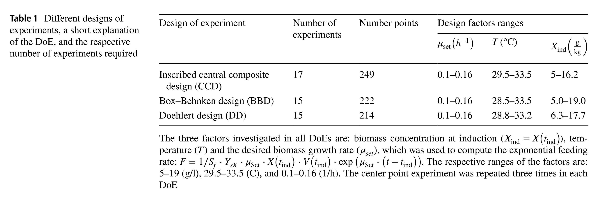
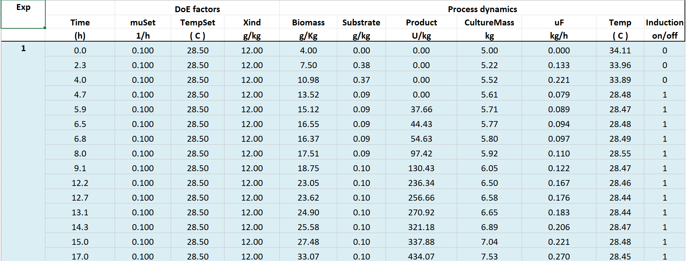
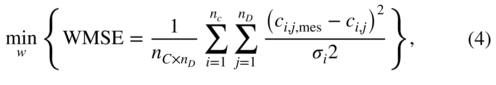
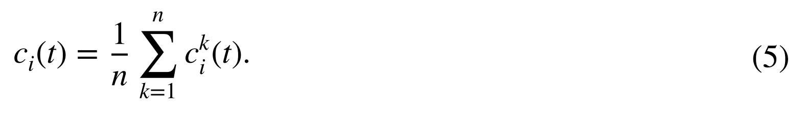
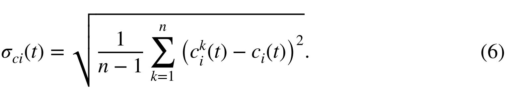

## 摘要

- **混合半参数模型：** 结合了机制和机器学习方法，用于生物过程的开发。
- **引导聚集（Bootstrap Aggregation）：** 提出用于增强模型预测能力，特别是当使用统计设计实验数据时。
- **实验设计方法：** 包括Box-Behnken、中心复合和Doehlert设计，旨在识别最佳的细胞生长和重组蛋白表达条件。
- **预测性能的改善：** 引导聚集显著减少了对所有三种设计的新批次实验的预测均方误差。
- **模型校准：** 聚集的**最优模型数量**是关键参数，需要针对每个具体问题进行调整。
- **Doehlert设计的优势：** 在识别过程最优条件方面略优于其他设计方法。
- **误差界限的计算：** 多个预测的可用性允许对模型各部分的误差界限进行计算，提供了对模型组件预测变异的深入了解。

## Introduction

- **混合模型的定义**：混合半参数模型结合了机器学习方法（非参数化，如人工神经网络、偏最小二乘法、支持向量机）和质量守恒定律（参数化），用于从过程数据中学习未知或不完全理解的细胞动力学/动态。
- **实际优势**：这种模型可以减少过程开发中所需的实验数量，提高新（最优）过程条件的预测能力。
- **数据的重要性**：建立非参数组成部分的数据量、质量和结构至关重要。数据通常被分为训练集、验证集和测试集，以支持模型的参数估计、验证和独立数据性能评估。
- **数据分割方法**：数据分割是一种抽样问题，可以通过重新抽样方法来解决。例如，bagging（引导聚集）是一种基于重新抽样的集成方法，已成功应用于神经网络、偏最小二乘模型和决策树。
- **集成方法在混合模型中的应用**：集成方法如bagging和boosting在混合模型中的应用还相对有限，**但这些方法有助于评估从混合模型的一个部分到另一个部分的不确定性传播(propagation of uncertainty)**，这对于过程控制和优化尤其重要。


## 方法

### 案例研究：大肠杆菌连续投料过程

本研究选用了一个先前建模并优化过的大肠杆菌连续投料过程作为案例研究。通过过程模拟生成了合成数据集，这样可以公正地比较不同的建模方法，避免未知的生物和/或实验变异带来的偏差。

模拟模型的详细信息在“附录A”中提供。简要来说，该模型通过应用质量守恒定律，描述了在搅拌罐连续投料生物反应器中生物量、底物和产物浓度的动态变化。具体的生长、底物吸收和产物形成的动力学速率被定义为底物浓度和温度的非线性函数，使用Monod型动力学，其中温度依赖性决定了最大可实现的速率。设计因素包括温度$T$（变化范围为 29.5 至 33.5°C）、特定生长速率设定点 $\mu_{\text{Set}}$（变化范围为 0.1 至 0.16 h^(-1)）和诱导时的生物量浓度$X_{\text{ind}}$（变化范围为 5.0 至 19.0 g/kg）。模型针对不同设计因素的值进行了模拟，应用了三种统计学上不同的设计方法：



1. **内嵌中心复合设计 (CCD)**：进行了17次培养实验（包括中心点的两次重复）和249个测量点；
2. **Box-Behnken设计 (BBD)**：进行了15次培养实验和222个测量点；
3. **Doehlert设计 (DD)**：进行了15次培养实验和214个测量点。

**设计因素的范围**:

- **特定生长速率设定点 (μ_set)**：从0.1到0.16 1/h，影响生物量的增长速度。
- **温度 (T)**：不同设计中温度范围略有不同，总体在大约28.5°C到33.5°C之间变化，影响生物过程的活性和效率。
- **诱导时的生物量浓度 (X_ind)**：各种设计中从5.0到19.0 g/kg不等，这是开始生产目标蛋白质或其他代谢产物前的生物量浓度。




这个表格展示了使用Box-Behnken设计（BBD）进行的一个大肠杆菌连续投料实验过程的详细数据记录。表中记录了实验过程中不同时间点的各种参数和过程动态。

表格列说明：

1. **Exp**：实验编号，表明这些数据属于同一个实验批次。
2. **Time (h)**：时间，以小时为单位，展示了实验从开始到结束的每个测量时间点。
3. **muSet (1/h)**：特定生长速率设定点，是生物反应过程中控制生物生长速率的参数。
4. **TempSet (°C)**：设置的温度，用于控制生物反应器内的温度。
5. **Xind (g/kg)**：诱导时的生物量浓度，表示在诱导表达开始时的生物量浓度。
6. **Biomass (g/Kg)**：不同时间点测量的生物量。
7. **Substrate (g/kg)**：底物浓度，显示生物反应过程中底物的消耗情况。
8. **Product (U/kg)**：产物浓度，表示不同时间点的产物（如蛋白等）浓度。
9. **CultureMass (kg)**：培养质量，反应器内的总质量。
10. **uF (kg/h)**：上流量，表示每小时向反应器中添加的流体量。
11. **Temp (°C)**：实际测量的温度，显示实验过程中的温度变化。
12. **Induction (on/off)**：表达诱导的开/关状态，1 表示诱导打开，0 表示关闭。

数据分析：

- 随着时间的推移，生物量、产物浓度逐渐增加，显示了生物反应的进行和产物的积累。
- 诱导表达（Induction）在第一次测量后（约4.7小时）被打开，随后产物浓度显著增加，从37.66 U/kg跃升至最后的434.07 U/kg。
- 生物量从开始的4.00 g/kg增加到最后的33.07 g/kg，说明生物质的积累。
- 底物浓度在诱导表达前保持较低（0.37 g/kg以下），诱导后略有增加，这可能与生物代谢活动增强有关。


### 模型描述

1. **基础公式**:
   - **物质守恒定律**：用方程 $ \frac{dc}{dt} = K \cdot r(c, x) - D \cdot c + u $ 描述，其中 $ c $ 是浓度向量，$ K $ 是已知的产率系数矩阵，$ D $ 是稀释率，$ u $ 是体积进料率（控制输入），$ r(c, x) $ 是体积反应速率向量。
   
2. **反应速率函数**:
   - **$ r(c, x) $**：是一个复杂的非线性函数，依赖于浓度 $ c $ 和其他物理化学属性 $ x $（例如温度和 pH）。该函数的具体形式为 $ r(c, x) = r(g(f(c, x), w), c, x) $，其中 $ r(g, c, x) $ 是基于已知知识的参数化函数，而 $ g = g(f(c, x), w) $ 是代表需要从数据中"学习"的未知现象的非参数化函数。
   - **神经网络模型**：$ g $ 函数通常通过一个简单的前馈神经网络实现，该网络包含三层，转换函数在输入和输出层是线性的，隐藏层是双曲正切函数。神经网络的参数向量 $ w $ 需要通过数据来识别。

3. **材料平衡方程**：
   - **生物量和产品**：材料平衡方程用于生物量 $ X $ 和产品 $ P $，形式为 $ \frac{dX}{dt} = \mu \cdot X - D \cdot X $ 和 $ \frac{dP}{dt} = v_p \cdot X - D \cdot P $。这里 $ \mu $ 和 $ v_p $ 是具体反应速率，它们通过相同的神经网络模型来建模。

4. **非参数化功能**：
   - **预处理函数**：$ f(c, x) $ 通常用于简化非参数化函数 $ g(\cdot) $ 的识别过程。在这个案例中，$ f(c, x) $ 被定义为 $[X, F, T]^T$，其中 $ X $ 是生物量，$ F $ 是进料速率，$ T $ 是培养温度。

5. **模型优化**：
   - **隐藏层神经元数量**：初步测试表明，隐藏层中五个神经元是最佳的，对应的参数维度为 $ dim(w) = 4 \times 5 + 6 \times 2 = 32 $。


### Bootstrap-Aggregated

这种Bootstrap聚集的方法特别适合于当数据集较小时，通过创建多个模型并聚合它们的预测来提高模型的鲁棒性和准确性。它允许模型捕捉到数据中的重要特征，同时通过聚合减少过拟合的风险。这种方法对于理解如何从 $g$ 到 $r$ 再到 $c$ 的变异性如何传播也提供了有价值的见解。在实际应用中，选择合适数量的 $n_{\text{boot}}$ 和进行有效的参数初始化和优化是实现高性能模型的关键。

#### 步骤 1: 数据重采样
- 数据被划分为三个集合：训练集（占总数据的一半），验证集（占四分之一），和测试集（占四分之一）。

- 训练集和验证集数据通过随机重采样 $n_{\text{boot}}$ 次从均匀分布中选取，形成多个训练/验证分区。重采样是以实验为单位进行的，不是观测值，以确保验证集不重复选择。

  ```python
  import numpy as np
  import pandas as pd
  from math import factorial
  from itertools import combinations
  
  def calculate_max_boot(n_tr, n_vd):
      """计算最大的bootstrap样本数"""
      return factorial(n_tr + n_vd) // (factorial(n_vd) * factorial(n_tr))
  
  def bootstrap_resampling(data, test_set, n_boot):
      # 假设data是一个DataFrame，其中每一行代表一个实验的观测数据
      # 分离测试集实验
      training_validation_data = data[~data['experiment_id'].isin(test_set)]
      
      # 获取训练/验证实验的唯一标识符
      experiments = training_validation_data['experiment_id'].unique()
      n_experiments = len(experiments)
      
      # 计算训练集和验证集的大小
      n_train = int(0.5 * n_experiments)  # 或其他适当的比例
      n_val = n_experiments - n_train
  
      # 计算最大的bootstrap样本数
      max_boot = calculate_max_boot(n_train, n_val)
      n_boot = min(n_boot, max_boot)  # 确保不超过最大样本数
  
      # 随机选择训练集和验证集的实验，确保不重复选择
      bootstrap_samples = []
      all_combinations = list(combinations(experiments, n_train))
      selected_combinations = np.random.choice(len(all_combinations), size=n_boot, replace=False)
  
      for idx in selected_combinations:
          train_experiments = all_combinations[idx]
          val_experiments = [exp for exp in experiments if exp not in train_experiments]
          
          # 获取训练和验证数据
          train_data = training_validation_data[training_validation_data['experiment_id'].isin(train_experiments)]
          val_data = training_validation_data[training_validation_data['experiment_id'].isin(val_experiments)]
          
          bootstrap_samples.append((train_data, val_data))
      
      return bootstrap_samples
  
  # 假设df是包含所有数据的DataFrame，其中包括一个名为'experiment_id'的列，标识每次实验
  # 假设已知的测试集实验ID列表
  test_set_ids = [101, 102, 103]  # 这应由您的数据集确定
  # n_boot表示要生成的重采样数据集对的数量
  bootstrap_datasets = bootstrap_resampling(df, test_set_ids, n_boot=100)
  
  # 打印第一对重采样数据集的信息
  print("Example of one bootstrap sample:")
  print("Training set:")
  print(bootstrap_datasets[0][0].head())
  print("Validation set:")
  print(bootstrap_datasets[0][1].head())
  ```

  1. **测试集保持不变**：将测试集从总数据集中分离出来，并保证在生成训练集和验证集的过程中测试集不被触及。
  2. **正确计算 $ n_{\text{boot}} $ 的最大数量**：增加了一个函数 `calculate_max_boot`，用来计算根据组合公式得到的训练集和验证集的最大可能组合数。
  3. **随机选择训练和验证集的过程中，不超过最大样本数**：通过 `itertools.combinations` 生成所有可能的组合，并从中随机选择需要的样本数，以确保不重复选择相同的验证集。


#### 步骤 2: 参数估计和模型验证
- 每一个训练/验证样本都会开发出一个不同的混合模型，而模型结构（如神经网络中隐藏节点的数量）保持不变，仅网络参数值 $w$ 允许变化。

- 这些参数值在高斯分布的 [-0.01, 0.01] 范围内随机初始化。

- 参数通过最小化加权最小二乘（WMSE）损失函数来估计，并采用基于梯度的方法（如Levenberg-Marquardt算法）优化。

  

-  The WMSE loss function is also monitored for the validation partition comprising  n_vd  experiments. The decision to stop the parameter estimation is made by when the validation WMSE starts to increase to avoid modeling measurement noise. 

- 参数估计重复100次(epochs)，从中选出表现最佳的模型用于后续聚合。

  

  ```python
  def train_model(train_data, val_data, epochs=100):
      input_size = train_data.shape[1] - 1  # Assuming last column is the target
      hidden_size = 5  # Example: 5 neurons in hidden layer
      output_size = 1  # Assuming single target variable
      weight = torch.tensor([1.0])  # Example weight
      # Create instance of the model
      model = SimpleNN(input_size, hidden_size, output_size)
      model.apply(init_weights)
  
      optimizer = torch.optim.Adam(model.parameters())  # Using Adam optimizer
      best_val_loss = float('inf')
      best_model = None
  
      for epoch in range(epochs):
          model.train()
          for batch in train_data:
              inputs, targets = batch[:, :-1], batch[:, -1]
              optimizer.zero_grad()
              outputs = model(inputs)
              loss = wmse_loss(outputs, targets, weight)
              loss.backward()
              optimizer.step()
  
          # Validate the model
          model.eval()
          with torch.no_grad():
              val_loss = 0
              for batch in val_data:
                  inputs, targets = batch[:, :-1], batch[:, -1]
                  outputs = model(inputs)
                  val_loss += wmse_loss(outputs, targets, weight).item()
              val_loss /= len(val_data)
  
          # Early stopping
          if val_loss < best_val_loss:
              best_val_loss = val_loss
              best_model = model.state_dict()  # Save the best model
          else:
              # Stop training if validation loss starts to increase
              break
  
      return best_model
  ```

#### 步骤 3: 聚合
- 聚合阶段是将 $n_{\text{boot}}$ 个混合模型通过平均其输出变量来聚合。

  

- 实际上，只有表现最佳的 $n$ 个模型被聚合，这里的 $n$ 是一个设计参数。

  -  The models are ranked according to their joint training-validation WMSE.

- 预测的浓度在给定时间 $t$ 计算为这 $n$ 个最佳模型的浓度平均值，相应的时间依赖性预测标准偏差也可以计算出来。

  

为了实现上述描述的聚合阶段，我们首先需要确保有一个方法来存储每个模型的训练和验证性能，以便于之后进行排序和选择最佳模型。然后，我们可以实现一个函数来计算这些最佳模型输出的平均值和标准偏差。

首先，我们需要假设我们已经有了一个列表，其中包含了模型的状态和它们对应的训练及验证集损失。然后我们实现聚合功能。

```python
import torch
import numpy as np

def aggregate_models(model_list, n_best, input_data):
    """
    聚合最佳模型的输出，使用训练集和验证集的联合WMSE进行排序
    :param model_list: 包含模型状态、训练损失和验证损失的元组列表 [(model_state_dict, train_loss, val_loss), ...]
    :param n_best: 要聚合的最佳模型数量
    :param input_data: 用于预测的输入数据，假设是一个Tensor
    :return: 平均预测和标准偏差
    """
    # 计算联合WMSE并排序，假设训练和验证损失有相同的权重
    sorted_models = sorted(model_list, key=lambda x: (x[1] + x[2]) / 2)[:n_best]

    # 载入模型并进行预测
    predictions = []
    for model_state, _, _ in sorted_models:
        model = SimpleNN(input_data.shape[1], 5, 1)  # 假设模型结构与之前定义相同
        model.load_state_dict(model_state)
        model.eval()
        with torch.no_grad():
            output = model(input_data).numpy()  # 进行预测并转换为NumPy数组
        predictions.append(output)

    # 计算预测值的平均值和标准偏差
    predictions = np.array(predictions)
    mean_predictions = np.mean(predictions, axis=0)
    std_predictions = np.std(predictions, axis=0)

    return mean_predictions, std_predictions

# 示例使用
# 假设model_states包含了若干个模型的状态和它们的验证损失
# input_data是用于预测的输入数据
mean_preds, std_preds = aggregate_models(model_states, 5, torch.tensor(input_data))
```

1. **排序和选择**：函数`aggregate_models`首先根据传入的模型列表（包含模型状态和相应的训练，验证损失）进行排序，选择训练集和验证集损失的平均值最小的前`n_best`个模型。
2. **模型预测**：对每个选中的模型，加载其状态并对输入数据`input_data`进行预测。
3. **计算平均值和标准偏差**：收集所有选中模型的预测结果，计算这些预测结果的平均值和标准偏差。

