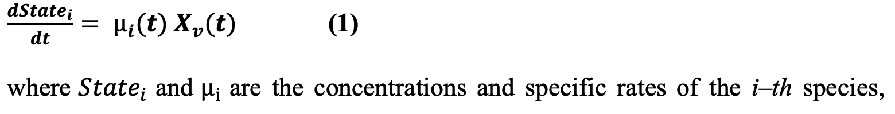

## Abstract & Introduction

Hybrid-EKF该框架结合了混合模型和扩展卡尔曼滤波器（EKF），用于哺乳动物细胞培养过程的实时监控、控制和自动决策制定。该研究的主要贡献包括：

1. **改进预测监控准确性**：通过与传统的基于PLS模型的工业标准工具相比较，使用Hybrid-EKF框架能在特定应用中将预测监控准确性提高至少35%。

2. **工业应用优势**：研究强调了Hybrid-EKF在工业应用中的优势，尤其是在条件性过程喂养和过程监控方面。例如，将Hybrid-EKF作为产量（titer）的软传感器使用时，与最先进的软传感器工具相比，预测准确性提高了50%。

3. **提供更有效的过程监控和控制方法**：通过Hybrid-EKF框架，实现了对哺乳动物细胞培养过程的更有效监控和控制，支持了行业4.0中智能工厂的构建，其中的工厂能够适应不同的过程场景并自主运作。

## Data organization

### 实验设计因子:

- Xv_0
- Glc_0
- Gln_0
- pH_before
- pH_after
- pH_shift_day
- Temp_before
- Temp_after
- Temp_shift_day
- Feed_Gln
- Feed_Glc
- Feed_start
- Feed_end

### In-silico Dataset

这个数据集使用宏观动力学模型（引用了Craven等人和Xing等人的研究）进行模拟，这些模型针对哺乳动物细胞培养进行了调整，以体现生长率依赖性的复杂非线性以及对pH和温度变化的考量。主要要点如下：

1. **数据模拟与设计**：数据集包含14个过程因子，例如初始的细胞密度（Xv）、葡萄糖（GLC）、谷氨酰胺（GLN）浓度、pH值在变化前后的情况、温度在变化前后的情况、变化的天数、葡萄糖和谷氨酰胺的添加开始与结束日期，以及这些添加物的日均量。使用分数因子设计进行了100次实验的模拟，每次实验持续14天。

2. **数据结构与组织**：模拟的过程数据按不同信息源组织，包括动态变化的非控制过程变量如Xv和GLC，这些以三维矩阵X表示，时间是第三维。此外，实验中控制的变量如pH和温度以W矩阵形式表示，而产品特性由Y矩阵表示。
    - X
        - Xv
        - GLC
        - LAC
        - GLN
        - NH4
        - Titer
    - W:
        - pH
        - temp
    - F:
        - Feed_GLC
        - Feed_GLN
    - Z: none
    - 

3. **数据测量与噪声**：模拟数据中的测量频率为2.4小时一次，并加入了**15%的高斯噪声**，以模拟光谱技术的测量误差。**pH和温度的动态变化被纳入考量**，并且**每天都有葡萄糖和谷氨酰胺的添加**，这些都是设计中的因素之一。

4. **模拟数据的应用**：这些模拟数据被用来测试Hybrid-EKF框架，评估混合模型在实时监控和控制哺乳动物细胞培养中的性能，并与现实工业数据集进行比较。

5. 虽然使用了 100 个实验进行训练,但是实际上 16 个实验即可达到稳健的性能,如下图

### Real Dataset

数据集包含81次3.5升工作体积的连续进料批次实验，每次实验持续10天。

- X
    - Xv
    - GLC
    - LAC
    - GLN
    - GLU
    - NH4
    - OSM
    - measured once per day
- W:
    - pH
    - pO2
    - pCO2
    - measured once per day
- F:
    - Feed_GLC
    - Feed_GLN
- Z:
    - pH_set
    - DO_set
- Y: Titer
    - measured on even days from day 0 until the end of the run

### 数据集分割

### Evaluation Metric

Root Mean Squared Error in Prediction (RMSEP)

## Model

### Hybrid model

#### Input setting:

- X:

    - In-silico dataset
        - i for : Xv, GLC, GLN, LAC, NH4, titer

    - Real dataset
        - i for : Xv, GLC, GLN, LAC, NH4, titer, GLU Osm

- W

- Z

#### ANN setting:

 

### Historical model

