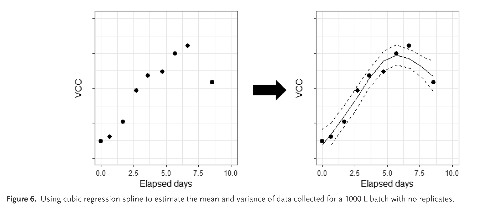
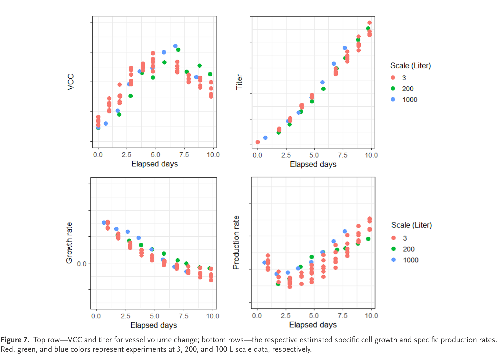
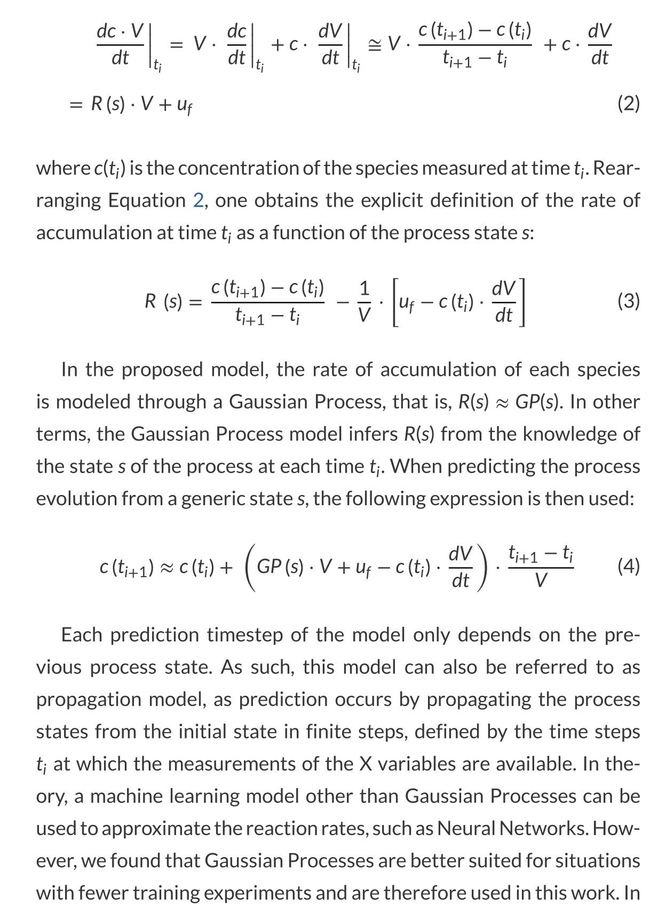

该工作提出通过对**特定速率进行多变量数据分析**和建模，**揭示了底层生物系统行为**的深入见解，这是通过分析代谢物浓度所无法获得的。


### 0. Introduction

- **MVDA 应用及其影响**：
  - MVDA 有助于检测过程性能的变化和变异，但其分析结果受过程操作中的有意变化或接种反应器时的小变化影响较大。

- **Gnoth 等人的发现**：
  - 小的初始生物量浓度变化（接种后）在最佳生产条件下可能导致显著的过程性能变化，特别是最终滴度浓度的变化。
  - 结论：在最大生产率下运行的培养过程在经典意义上不能被认为是稳健的，因为最终浓度可能会显著变化。

- **底层生物生产系统的稳定性**：
  - 观察到的浓度变化可能是由于过程修改引起的“人为现象”，而非生物变化。
  
- **代谢建模的挑战**：
  - 代谢建模（如代谢流分析、流量平衡分析）可以阐明生物系统的变化，**但通常需要测量更多的浓度**，并且**模型开发复杂且耗时**。

- **MVDA 的实用性和局限性**：
  - 鉴于资源和时间限制，MVDA 是一种实用工具，能够突出数据差异。
  - **但目前尚不清楚这些差异是源于生物系统本身还是过程操作**。

### 1.1 浓度变化可能是与过程修改相关的“人为现象”

至少存在四种情景，在这些情景下，**浓度剖面的比较分析无法提供**对系统行为差异的代表性洞察，即过程监控、可重复性分析、培养基开发/优化和放大（图1）。


考虑以下基于简单物料平衡的示例，


描述了补料批操作理想混合生物反应器中体积（V）、生物量（X）和底物（S）浓度随时间的演变：

##### 1.1.1 过程监控/可重复性分析


在典型的指数增长阶段，**初始生物量浓度的小变化会被放大，导致阶段末的生物量显著不同**，从而导致不同的底物剖面（图1A）。这是否意味着过程不稳健或不符合规范？尽管可以减少初始生物量浓度的波动，但我们认为，如果下游过程（特别是色谱纯化步骤）不受影响（因为更多的生物量可能增加需要去除的杂质量），从生物学角度来看，所有剖面实际上是可比的，因为特定速率没有表现出差异/变异。

##### 1.1.2 培养基开发


最简单的比较不同培养基的方法是通过改变不同实验的初始底物浓度进行模拟（图1B）。同时，我们可以假设初始生物量浓度存在差异，但为了简化，不包括这些波动。比较使用不同培养基进行的不同实验中底物浓度随时间的演变，几乎没有提供关于底层过程性能的洞察，因为这些变化仅仅是由于培养基浓度的变化。实际上，需要评估多个浓度剖面（即喂料速度和喂料培养基中的浓度）。

##### 1.1.3 放大/缩小和喂料速率优化研究


放大/缩小是生物加工中最具挑战性的问题之一。通常，通过保持限制因素（如质量传递速率或无量纲数，如单位体积功率）在不同尺度上相同来完成放大/缩小（图1C）。在图1C展示的放大情景中，**体积在不同尺度上变化**，但**喂料速率的调整被认为是不必要的**，因为底物浓度不被认为是限制因素。然而，可以观察到浓度剖面演变的影响，特别是在**高浓度下**（即，项 −u/V·S 会增加），这会导致非常不同的轨迹。**观察到的变化可以归因于稀释的变化，但底层生物系统行为相同**。


相反，图1D展示的放大情景在过程中浓度变化非常小，但底层生物系统在不同尺度上表现不同。

##### 1.1.4 一般结论
| 场景示例                    | 有意过程变化的影响                                           | 固有变化的影响                                 | 结果及解释                                                   |
| --------------------------- | ------------------------------------------------------------ | ---------------------------------------------- | ------------------------------------------------------------ |
| 图1A: 过程监控/可重复性分析 | 初始生物量浓度的小变化会被放大，导致阶段末的生物量显著不同，进而影响底物剖面 | 底层生物系统生产模式可能未变，变化是“人为现象” | 不影响下游操作时，**剖面从生物学角度是可比的**；可能导致实验被拒绝作为可重复批次的一部分 |
| 图1B: 培养基开发            | 通过改变初始底物浓度模拟不同培养基的影响                     | **变化仅由于培养基浓度的差异，未涉及代谢变化** | **洞察有限，需要评估多个浓度剖面**；可能导致不必要的实验生成 |
| 图1C: 放大研究              | 不同尺度上的体积变化但喂料速率未调整，导致浓度剖面显著变化   | 底层生物系统行为相同                           | **变化归因于稀释的变化，实际系统行为一致**                   |
| 图1D: 放大研究              | 浓度变化较小但不同尺度上系统行为不同                         | **底层生物系统表现不同**                       | 需要验证喂料剖面的修改，拒绝缩小模型                         |

我们**主张在特定速率空间**（即特定吸收和生产速率）**而非浓度空间中应用 MVDA 和模型开发**。通过两个工业示例（HEK 培养基比较研究和 CHO 放大研究），展示了将重点转移到速率空间的影响。这种方法展示了数据转换（可理解为一种“特征工程”形式）如何帮助更好地理解和建模系统。


### 2.1 培养基比较研究

**实验目的**：

- 本研究旨在识别影响 HEK293 细胞培养存活细胞密度的代谢物。
- 具体来说，分析重点是调查培养基家族 B 和 C 的性能，并将其与参考培养基 A 进行比较。
- 简言之，我们希望了解参考培养基 A 与培养基 B 和 C 之间过程差异的来源。


#### 2.1.1 数据生成


| **实验步骤**   | **描述**                                                     |
| -------------- | ------------------------------------------------------------ |
| **设备和时间** | 在 24 个 Ambr250 设备中进行 8 天的 HEK293 批量培养           |
| **研究条件**   | 13 组条件，涉及 3 种培养基家族和预培养池                     |
| **取样时间点** | 第 0、1、2、3、5 和 8 天                                     |
| **分析内容**   | 20 种氨基酸（UPLC）、葡萄糖、铵、甘油、乳酸、尿素、钙、镁（Cedex-Bio） |
| **性能指标**   | 存活细胞密度                                                 |


#### 2.1.2 数据转换

**背景**：

- **测量代谢物浓度时会有测量误差**。
- 从浓度测量值估算特定速率是一个病态的逆问题，**测量误差可能被放大，导致特定速率的不确定性范围很大**。
- 为了量化这种情况的程度，使用基于蒙特卡洛方法的抽样方法。

**方法步骤**：

1. 从正态或均匀分布中抽取一个随机值，使用该测量的标准偏差，针对每个测量浓度的时间点。将这些值添加到原始测量浓度值中。
2. 对生物量浓度执行相同操作，因为这些浓度将用于计算特定速率。
3. 使用实验部分描述的方法，通过分段三次插值（函数 csaps，Matlab 2016a）从修改后的浓度值中估算速率，以近似测量值（即 f(t, w) 是一个光滑的分段三次样条）。
4. 将速率值与先前的值组合并重复步骤（1）到（4），直到在不断增长的速率数据集上计算的速率标准偏差估计值收敛。

**假设和参数**：
- 对于每个浓度数据，假设变异系数为10%，但对于生物量测量，假设误差仅为5%。
- 假设最小实验误差为 0.1 mg L−1，最大为 10 mg L−1。
- 生成100个随机测量值，均匀分布在与该点相关的实验置信区间内。
- 使用这些随机生成的数据，为每个测量的代谢物构建一个样条。

**样条平滑参数**：
- 使用 MATLAB 的 csaps 函数定义浓度数据的样条，确定合适的平滑参数 p。
- 默认的平滑参数公式为：p = 1/(1+(h^3/60))，其中 h 是平均采样时间间隔。
- 使用默认平滑参数检查样条是否在测量的置信区间内，如果不在，增加平滑参数直到样条穿过所有置信区间。

**结果**：
- 计算每个100个随机样条的速率，图表展示了所有计算速率的平均值和相关的置信区间（±标准差误差）。

下面是使用 Python 和相关库（如 NumPy 和 SciPy）实现上述方法的示例代码：

```python
import numpy as np
from scipy.interpolate import CubicSpline
import matplotlib.pyplot as plt

# 示例数据
time_points = np.array([0, 1, 2, 3, 5, 8])
original_concentrations = np.array([1.0, 1.5, 2.0, 2.5, 3.0, 3.5])
biomass_concentrations = np.array([0.5, 0.7, 0.8, 0.9, 1.0, 1.1])
n_samples = 100

# 测量误差
cv_concentration = 0.10
cv_biomass = 0.05

# 生成随机测量值
random_concentrations = np.array([np.random.normal(loc=val, scale=val * cv_concentration, size=n_samples) for val in original_concentrations])
random_biomass = np.array([np.random.normal(loc=val, scale=val * cv_biomass, size=n_samples) for val in biomass_concentrations])

# 使用分段三次插值（CubicSpline）构建样条
def generate_spline(time_points, values):
    return CubicSpline(time_points, values, bc_type='natural')

# 计算特定速率
def compute_specific_rate(concentration_spline, biomass_spline, time_points):
    concentration_rates = concentration_spline(time_points, 1)  # 一阶导数
    biomass_rates = biomass_spline(time_points, 1)  # 一阶导数
    specific_rates = concentration_rates / biomass_rates
    return specific_rates

# 进行蒙特卡洛模拟
all_specific_rates = []

for i in range(n_samples):
    concentration_spline = generate_spline(time_points, random_concentrations[:, i])
    biomass_spline = generate_spline(time_points, random_biomass[:, i])
    specific_rates = compute_specific_rate(concentration_spline, biomass_spline, time_points)
    all_specific_rates.append(specific_rates)

all_specific_rates = np.array(all_specific_rates)
mean_specific_rates = np.mean(all_specific_rates, axis=0)
std_specific_rates = np.std(all_specific_rates, axis=0)

# 绘图
plt.figure()
plt.plot(time_points, original_concentrations)
plt.xlabel('Time')
plt.ylabel('Concentrations')
plt.show();
plt.figure()
plt.errorbar(time_points, mean_specific_rates, yerr=std_specific_rates, fmt='-o')
plt.xlabel('Time')
plt.ylabel('Specific Rates')
plt.title('Mean Specific Rates with Confidence Intervals')
plt.show();

```

通过这种方法，**可以有效地量化测量误差对特定速率估算的影响**，确保数据分析的可靠性。


##### 图2：样条近似和特定速率


- **样条近似**：
  - 图2展示了样条近似和速率的代表性示例，说明了**浓度在测量的置信区间内均匀分布**，符合预期。
  - 样条近似的目的是生成平滑的浓度曲线，以便在浓度数据存在测量误差的情况下估算特定速率。

- **特定速率的置信区间**：
  - 估算的特定速率**在浓度剖面变化的区域显示出稍大的置信区间**，而在其他区域则更为紧凑。
  - 这种置信区间的变化反映了在蒙特卡洛采样过程中构建的一组样条曲线的曲率变化最小化的方法，同时考虑了实验测量误差。
  - 这意味着**在浓度快速变化的区域，特定速率的估计值不确定性更大**。

##### 图3：小提琴图中的特定速率数据分布


- **特定速率数据的分布**：
  - 这一观察结果表明，**尽管输入的浓度数据是均匀分布的，通过计算特定速率后，结果数据趋向于正态分布。**
  - 这种现象**是否具有普遍性尚不明确**，可能是个别案例特有的特征。


#### 2.1.3 PCA 分析的洞察

**主成分分析（PCA）**：
- 批次展开的浓度数据和速率（流量）数据分别进行了两次 PCA 分析。
- 数据在变量维度上进行自动缩放，使用三个潜在成分描述数据的变异，对于浓度数据为 66.15% ± 1%，对于速率数据为 52.42% ± 1.73%。
- 图4展示了浓度和速率数据的前三个潜在成分的得分图。


- **浓度数据**：
  - 比较不同培养基**在浓度的潜在空间**，发现 A(red)、B(blue) 和 C(green) 导致不同的培养，**培养基 B 和 C 与参考培养基 A 显著不同**。
- **速率数据**：
  - 在**速率的潜在空间**中，**参考培养基 A 的培养在某些条件下与其他培养基 B 和 C 的培养相当接近**。
  - 这些不同的行为表明，**尽管培养基在浓度上有所不同，但细胞代谢是相似的**，因此可以预期产品质量相似，但数量不一定相同（与浓度相关）。

**载荷分析**：


- **浓度负载**：
  - 浓度负载提供了**每一天实验浓度主要差异的直接洞察**。可以看到，**随着时间的推移，负载的位置更加分散**，突显了第1天的浓度变化如何影响培养的演变，导致更多浓度的差异。
  - 特定化合物负载在几天内的演变不应单独分析，因为每一天负载的位置受其他化合物的影响。
- **速率负载**：
  - **速率负载表明化合物的吸收/分泌差异**，指示实验间代谢的差异。
  - 由于细胞来自同一个预培养池，它们在开始时代谢相似，只是某些速率发生变化，表示细胞对有意添加化合物的初始响应。
  - **随着时间的推移，速率变化变得更加显著，反映了细胞对暴露环境和培养基的适应。**
  - 有趣的是**，第3天和第5天乳酸和谷氨酰胺在速率负载中起到更重要的作用**，这些途径的吸收/分泌受条件和培养基变化的影响。

以下是使用 Python 和相关库（如 NumPy 和 scikit-learn）进行 PCA 分析的示例代码：

```python
import numpy as np
import pandas as pd
from sklearn.decomposition import PCA
import matplotlib.pyplot as plt

# 示例数据（需要替换为实际数据）
concentration_data = np.random.rand(100, 20)  # 假设100个样本，20个浓度变量
rate_data = np.random.rand(100, 20)  # 假设100个样本，20个速率变量

# 标准化数据
concentration_data_scaled = (concentration_data - np.mean(concentration_data, axis=0)) / np.std(concentration_data, axis=0)
rate_data_scaled = (rate_data - np.mean(rate_data, axis=0)) / np.std(rate_data, axis=0)

# PCA 分析
pca_concentration = PCA(n_components=3)
pca_rate = PCA(n_components=3)

pca_concentration.fit(concentration_data_scaled)
pca_rate.fit(rate_data_scaled)

# 得分图
scores_concentration = pca_concentration.transform(concentration_data_scaled)
scores_rate = pca_rate.transform(rate_data_scaled)

# 图示
plt.figure(figsize=(14, 6))

plt.subplot(1, 2, 1)
plt.scatter(scores_concentration[:, 0], scores_concentration[:, 1], c='blue', label='Concentration Data')
plt.xlabel('PC1')
plt.ylabel('PC2')
plt.title('PCA Score Plot - Concentration Data')
plt.legend()

plt.subplot(1, 2, 2)
plt.scatter(scores_rate[:, 0], scores_rate[:, 1], c='red', label='Rate Data')
plt.xlabel('PC1')
plt.ylabel('PC2')
plt.title('PCA Score Plot - Rate Data')
plt.legend()

plt.show()
```

| **分析项目**     | **描述**                                                     |
| ---------------- | ------------------------------------------------------------ |
| **PCA 分析**     | 分别对批次展开的浓度和速率数据进行了 PCA 分析，三个潜在成分足以描述数据的主要变异。 |
| **浓度数据结果** | PCA 得分图显示，不同培养基 A、B、C 导致不同的培养，B 和 C 明显区别于 A。 |
| **速率数据结果** | 在速率的潜在空间中，参考培养基 A 的培养与 B 和 C 培养在某些条件下接近，表明代谢相似。 |
| **负载分析**     | **浓度负载**显示每天的主要**浓度差异**，**速率负载**显示化合物吸收/分泌的差异，**反映代谢差异。** |

通过这种分析，可以更好地理解不同培养基对细胞代谢和生长的影响，以及这些变化如何影响产品质量和数量。


### 2.2 过程放大/缩小案例

**背景**：
- 制药行业中，“**成功表征工艺**的一个重要要求是**具备代表制造工艺的缩小模型**”，这使得在实验规模上获得的丰富知识可以直接转化到全规模商业设施。
- 在实验规模上，最近的自动化和高通量小型生物反应器系统（如 Ambr 15 和 Ambr 250）在数据量和质量方面提供了显著优势。
- 然而，必须谨慎解释这些系统的原始数据，特别是在开发缩小模型时，这是由于**实验规模上样品体积与培养体积的比例问题**。
- 过程开发中通常需要**每日采样以评估生长率、代谢物浓度和总产量**。无论培养/反应器体积如何，都需要采样体积，这在实验规模上显著增加了**过程变异性**，因为它会影响进料体积与培养体积的比例。

**工程方法**：
- **使用无量纲数（如雷诺数、流量数和福鲁德数）**是放大/缩小的常见工程实践。
- 对于细胞培养过程，文献中报道了一些成功的方法，包括**保持与规模无关的参数相同**（如 **kLa-**质量传递系数与界面面积的乘积，**P/V**-单位体积功率，**OUR**-细胞特异性氧气吸收率）。
- 评估缩小模型的最常见方法是对**运行结束或峰值过程性能指标**（即 VCC、滴度和活力）进行统计测试，如 F 检验和 TOST（双侧 t 检验）。

**整体批次演变行为**：
- **通过 MVDA 技术对整体批次演变行为的考虑**越来越受欢迎，但基本问题依然存在：鉴于过程规模的差异以及反应器、采样策略、分析仪器、实验室、操作员和工艺科学家的内在变化，我们是否正确看待数据？

#### 2.2.1 数据生成

- 使用相同的 CHO 细胞系在不同规模上生成数据。所有批次的过程参数相同，包括过程设定点（pH、DO）、控制方法、培养基以及用于细胞计数和滴度测量的仪器和方法。
- 根据需要添加消泡剂。

#### 2.2.2 数据转换

- 特定速率按照方法部分描述进行估算。

- 使用 R 的 mgcv 包进行三次样条近似，最小化残差平方和，同时对曲率进行惩罚：
  $$
  \sum_{i=1}^{n} \left( y_i - s(t) \right)^2 + \rho \cdot \int \left( s''(t) \right)^2 dt
  $$
  其中，$ s(t) = \sum_{j=1}^{q} b_j(t) \cdot \alpha_j $ 是三次回归样条，$ b_j $ 是第 $ j $ 个基函数，$ q $ 是基函数维度，$ \alpha_j $ 是第 $ j $ 个基函数的权重。
  
  基维度选择为四，基于细胞生长阶段：延滞、指数生长、稳定和死亡阶段。进一步增加基维度不会提高模型性能。

- 回归样条是一种用于拟合数据的平滑方法，它在处理非线性数据和高噪声数据方面表现出色。在生物工艺开发中，特定速率的估算是一个病态的逆问题，测量误差可能被放大，从而导致特定速率的不确定性范围很大。回归样条通过平滑数据，可以减少这种不确定性，并生成更可靠的估算结果。

    **目的**：

    1. **减少测量误差的影响**：
       - **回归样条可以平滑数据，减少因测量误差导致的波动**。这在处理实验数据时尤为重要，因为实验数据通常伴随着测量误差和噪声。

    2. **处理复杂的非线性关系**：
       - 生物过程中的数据往往具有复杂的非线性关系。回归样条通过分段三次多项式，可以很好地捕捉和拟合这些非线性关系，提供更准确的模型。

    3. **估算特定速率**：
       - 从浓度数据估算特定速率需要**对时间序列数据进行差分计算**。平滑后的样条曲线可以提供更稳定的导数估算，进而获得更可靠的特定速率。

    4. **生成置信区间**：
       - 通过回归样条，可以生成数据的置信区间。这有助于量化估算结果的不确定性，并提供更全面的分析结果。

    5. **减少残差平方和与惩罚曲率**：
       - 回归样条方法通过最小化残差平方和与惩罚曲率相结合，确保拟合曲线既能够紧密跟随数据，又不会过度拟合。惩罚项用于控制曲线的光滑度，避免过度波动。

**图示**：



- 图6展示了一个 1000 L 大规模批次的概念，其中尚未收集到重复数据。通过三次回归样条进行的回归包括估计的平均 VCC 和 95% 置信区间，即如果我们可以运行多个批次，VCC 剖面的估计值，这反过来可以用于提供更多（或更少）的见解和对工艺/细胞可扩展性的信心。

| **步骤**             | **描述**                                                     |
| -------------------- | ------------------------------------------------------------ |
| **数据生成**         | 使用相同的 CHO 细胞系在不同规模上生成数据，所有批次的过程参数相同。 |
| **数据转换**         | 使用 R 的 mgcv 包进行三次样条近似，估算特定速率，最小化残差平方和，同时对曲率进行惩罚。 |
| **统计推断**         | 基于贝叶斯后验协方差矩阵预测标准误差，用于估计样本均值和方差。 |
| **大规模反应器挑战** | 对于较大规模反应器，数据生成昂贵，通常没有“重复”数据，科学家需要在缺乏数据的情况下推断工艺可扩展性。 |

通过这些方法，可以在不同规模上进行过程表征，并确保从实验规模到商业规模的知识转化，从而提高工艺开发的效率和可靠性。

以下是使用 Python 和相关库（如 NumPy 和 SciPy）实现三次样条近似和数据转换的示例代码：

```python
import numpy as np
from scipy.interpolate import CubicSpline
import matplotlib.pyplot as plt

# 示例数据
time_points = np.array([0, 1, 2, 3, 5, 8])
original_vcc = np.array([1.0, 2.0, 4.0, 8.0, 6.0, 5.0])
rho = 0.1  # 惩罚参数

# 构建三次样条并进行平滑
cs = CubicSpline(time_points, original_vcc)

# 计算残差平方和和曲率惩罚项
def residual_sum_of_squares(y, s):
    return np.sum((y - s)**2)

def curvature_penalty(s, t):
    return rho * np.sum((s.derivative(nu=2)(t))**2)

# 样条拟合
spline_vcc = cs(time_points)
rss = residual_sum_of_squares(original_vcc, spline_vcc)
curvature_pen = curvature_penalty(cs, time_points)

# 打印结果
print(f"Residual Sum of Squares: {rss}")
print(f"Curvature Penalty: {curvature_pen}")

# 绘制图形
plt.figure()
plt.plot(time_points, original_vcc, 'o', label='Original VCC')
plt.plot(time_points, spline_vcc, '-', label='Cubic Spline Fit')
plt.fill_between(time_points, spline_vcc - 0.1, spline_vcc + 0.1, color='gray', alpha=0.2, label='95% Confidence Interval')
plt.xlabel('Time')
plt.ylabel('VCC')
plt.legend()
plt.title('Cubic Spline Fit with Confidence Interval')
plt.show()
```

通过上述代码，可以有效地进行数据转换和样条近似，生成置信区间，从而更好地理解和评估工艺的可扩展性。


#### 2.2.3 各尺度特定速率和浓度的分析

**总体描述**：



- 图7的顶部展示了在不同尺度下几乎相同工艺的细胞生长和生产剖面。
  - 在3L规模下，批次结束时和峰值的VCC浓度略低；
  - 而滴度方面，3L和200L规模的结果相近，1000L规模的滴度似乎稍高。
- 鉴于所有来自分析测量、初始VCC和过程尺度的变异，**很难确定这些差异和/或相似性是否源于生物系统**。

**数据转换与分析**：

- 图7底部展示了通过三次样条近似转换的数据，并基于估计的平均响应剖面计算的平均生长和生产速率。
- **1000L规模**的特定生长速率在**前4至5天内高于较小规模**，尽管起始VCC较低，**但4至5天后VCC相当**。
- 1000L规模的细胞**特异性生产力**似乎不受更快生长的影响，并且从第3天起高于3L规模。
- 6.5天左右略高的VCC值与略高的生产速率相结合，导致1000L批次完成时（约7.5天）滴度略高于其他规模。
- 200L规模下，较高的VCC值并未导致更高的滴度，因为特定生产速率较低。VCC在200L的“追赶”似乎略有延迟，因为第4到7天的生长速率仅略高。

**数据转换的附加值**：
- 对于3L结果，取决于分析浓度数据还是速率数据，得出的结论完全相反。**具体速率数据表明，整体反应器性能的变异主要由于蛋白质生产机制，而不是细胞生长**；而浓度数据表明，VCC呈现更高的变异度。
- 传统的放大研究通常需要在较大规模（如200L和1000L）上获得更多实验数据，以进行VCC和滴度测量的统计测试，如F检验。在短时间内收集这些数据很困难。
- 然而，**通常在较大规模的运行期间会多次测量浓度。使用整个浓度剖面拟合任意时间依赖函数，可以减少测量误差对不同尺度数据比较的影响**。

**结论和建议**：
- **数据转换可以理解为一种“归一化”，将生物系统的变异与过程操作中的“小”变异（如初始生物量浓度的变异）计算分离开**。因此，比较不同尺度的**估计细胞特异性生长和生产速率（图7底部）似乎是一个可行的选择，表明生物系统的变化**。
- 虽然需要更深入的研究（可能包括“组学”数据），以证明确实可以基于少量运行的转换数据分析得出关于可重复性的结论，但相比传统的可重复性研究，可能显著减少较大规模运行的次数。
- 这不仅可以显著降低成本，还可以潜在缩短时间表，尤其是在应对大流行病时，这一点更具吸引力，同时不会影响安全性或质量。


以下是一个使用 Python 进行三次样条近似和数据转换的示例代码：

```python
import numpy as np
import matplotlib.pyplot as plt
from scipy.interpolate import CubicSpline

# 示例数据
time_points = np.array([0, 1, 2, 3, 4, 5, 6, 7])
vcc_3l = np.array([1.0, 2.0, 4.0, 6.0, 7.0, 7.5, 7.8, 7.8])
vcc_200l = np.array([1.1, 2.2, 4.2, 6.2, 7.2, 7.6, 7.9, 7.9])
vcc_1000l = np.array([0.8, 1.8, 3.8, 5.8, 6.8, 7.3, 7.7, 7.7])

# 三次样条近似
cs_3l = CubicSpline(time_points, vcc_3l)
cs_200l = CubicSpline(time_points, vcc_200l)
cs_1000l = CubicSpline(time_points, vcc_1000l)

# 计算特定速率（假设为VCC的导数）
growth_rate_3l = cs_3l(time_points, 1)
growth_rate_200l = cs_200l(time_points, 1)
growth_rate_1000l = cs_1000l(time_points, 1)

# 绘图
plt.figure(figsize=(14, 6))

# VCC图
plt.subplot(1, 2, 1)
plt.plot(time_points, vcc_3l, 'o-', label='3L VCC')
plt.plot(time_points, vcc_200l, 's-', label='200L VCC')
plt.plot(time_points, vcc_1000l, '^-', label='1000L VCC')
plt.xlabel('Time (days)')
plt.ylabel('VCC')
plt.title('VCC Profiles at Different Scales')
plt.legend()

# 特定速率图
plt.subplot(1, 2, 2)
plt.plot(time_points, growth_rate_3l, 'o-', label='3L Growth Rate')
plt.plot(time_points, growth_rate_200l, 's-', label='200L Growth Rate')
plt.plot(time_points, growth_rate_1000l, '^-', label='1000L Growth Rate')
plt.xlabel('Time (days)')
plt.ylabel('Growth Rate')
plt.title('Specific Growth Rates at Different Scales')
plt.legend()

plt.show()
```

通过上述代码，可以生成不同尺度下细胞生长和生产速率的曲线图，便于对比和分析不同条件下的表现。这有助于理解不同尺度下工艺性能的差异，并为工艺放大提供数据支持。


### 3. 讨论

- **浓度数据的(M)VDA**：
  
  - 广泛用于工业上游生物过程研究。
  - 虽然可以分析过程性能的变化/变异，但无法区分“有意”的设计/操作变异和固有的生物变异。
- 在生物制药背景下，**区分变异来源至关重要**，因为宿主细胞的代谢状态可能影响药物生产机制和药物质量属性。
  
- **操作变异与生物变异**：
  
  - 操作变化（如喂料变化）如果不影响培养下游操作的有效性，可以忽略。
- **生物系统变异的洞察对于优化过程和提高产品质量非常重要**。
  
- **过程数据转换与分析**：
  - 通过过程数据的转换及其后续使用标准(M)VDA方法的分析，可以深入了解生物系统的变异。
  - 两个上游生物过程研究表明，**不同培养基和规模的生物系统表现更具可比性**。
  - 仅分析浓度数据会导致不同的结论和后续行动。

- **PCA 分析**：
  - PCA 得分的相对距离表明测试培养基上的培养与参考培养基不相似。
  - 特定速率数据的PCA得分表明培养行为相似，转移重点寻找改变特定速率的化合物。

- **特定速率模型**：
  - 参数化或非参数化模型可以提供驱动细胞行为的因素的额外洞察。
  - **开发此类模型需要特定速率随过程条件变化的数据**。
  - 通过实验设计生成的数据可能不足以提供特定速率的足够变化。

- **转换数据的增值**：
  - 在药物产品生命周期内增值。
  - 在过程开发中，提供克隆或过程条件在代谢上不同的更好洞察。
  - 在开发和制造条件下，**额外的速率监控可以帮助确定过程变异的来源**。
  - 在**放大研究中，指示细胞在不同规模上是否表现相似**。
  - 对于过程控制目的，帮助设计控制方程，代表系统的动态性质。

  
  

### 4. 速率估计

**方法论：速率估算**

1. 从积分形式的物质平衡公式（方程(5)）开始，将速率相关项隔离在右侧，因为它们无法测量：
   $$
   c_{ex}(t_i) \cdot V(t_i) - c_{ex}(t_0) \cdot V(t_0) - \int_{t_0}^{t_i} u \cdot dt = \int_{t_0}^{t_i} q \cdot x \cdot V \cdot dt
   $$

2. 拟合任意时间依赖函数（例如，三次平滑样条、高斯过程模型、多项式或其他），$f(t, w)$，以近似测量值，$\gamma_m(t_i) = c_{ex,m}(t_i) \cdot V_m(t_i) - c_{ex,m}(t_0) \cdot V_m(t_0) - \int_{t_0}^{t_i} u_m \cdot dt$，使残差$\epsilon$尽可能小，同时函数不过拟合数据：
   $$
   \gamma_m = f(t, w) + \epsilon
   $$

- **步骤1：积分形式的物质平衡**：
  - 从积分物质平衡公式出发，将无法测量的速率相关项隔离。
  - 公式描述了在不同时间点的浓度和体积变化，以及喂料和特定速率的关系。

- **步骤2：拟合时间依赖函数**：
  - 使用三次平滑样条、高斯过程模型或多项式等函数来近似测量值。
  - 确保残差尽可能小，同时避免函数对数据的过拟合。


#### 使用高斯过程拟合 $\gamma_m$

如果使用高斯过程来拟合 $\gamma_m$，可以利用 `scikit-learn` 库中的 `GaussianProcessRegressor` 类。以下是如何使用高斯过程拟合 $\gamma_m$ 的示例代码：

以下是使用高斯过程拟合 $\gamma_m$ 的代码：

```python
import numpy as np
import matplotlib.pyplot as plt
from scipy.integrate import quad
from sklearn.gaussian_process import GaussianProcessRegressor
from sklearn.gaussian_process.kernels import RBF, ConstantKernel as C

# 示例数据（需要替换为实际实验数据）
time_points = np.array([0, 1, 2, 3, 4, 5, 6, 7])
concentration_data = np.array([1.0, 2.1, 3.5, 4.0, 4.8, 5.2, 5.7, 6.0])
volume_data = np.array([1.0, 1.1, 1.2, 1.3, 1.4, 1.5, 1.6, 1.7])
feeding_rate = 0.1  # 示例喂料速率

# 计算 gamma_m
gamma_m = concentration_data * volume_data - (concentration_data[0] * volume_data[0]) - \
          np.array([quad(lambda t: feeding_rate, 0, t)[0] for t in time_points])

# 准备数据
X = time_points.reshape(-1, 1)
y = gamma_m

# 定义高斯过程模型
kernel = C(1.0, (1e-4, 1e1)) * RBF(1.0, (1e-4, 1e1))
gp = GaussianProcessRegressor(kernel=kernel, n_restarts_optimizer=10)

# 拟合高斯过程模型
gp.fit(X, y)

# 预测
y_pred, sigma = gp.predict(X, return_std=True)

# 绘制结果
plt.figure(figsize=(10, 6))
plt.plot(time_points, gamma_m, 'o-', label='gamma_m (Measured Quantities)')
plt.plot(time_points, y_pred, 's-', label='GP Fitted Values')
plt.fill_between(time_points.ravel(), y_pred - 1.96 * sigma, y_pred + 1.96 * sigma, alpha=0.2, label='95% Confidence Interval')
plt.xlabel('Time')
plt.ylabel('Values')
plt.legend()
plt.title('Fitting Gaussian Process to gamma_m')
plt.show()

# 打印残差
residuals = gamma_m - y_pred
print("Residuals: ", residuals)
```

- **数据准备**：替换示例数据为实际实验数据。
- **计算$\gamma_m$**：根据积分公式计算$\gamma_m$。
- **高斯过程模型**：使用`GaussianProcessRegressor`拟合高斯过程模型，并进行预测。
- **绘制结果**：绘制测量值、拟合值及其95%置信区间。


#### 版本2：Datahow-2024




##### 训练

这个版本的公式与之前的公式相比，提供了更明确的积累速率 $R(s)$ 的定义。新公式基于两个连续时间点之间的浓度变化以及体积变化的影响，而之前的版本基于积分形式来估算速率。具体来说：
$$
R(s) = \frac{c(t_{i+1}) - c(t_i)}{t_{i+1} - t_i} - \frac{1}{V} \left[ u_f - c(t_i) \cdot \frac{dV}{dt} \right]
$$
- **$c(t_i)$** 是在时间 $t_i$ 测量的物种浓度。
- **$V$** 是培养液的体积。
- **$u_f$** 是喂料速率。
- **$\frac{dV}{dt}$** 是体积随时间的变化率。

1. **明确性**：
   - 新公式给出了**积累速率的显式定义**，而**之前的公式是积分形式**，需要通过拟合时间依赖函数来近似测量值。
2. **计算方法**：
   - 新公式通过两个连续时间点之间的差异来计算速率，而之前的公式通过积分形式并采用三次样条或高斯过程模型来拟合测量值。
   

以下是使用新的积累速率公式，并采用高斯过程来建模 $R(s)$ 的实现代码：

```python
import numpy as np
import matplotlib.pyplot as plt
from sklearn.gaussian_process import GaussianProcessRegressor
from sklearn.gaussian_process.kernels import RBF, ConstantKernel as C

# 示例数据（需要替换为实际实验数据）
time_points = np.array([0, 1, 2, 3, 4, 5, 6, 7])
concentration_data = np.array([1.0, 2.1, 3.5, 4.0, 4.8, 5.2, 5.7, 6.0])
volume_data = np.array([1.0, 1.1, 1.2, 1.3, 1.4, 1.5, 1.6, 1.7])
feeding_rate = 0.1  # 示例喂料速率
dV_dt = np.gradient(volume_data, time_points)  # 计算体积变化率

# 计算 R(s)
R_s = []
for i in range(len(time_points) - 1):
    delta_c = (concentration_data[i+1] - concentration_data[i]) / (time_points[i+1] - time_points[i])
    R = delta_c - (1 / volume_data[i]) * (feeding_rate - concentration_data[i] * dV_dt[i])
    R_s.append(R)
R_s = np.array(R_s)

# 准备数据
X = time_points[:-1].reshape(-1, 1)
y = R_s

# 定义高斯过程模型
kernel = C(1.0, (1e-4, 1e1)) * RBF(1.0, (1e-4, 1e1))
gp = GaussianProcessRegressor(kernel=kernel, n_restarts_optimizer=10)

# 拟合高斯过程模型
gp.fit(X, y)

# 预测
y_pred, sigma = gp.predict(X, return_std=True)

# 绘制结果
plt.figure(figsize=(10, 6))
plt.plot(time_points[:-1], R_s, 'o-', label='R(s) (Measured)')
plt.plot(time_points[:-1], y_pred, 's-', label='GP Fitted Values')
plt.fill_between(time_points[:-1].ravel(), y_pred - 1.96 * sigma, y_pred + 1.96 * sigma, alpha=0.2, label='95% Confidence Interval')
plt.xlabel('Time')
plt.ylabel('R(s)')
plt.legend()
plt.title('Fitting Gaussian Process to R(s)')
plt.show()

# 打印残差
residuals = R_s - y_pred
print("Residuals: ", residuals)
```

- **数据准备**：替换示例数据为实际实验数据。
- **计算 $R(s)$**：根据新的积累速率公式计算 $R(s)$。
- **高斯过程模型**：使用 `GaussianProcessRegressor` 拟合高斯过程模型，并进行预测。
- **绘制结果**：绘制测量值、拟合值及其 95% 置信区间。


##### 预测

在训练好高斯过程模型后，可以使用以下公式进行预测：

$$
c(t_{i+1}) \approx c(t_i) + \left( GP(s) \cdot V + u_f - c(t_i) \cdot \frac{dV}{dt} \right) \cdot \frac{t_{i+1} - t_i}{V}
$$

- **公式解释**：
  - **$c(t_{i+1})$**：预测的在时间 $t_{i+1}$ 的浓度。
  - **$c(t_i)$**：在时间 $t_i$ 的已知浓度。
  - **$GP(s)$**：高斯过程模型预测的速率。
  - **$V$**：体积。
  - **$u_f$**：喂料速率。
  - **$\frac{dV}{dt}$**：体积的变化率。
  - **$\frac{t_{i+1} - t_i}{V}$**：时间步长与体积的比率，用于将速率转换为浓度变化。

- **预测方法**：
  - 该模型通过从初始状态以有限步长传播过程状态来进行预测，每个预测时间步长仅依赖于前一个过程状态。

以下是使用高斯过程模型进行预测的Python代码：

```python
import numpy as np
import matplotlib.pyplot as plt
from sklearn.gaussian_process import GaussianProcessRegressor
from sklearn.gaussian_process.kernels import RBF, ConstantKernel as C

# 示例数据（需要替换为实际实验数据）
time_points = np.array([0, 1, 2, 3, 4, 5, 6, 7])
concentration_data = np.array([1.0, 2.1, 3.5, 4.0, 4.8, 5.2, 5.7, 6.0])
volume_data = np.array([1.0, 1.1, 1.2, 1.3, 1.4, 1.5, 1.6, 1.7])
feeding_rate = 0.1  # 示例喂料速率
dV_dt = np.gradient(volume_data, time_points)  # 计算体积变化率

# 计算 R(s)
R_s = []
for i in range(len(time_points) - 1):
    delta_c = (concentration_data[i+1] - concentration_data[i]) / (time_points[i+1] - time_points[i])
    R = delta_c - (1 / volume_data[i]) * (feeding_rate - concentration_data[i] * dV_dt[i])
    R_s.append(R)
R_s = np.array(R_s)

# 准备数据
X = time_points[:-1].reshape(-1, 1)
y = R_s

# 定义高斯过程模型
kernel = C(1.0, (1e-4, 1e1)) * RBF(1.0, (1e-4, 1e1))
gp = GaussianProcessRegressor(kernel=kernel, n_restarts_optimizer=10)

# 拟合高斯过程模型
gp.fit(X, y)

# 预测浓度
c_pred = [concentration_data[0]]
for i in range(len(time_points) - 1):
    # 预测 R(s)
    R_pred, sigma = gp.predict(np.array([[time_points[i]]]), return_std=True)
    # 更新浓度
    delta_c = (R_pred * volume_data[i] + feeding_rate - concentration_data[i] * dV_dt[i]) * (time_points[i+1] - time_points[i]) / volume_data[i]
    c_next = c_pred[-1] + delta_c
    c_pred.append(c_next)

c_pred = np.array(c_pred)

# 绘制结果
plt.figure(figsize=(10, 6))
plt.plot(time_points, concentration_data, 'o-', label='Measured Concentration')
plt.plot(time_points, c_pred, 's-', label='Predicted Concentration')
plt.xlabel('Time')
plt.ylabel('Concentration')
plt.legend()
plt.title('Predicting Concentration Using Gaussian Process')
plt.show()
```

- **数据准备**：替换示例数据为实际实验数据。
- **计算 $R(s)$**：根据新的积累速率公式计算 $R(s)$。
- **高斯过程模型**：使用 `GaussianProcessRegressor` 拟合高斯过程模型，并进行预测。
- **浓度预测**：使用公式预测每个时间步的浓度，并绘制结果。
