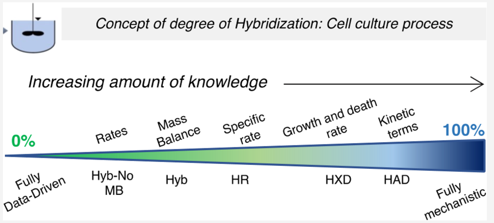
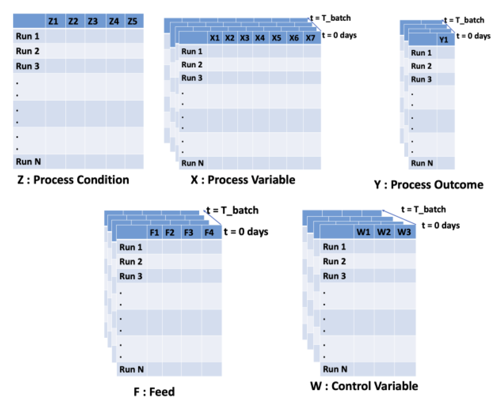
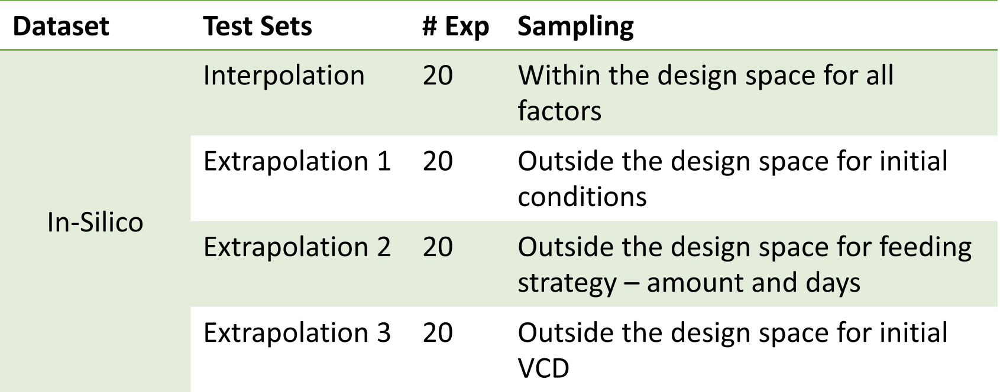
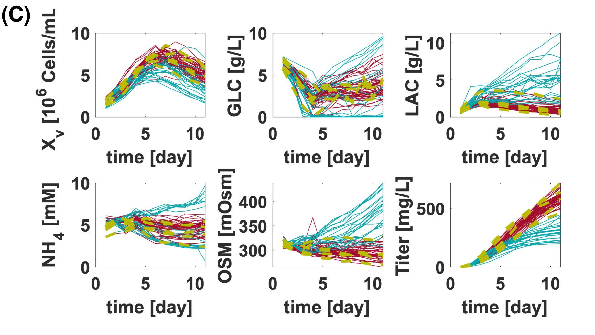
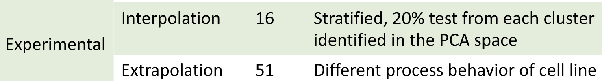

### Abstract

- 引入细胞培养过程建模中的**混合度**概念

- 创建一系列混合模型，定义混合度为显式编码的过程知识比例
  
  
  
  - 完全数据驱动模型（0%）
  - 完全机制模型（100%）
  
- 目标：基于不同指标比较模型
  - 模型精度
  - 模型开发的实验工作量
  - 外推能力
  - 生成新的过程理解的能力
  - 实际使用的简易性
  
- 证明混合度可以为模型选择提供额外的自由度

- **定量证明极端模型的局限性**
  
  - 数据驱动模型：**数据可用性低时表现差，外推能力差**，无法提供过程理解，实际应用效率低
  - 机制模型：**添加过多知识导致精度差**
  
- 模型性能逐步提高，只要添加的知识不过于偏颇

- 选择混合模型取决于模型开发的目标
  - 包含**质量平衡**的混合模型在跨不同操作模式传递模型时表现更好
  - **高混合度模型允许更多过程解释可能性**
  
- **混合速率（HR）模型**在建模精度、训练数据量、外推和实际应用方面表现最佳
  
  - 原因：在增加过程知识和模型参数之间**达到了妥协**
  - 结合**质量平衡**和**细胞特异性速率**的信息
  
- 混合度概念将在开发和测试复杂过程（如细胞培养）的假设中起重要作用

### Introduction

- 数学模型用于理解和描述现实，是实验研究的补充和替代，模型在优化、监控、控制和规模放大等过程应用中至关重要
- 数学模型分为数据驱动（DD）模型和知识驱动（机制）模型
  - 数据驱动模型用于了解较少或没有了解的模型输入输出关系
  - 知识驱动模型用于对输入输出关系有详细机制理解的情况
- 细胞培养过程中的机制知识有限或复杂，通常使用宏观动力学模型
- **生物制药细胞培养过程通常使用简单的数据驱动模型**
  - 由于部分理解和数据分析限制，开发详细机制模型困难
  - 缺乏开发混合方法的专家
  - 实验成本高且数据稀缺，限制了复杂非线性数据驱动方法的使用
- **混合模型结合数据驱动和知识驱动模型的优点**
  - 描述过程中的**基本物理化学**现象
  - **利用数据驱动方法解决未理解部分**
- 混合模型应用于化学过程、能源储存、生物技术等领域
  - 用于优化、质量建模、监控和控制
- 本研究生成了一系列混合模型，重新应用“**混合度**”概念
  - 定义0%混合模型为数据驱动模型，100%混合模型为机制模型
  - 研究纳入不同机制知识对模型指标的影响

### Material and methods

#### Dataset

设计因素和收集的数据按照之前的工作进行了分类：
- **Z**: 运行过程中保持不变的过程条件
- **X**: 动态测量的过程变量
- **W**: 受控变量
- **F**: 添加的饲料量

使用的两组数据集(with daily bolus feed)：
1. 计算机模拟的宏观动力学模型生成的批次哺乳动物细胞培养数据集
2. 工业实验室规模的生物反应器生成的数据集

#### In Silico 和 Experimental 对比

| 特性                   | In Silico Dataset              | Experimental                                |
| ---------------------- | ------------------------------ | ------------------------------------------- |
| **规模**               | 单位体积                       | 生物反应器 (3.5 L)                          |
| **产品**               | 单克隆抗体 (mAb)               | 融合 Fc 蛋白                                |
| **培养基**             | 化学定义                       | 基于蛋白胨                                  |
| **模式**               | 补料分批                       | 补料分批                                    |
| **培养持续时间**       | 14 天                          | 10 天                                       |
| **采样**               | 每天一次                       | 每天一次                                    |
| **过程条件 (Z)**       | 搅拌速度                       | 扩增时间、扩增 VCD、扩增细胞龄、DO、pH 设置 |
| **过程变量 (X)**       | VCD, GLC, LAC, GLN, NH4, Titer | VCD, GLC, LAC, GLN, GLU, NH4, OSM, Titer    |
| **饲料种类 (F)**       | GLC, GLN                       | GLC                                         |
| **饲料开始和结束时间** | 设计                           | 第 3 天到第 9 天                            |
| **可控变量 (W)**       | pH, T                          | pH, pCO2, pO2                               |
| **变化**               | pH, T                          | 无                                          |
| **预测变量**           | 过程变量 (X)                   | 过程变量 (X)                                |
| **运行总数**           | 模拟样本                       | 81                                          |

####  In Silico 数据集

##### 模型和数据生成
- 基于哺乳动物细胞培养的宏观动力学模型（文献17和18）
- 考虑温度、pH值和搅拌速率对特定速率的影响
- 包含14个过程因素：
  1. **搅拌速率**
  2. **初始条件**
     - **Xv（活细胞密度）**
     - **GLC（葡萄糖）**
     - **GLN（谷氨酰胺）**
  3. **控制变量设定点**
     - **pH值变化前**
     - **pH值变化后**
     - **温度变化前**
     - **温度变化后**
     - **变化天数**
  4. **饲料策略**
     - **GLC饲料开始日**
     - **GLC饲料结束日**
     - **GLN饲料开始日**
     - **GLN饲料结束日**
     - **GLC日投料量**
     - **GLN日投料量**

##### 数据特征
- 提供6个过程变量的每日浓度值
  - VCD
  - GLC
  - LAC
  - GLN
  - NH4
  - Titer

- 加入10%相对标准偏差的白噪声

- 详细描述和组织见之前的工作（Datahow-2020-Process-Monitoring_Hybrid-Model_Continuous-Propagation-Model-NN）

  

##### 数据集和测试集
- 使用拉丁超立方（LHC）采样设计生成不同运行数量的数据集

- 四个独立测试数据集（图1B总结）
  
  
  
  - 每个测试集使用独立的LHC设计采样
  - "插值"测试集用于分析预测精度（第3.1节）
  - "外推1"和"外推2"测试集用于表示一般外推能力（初始条件以及feed）（第3.2节）
  - "外推2"和"外推3"测试集用于比较混合模型之间的外推能力（feed以及初始VCD）（第3.4节）
  
- 强调引入质量平衡和Xv功能知识的优势

#### 实验数据集

2.1.2. 实验数据集：此外，还评估了所考虑模型在从工业哺乳动物细胞培养补料分批生物反应器**（3 L规模）**获得的实验数据集上的性能。

为了确保设计空间的覆盖，通过在**主成分分析（PCA）空间中对每个簇进行分层采样**，获得了**实验插值测试集**（取每个簇20%的实验）

该测试集**用于比较不同模型在工业相关数据集上的预测精度**。

为了比较外推性能**，数据集（80个实验）分为两部分，代表系统的两种不同过程行为**，这在之前对该数据集的分析工作中被确定。 

当DO（溶解氧）<25%时（图1C中的蓝色曲线）和DO≥25%时（图1C中的红色和黄色曲线），表现出不同的过程行为。

前者表现为**非常低或非常高的GLC（葡萄糖）和NH4（氨）**，**高OSM（渗透压）**，**LAC（乳酸）增加**，导致**低Xv（活细胞密度）**和**低产量**。

后者表现为**中等的GLC和NH4值**，**OSM减少**和**LAC消耗**，一般对应于**较高的Xv和产量**。在本案例研究中，**我们在第一组（即蓝色曲线，24个实验）上训练模型**，**并添加第二组中的五个实验（即黄色曲线）**，**然后测试模型在第二组剩余51个实验（即红色曲线）上的性能**。这五个实验（黄色表示）被**选择为实验之间的成对距离**（使用所有信息矩阵创建的批量展开数据计算）**最大化**。其目的是展示如何利用具有特定过程行为（由于某种代谢状态或产品类型）的系统中创建的知识来最小化新系统所需的数据量。

##### 数据集和测试集

- **插值测试集**：
  - 通过PCA空间中每个簇的20%实验分层采样获得
  - 用于比较不同模型在工业相关数据集上的预测精度

- **外推测试集**：
  - 数据集（80个实验）分为两部分，代表两种不同过程行为（图1C）
    - **DO < 25%**: 低或高GLC和NH4，高OSM，LAC增加，低Xv和产量（蓝色曲线）
    - **DO ≥ 25%**: 中等GLC和NH4，OSM减少，LAC消耗，高Xv和产量（红色和黄色曲线）
  - 模型训练：
    - 第一组：蓝色曲线（24个实验）
    - 添加第二组中的5个实验：黄色曲线
  - 模型测试：
    - 第二组剩余51个实验：红色曲线
  - 选择五个实验使实验之间的成对距离最大化

- 展示如何利用具有特定过程行为的系统中创建的知识来最小化新系统所需的数据量

### 模型

考虑了七种可能的混合模型，这些模型的混合度范围从0%（数据驱动）到100%（机械模型），如表1所示。

当混合度从0%增加到100%时，混合模型中显式描述的基础现象的数量也增加，因此最一般的假设和现象首先被描述。

#### 模型类型

- BWU-PLS1模型,纯粹的数据驱动模型（0%混合）没有包含任何现象，因此尝试直接预测过程变量。
- Hybrid-No Mass Balance（Hyb-No MB）模型通过使用数据驱动模型（DD）建模积累率，添加了第一个知识片段。因此，神经网络（NN）学习速率方程右侧的全部内容，用常微分方程（ODEs）表示。换句话说，NN必须学习质量平衡（或保持质量守恒）的关系。
- Hybrid（Hyb）模型，通过考虑不同过程变量从生物反应器的流入和流出，显式地说明了质量平衡。因此，它只学习系统中不同过程变量的消耗（或生产）速率，而不是像Hyb-No MB模型那样学习整个质量平衡。
- Hybrid Rate（HR）模型编码反应速率与Xv的比例。因此，它只学习细胞特异性的消耗（或生产）速率。此外，已知细胞生长并随后死亡。因此，可以进一步将细胞特异性速率学习为细胞生长和死亡的特定速率。
- Hybrid Xv Decomposition（HXD）模型中进一步将细胞特异性速率学习为细胞生长和死亡的特定速率，其中NN分别学习特定的生长和死亡速率（表1中的NN1a，NN1b）。
- Hybrid All Decomposition（HAD）模型进一步引入了细胞独立的代谢物消耗/生产动力学途径，从而增加了混合度, 因为HR和HXD模型**基于的假设**仅限于代谢物与可行细胞密度成比例，而实际上，代谢物通过不依赖于可行细胞密度的途径进行动力学消耗（或生产）也是可能的（例如，谷氨酰胺直接降解为氨）。HAD模型考虑了代谢物反应生产或消耗项的两个贡献：（i）与可行细胞直接相关的消耗或生产，（ii）通过与可行细胞密度无直接关系的其他途径的消耗或生产。
- 100%混合是机械模型（Mech），它用经验方程（如Monod动力学抑制）替换了HAD模型中的NN，用于特定的细胞生长和死亡速率。

#### 模型特征总结表

| 模型      | 显式添加的机制       | 方程                                                         | 输入到DD模型                          |
| --------- | -------------------- | ------------------------------------------------------------ | ------------------------------------- |
| BWU-PLS1  |                |                                   | $Z, X(t-1), W(t-1), F(t-1)$         |
| Hyb-No MB | 累积率               | $\frac{dx_i}{dt} = NN_i$                                   | $Z, X(t), W(t), F(t)$               |
| Hyb       | 质量平衡             | $\frac{dx_i}{dt} = NN_i + In_i - Out_i$                    | $Z, X(t), W(t)$                     |
| HR        | 特定速率             | $\frac{dx_i}{dt} = NN_i \cdot X_v + In_i - Out_i$          | $Z, X[\text{except } X_v](t), W(t)$ |
| HXD       | 特定Xv生长和死亡速率 | $\frac{dX_v}{dt} = NN_{1a} \cdot X_v - NN_{1b} \cdot X_v$  $\frac{dx_i}{dt} = NN_i \cdot X_v + In_i - Out_i$ | $$Z, X[\text{except } X_v](t), W(t)$$ |
| HAD       | 动力学项             | $\frac{dX_v}{dt} = NN_{1a} \cdot X_v - NN_{1b} \cdot X_v$  $\frac{dx_i}{dt} = NN_i \cdot X_v + NN_b + In_i - Out_i$ | $Z, X[\text{except } X_v](t), W(t)$ |
| Mech      | 单德动力学方程       | $一系列经验方程$                                           | $(一系列输入)$                      |

#### 数据驱动模型

1. **BB-PLS1**
   - **模型概述**: 连接过程条件 $ Z $ 和初始条件 $ X(t=0) $ 与不同时间点的过程变量浓度。
   - **训练公式**: $[Z, X(t = 0)] \rightarrow PLS1_{i, t} \rightarrow X_i(t = t_{model})$
2. **BWU-PLS1**
   - **模型概述**: 每个时间点每个过程变量开发不同的PLS1模型，使用直到该时间点的过程条件和历史信息预测过程变量。
   - **训练公式**: $[Z, X(t < t_{model})] \rightarrow PLS1_{i, t} \rightarrow X_i(t)$​
   - **测试公式**: $[Z, X(t = 0), X^{predicted}(t < t_{model})] \rightarrow PLS1_{i, t} \rightarrow X_i(t=t_{model})$
3. **ANN**
   - **模型概述**: 使用每个时间点的过程条件和前一时间点的过程变量预测给定时间点的过程变量。
   - **训练公式**: $[Z, X(t = t_{model} - 1)] \rightarrow ANN_{i, t} \rightarrow X_i(t = t_{model})$​
   - **测试公式**: $[Z, \hat{X}(t = t_{model} - 1)] \rightarrow ANN_{i, t} \rightarrow X_i(t = t_{model})$
4. **OWU-ANN**
   - **模型概述**: 与ANN类似，但VWU-ANN为所有时间点使用单一模型。
   - **训练公式**: $[Z, X(t = t_{model} - 1)] \rightarrow ANN_i \rightarrow X_i(t = t_{model})$​
   - **测试公式**: $[Z, \hat{X}(t = t_{model} - 1)] \rightarrow ANN_i \rightarrow X_i(t = t_{model})$

