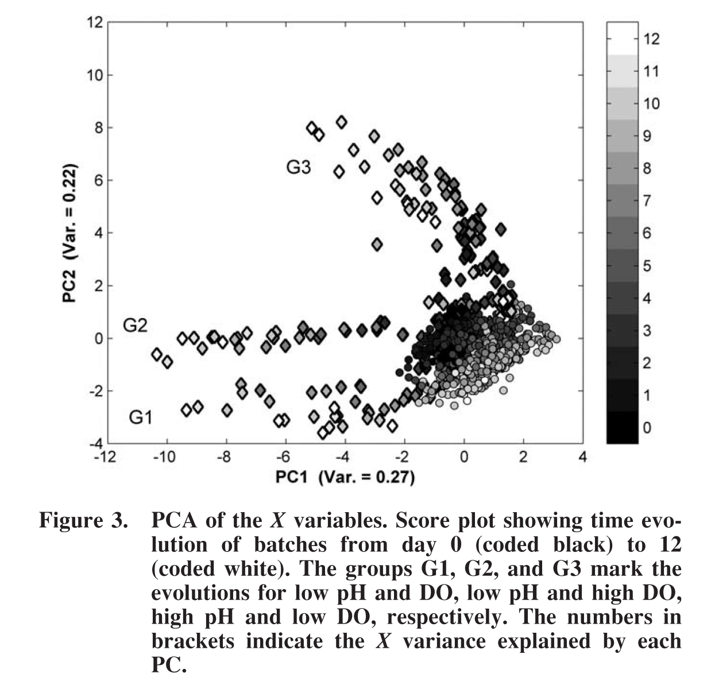
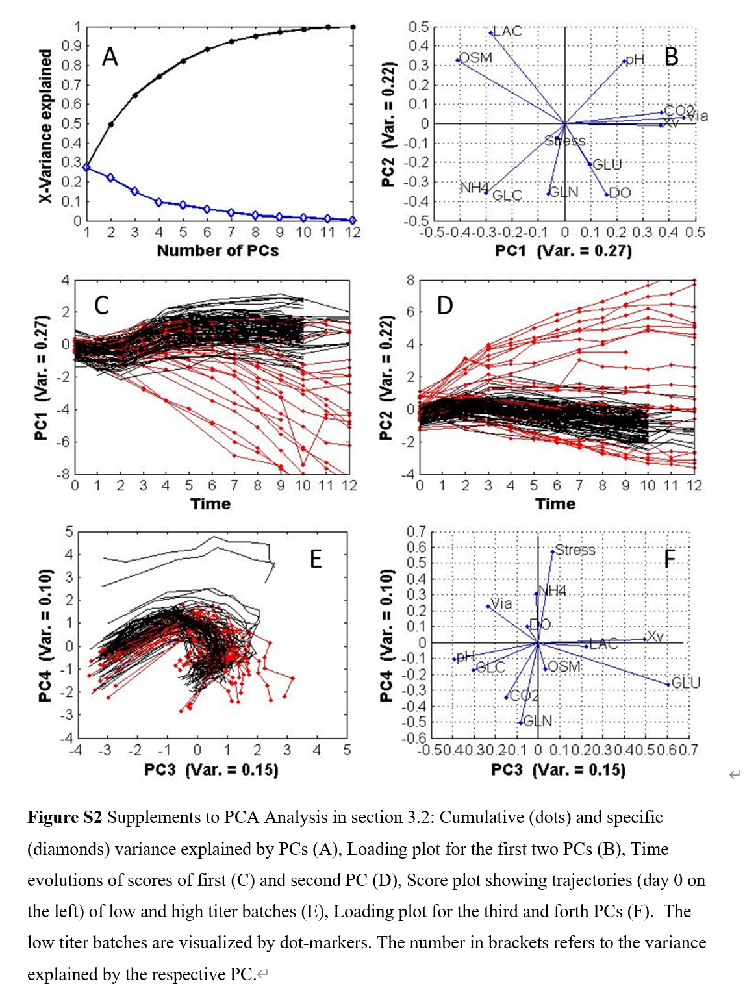

# Datahow-2015-MVDA-PCA

> 本文核心解决的问题:
> 
> - various (dynamic) upstream process characteristics  &rarr; patterns (fingerprints)
> 
> - variable importance under different perspectives
> 
> - variable interactions and trajetories in the time
> 
> 本文实验数据用于探索分析的要点
> 
> - Process variables: initial value analysis in a range
> 
> - Control variables: set point analysis in a range
> 
> - Replicate Variables: process robustness

## Description of data

W:

- pH

Z:

- DO

- Stress

X:

- Xv

- Via

- Glc

- Lac

- NH4

- Gln

- Glu

- OSM: osmolaity comprised 24% of randomly distributed missing values

F:

- Feed_Glc: feed from day 3

Y: Titer, contained 56% of missing values, measured on even days.

Initial value:

- pH set

- DO set

- Stress set

- Xv_0 set

## Ways to unfold a 3d data

- BWU: Batch-Wise Unfolding

- OWU: Observation-Wise Unfolding

## Deal with missing values

- **Eliminating** all rows which comprise missing X (and Y) values for PCA (and PLSR);

- **Interpolating** the missing values **separately** for all the X and Y evolutions;
  
  - **选择插值方法**：
    
    - 不同插值方法可用于估算缺失值，例如：
      
      - 线性插值
      - 多项式插值
      - 滑动平均
      - 样条插值
      - 洛伦兹插值
    
    - 根据时间序列数据，对输出变量Y的每一个维度单独进行插值填补。
  
  - **对X进行插值**：
    
    - 根据时间序列数据，对输入变量X的每一个维度单独进行插值填补。
  
  - **对Y进行插值**：
    
    - 根据时间序列数据，对输出变量Y的每一个维度单独进行插值填补。

- **Imputing** the missing data:
  
  - in the entire X space using the iterative algorithm by Walczak et al.,24
  
  - in the entire missing Y (titer) data by regressing Y with a logistic function (i.e., also extrapolation)
  
  - imputations **separately** in the X and Y space is to eliminate any information
    exchange in order to ensure unbiased prediction.

## Normlization Data

- Substracting the mean of each column and dividing each column by its standard deviation
  
  在进行多变量分析之前，对数据进行了自动缩放，即减去每一列的均值并将每一列除以其标准偏差。
  
  **1. 自动缩放的目的：**
  
  - **标准化数据：** 确保所有变量具有相似的量级。
  - **减少偏差：** 防止由于不同变量之间尺度差异而导致的偏差。
  - **提高模型性能：** 在多变量分析和机器学习模型中，标准化可以提升模型的稳定性和准确性。
  
  **2. 自动缩放的过程：**
  
  - **均值中心化：** 对每个变量减去其均值，使得数据居中于零。
  - **方差归一化：** 对每个变量除以其标准偏差，使得数据的方差归一到1。
  
  **3. 自动缩放的公式：**
  
  - 对于每个变量 \(x_j\)，其标准化后的值为：
    $ z_{ij} = \frac{x_{ij} - \mu_j}{\sigma_j} $
    - $z_{ij}$：第 \(i\) 行，第 \(j\) 列的标准化值
    - $x_{ij}$：第 \(i\) 行，第 \(j\) 列的原始值
    - $u_j$：第 \(j\) 列的均值
    - $\sigma_j$：第 \(j\) 列的标准偏差
  
  **方法演示：**
  
  使用Python代码对自动缩放进行演示：
  
  ```python
  import numpy as np
  import pandas as pd
  from sklearn.preprocessing import StandardScaler
  
  # 生成示例数据集
  np.random.seed(42)
  data = {
      'Temperature': np.random.normal(37, 0.5, 10),
      'pH': np.random.normal(7.2, 0.1, 10),
      'Oxygen': np.random.normal(30, 5, 10),
      'Titer': np.random.normal(100, 15, 10)
  }
  df = pd.DataFrame(data)
  
  # 显示原始数据
  print("原始数据：\n", df)
  
  # 使用sklearn的StandardScaler进行自动缩放
  scaler = StandardScaler()
  scaled_data = scaler.fit_transform(df)
  
  # 将缩放后的数据转换回DataFrame
  scaled_df = pd.DataFrame(scaled_data, columns=df.columns)
  
  # 显示缩放后的数据
  print("\n缩放后的数据：\n", scaled_df)
  
  # 手动实现自动缩放
  def manual_standardize(data):
      return (data - data.mean(axis=0)) / data.std(axis=0)
  
  manual_scaled_data = manual_standardize(df)
  print("\n手动实现的缩放后的数据：\n", manual_scaled_data)
  ```
  
  **输出：**
  
  ```python
  原始数据：
      Temperature   pH     Oxygen       Titer
  0    36.748357  7.24  27.575238   95.356223
  1    36.930868  7.21  33.209987   93.600846
  2    36.802824  7.09  24.934800  125.927032
  3    37.195735  7.11  31.571238   92.582581
  4    36.965263  7.16  33.500917  109.734857
  5    36.839794  7.18  25.486561  107.953771
  6    37.168219  7.30  26.469335   90.108154
  7    36.964516  7.18  27.695182  112.121789
  8    37.059321  7.16  25.777847  116.206465
  9    36.933581  7.28  29.258278  113.392213
  
  缩放后的数据：
      Temperature       pH    Oxygen     Titer
  0   -1.594649  0.536557 -1.205122 -1.186235
  1   -0.560381 -1.235631  1.215954 -1.314715
  2   -1.078360 -2.674079 -2.090463  2.135453
  3    1.140703 -2.074855  0.413025 -1.438010
  4   -0.416192 -0.451077  1.324794  0.000669
  5   -0.913108  0.134740 -1.924468 -0.199048
  6    0.989108  2.748191 -1.528329 -1.642905
  7   -0.419584  0.134740 -1.133076  0.266431
  8    0.298941 -0.451077 -1.829043  0.730120
  9   -0.546522  2.332488 -0.337729  0.648241
  ```

```
## Model Performance Evaluation

- K-Fold

- 用于评估模型性能和预测能力，避免过拟合。

- 过程：

1. 将数据集分成k个子集（通常k=5或k=10）。

2. 每次选择其中一个子集作为测试集，其余子集作为训练集。

3. 基于训练集构建模型，并使用该模型预测测试集中的Y值。

4. 计算实际Y值和预测Y值之间的误差，并记录每次交叉验证的误差。**RMSECV（交叉验证中的均方根误差）：**

   - 计算实际和预测Y值的平方差之和，并取平方根。
   - 衡量模型在交叉验证中的预测误差，值越小表示模型预测能力越好。

5. 计算实际Y值和预测Y值之间的**Q²（解释的方差）：**

   - 表示交叉验证中解释的方差占总方差的比值。
   - 值范围为0到1，越接近1表示模型越能解释数据的方差。

- 示例代码:

```python
from sklearn.model_selection import KFold
from sklearn.cross_decomposition import PLSRegression
from sklearn.metrics import mean_squared_error
import numpy as np

# 生成示例数据集
np.random.seed(42)
n_samples = 100
n_features = 10
X = np.random.rand(n_samples, n_features)
Y = np.random.rand(n_samples, 1)

# 设置PLS回归模型参数
n_components = 2
pls = PLSRegression(n_components=n_components)

# 设置k折交叉验证参数
k = 5
kf = KFold(n_splits=k, shuffle=True, random_state=42)

# 交叉验证评估模型性能
rmsecv_list = []
q2_list = []

for train_index, test_index in kf.split(X):
    X_train, X_test = X[train_index], X[test_index]
    Y_train, Y_test = Y[train_index], Y[test_index]

    # 训练PLS回归模型
    pls.fit(X_train, Y_train)

    # 预测测试集的Y值
    Y_pred = pls.predict(X_test)

    # 计算RMSECV
    rmsecv = np.sqrt(mean_squared_error(Y_test, Y_pred))
    rmsecv_list.append(rmsecv)

    # 计算Q²
    ss_tot = np.sum((Y_test - np.mean(Y_test))**2)
    ss_res = np.sum((Y_test - Y_pred)**2)
    q2 = 1 - ss_res / ss_tot
    q2_list.append(q2)

# 计算平均RMSECV和平均Q²
mean_rmsecv = np.mean(rmsecv_list)
mean_q2 = np.mean(q2_list)

print(f"平均RMSECV: {mean_rmsecv:.4f}")
print(f"平均Q²: {mean_q2:.4f}")
```

## Interrelationships between the X and Y

1. **b系数（b-coefficients）：**
   
   - b系数是PLSR模型中的回归系数，代表自变量（X变量）对因变量（Y变量）的线性关系强度和方向。
   - 对应于自动缩放后的X变量。

2. **变量重要性投影（VIP，Variable Importance in Projection）：**
   
   - VIP是PLSR模型中评估X变量相对重要性的指标。
   - 用于评估每个X变量对解释X和Y空间的贡献。
   - VIP值的特点：
     - 始终为正。
     - 值为1表示X变量的平均影响力。

3. **W*-载荷（W*-loadings）：**
   
   - 量化每个X变量在每个潜在变量（LV）上的权重。
   - 表示每个X变量对LV的贡献程度。
   - 如果第一个LV解释了大部分方差，则在该LV上具有高载荷的X变量更可能具有重要影响力。

**方法演示：**

使用Python代码计算b系数、VIP和W*-载荷：

```python
from sklearn.cross_decomposition import PLSRegression
import numpy as np
import pandas as pd

# 生成示例数据集
np.random.seed(42)
n_samples = 100
n_features = 5
X = np.random.rand(n_samples, n_features)
Y = np.random.rand(n_samples, 1)
columns = [f'X{i+1}' for i in range(n_features)]

# 设置PLS回归模型参数
n_components = 2
pls = PLSRegression(n_components=n_components)

# 训练PLS回归模型
pls.fit(X, Y)

# 计算b系数（回归系数）
b_coefficients = pls.coef_

# 计算VIP
def calculate_vip(pls, X):
    t = pls.x_scores_
    w = pls.x_weights_
    q = pls.y_loadings_

    p, h = w.shape
    s = np.zeros((p,))
    total_s = np.sum(np.diag(t.T @ t @ q.T @ q))

    for i in range(p):
        weight = np.sum((t @ np.diag(q[:, 0]))**2, axis=0)
        s[i] = np.sum(weight * (w[i, :]**2))

    vip = np.sqrt(p * s / total_s)
    return vip

vip_scores = calculate_vip(pls, X)

# 计算W*-载荷
w = pls.x_weights_
p = pls.x_loadings_
w_star = w @ np.linalg.inv(p.T @ w)

# 打印结果
results = pd.DataFrame({
    'b-coefficients': b_coefficients.flatten(),
    'VIP': vip_scores,
    'W*-loadings (LV1)': w_star[:, 0],
    'W*-loadings (LV2)': w_star[:, 1]
}, index=columns)

print(results)
```

**输出：**

```python
    b-coefficients       VIP  W*-loadings (LV1)  W*-loadings (LV2)
X1        0.030798  0.982699           0.548974           0.262306
X2        0.030547  1.082961           0.438153           0.483382
X3       -0.076504  1.032607          -0.401813           0.319908
X4       -0.023873  1.061569           0.560785          -0.508544
X5        0.034774  0.916164           0.368275           0.569357
```

**总结：**

- **b系数**：表示每个X变量对Y变量的线性影响。
  
  - - **数值大小**：
      
      - b系数的绝对值越大，表明该变量对响应变量（Y）的影响越大。
      - 较小的绝对值意味着该变量对Y的影响较小。
    
    - **符号解释**：
      
      - 正号（+）：表示该变量与响应变量正相关，即自变量增加，响应变量也增加。
      - 负号（-）：表示该变量与响应变量负相关，即自变量增加，响应变量减少。

- **VIP**：评估每个X变量对解释X和Y空间( X&rarr;Y即模型)的相对重要性。
  
  - - **数值大小**：
      - VIP的值始终为正，越大表示该变量对模型的影响越大。
      - 通常：
        - VIP > 1：表示该变量对模型有较高的解释力。
        - VIP < 1：表示该变量对模型解释力较弱。

- **W*-载荷**：量化X变量对潜在变量（LV）的贡献。
  
  - - **数值大小**：
      
      - W*-载荷的绝对值越大，表示该变量对潜在变量（LV）的贡献越大。
    
    - **符号解释**：
      
      - 正号（+）：表示该变量与潜在变量正相关。
      - 负号（-）：表示该变量与潜在变量负相关。

## Univariate analysis

**关于 X 变量的单变量分析****1. 图1的解读**

- **图1A（活细胞密度，XV）**：
  
  - 高滴度批次（黑色曲线）和低滴度批次（红色带点曲线）在活细胞密度上的差异显著。
  - 高滴度批次通常在第6天左右达到最大活细胞密度，然后逐渐下降。
  - 低滴度批次在较早阶段出现下降，表明早期细胞死亡。

- **图1B（滴度）**：
  
  - 高滴度批次的滴度演变更陡峭，达到更高的最终滴度。
  - 低滴度批次的滴度在早期趋于平稳，最终产量较低。

- **图1C（葡萄糖浓度）**：
  
  - 高滴度批次在第3天后保持稳定的葡萄糖浓度。
  - 低滴度批次中，葡萄糖浓度较早阶段就开始积累，表明早期细胞死亡导致消耗降低。

- **图1D（pH）**：
  
  - 高滴度批次的pH值主要集中在6.8到7.2之间。
  - 低滴度批次的pH值通常低于6.8或高于7.2。

**2. 单变量预分析的结论：**

- 高滴度批次和低滴度批次在各个**变量的演变**中表现出明显不同的特征模式。
- 通过引入滴度值的质量标准，将批次分为高滴度和低滴度两组，有助于简化分析并识别特征模式。
- 但是经典的单变量分析表明，大多数变量的演变揭示了一些特征模式。通过引入与滴度值相关的任意质量标准简化了该分析，该标准可区分高性能和低性能批次。尽管这种经验分组有助于对工艺有一些基本的了解，但无法评估这两组中的整体变量相互作用和差异。


**关于 Z 变量的单变量分析**

图2中的散点图分析揭示了不同的Z过程变量对产品滴度的影响。这种可视化方法便于**观察变量设定点**如何影响最终的产品滴度。

- **图2A和2B**：这两张图显示了pH和DO设定点在调查范围的极值（最高或最低）通常与低滴度批次相关联。
- **图2C和2D**：这两张图指出细胞接种密度和stress的范围可能未涵盖足够宽的区域，无法包括关键的失效边缘。由于这两个变量的控制不够精确，难以区分高滴度和低滴度批次。

此外，由于实验设定的细胞密度较为分散，这暗示了在初始阶段的过程控制存在问题，这可能影响了整体生产的稳定性和预测性。


## PCA analysis



该分析的主要目标是通过多元分析可视化12个输入变量的演变和相关性，并推断不同批次之间的特征模式和偏差。为了分析变化趋势，数据集按变量展开，并删除包含缺失值的行。最终得到了一个包含1,020个观测（行）和12个变量（列）的矩阵。

- 图3中展示的得分图明确区分了低产量批次（菱形符号）和高产量批次（圆形符号）。

- 图3中动态行为基于培养时间进行可视化，从初始条件（第0天为黑色）到最终条件（第12天为白色）。初始条件都位于一个明显的区域，接近图的原点。

- 图3中高产量批次围绕原点旋转，而低产量批次则偏离它。这一趋势在支持信息图S2中也有所展示，其中前两个主成分（PC）与时间的关系进行了绘图。

- 图3中PCA揭示了在低产量批次中，所有过程变量一起以一致的方式移动，并遵循与高产量批次不同的轨迹。特别是，可以使用相应的载荷图（如S2所示）识别三个特征组，分别标记为G1、G2和G3。前两个组对应于在pH 6.7以及高（70%和90%，G1）或低（10%，G2）DO条件下的实验。组G3对应于在高pH（7.2）和低DO（10%）水平下进行的实验。其余的五个低产量批次可以在靠近G3组主体区域的边界处被识别为在高pH或低DO条件下进行的分批工艺，而其他参数则保持标准条件。这意味着通过该分析，可以在单个图中揭示pH的强烈影响，尤其是pH和DO在极端条件下的组合效应。

图S2考虑PC3与PC4的关系图，它们总共解释了另外24%的方差。然而，这些PC提供的信息不再反映低产量和高产量批次的不同行为，而是显示了Xv的特征演变以及压力的影响。相应的得分和载荷图可在支持信息图S2中找到。

因此，PCA获得的结果不仅超越了单变量分析的发现，而且为表征X的演变并将其回归到响应Y提供了重要信息。对于具有动态行为的数据，此类分析的优势在于额外可视化特征多变量演变，这可以作为批次监测的基础。


